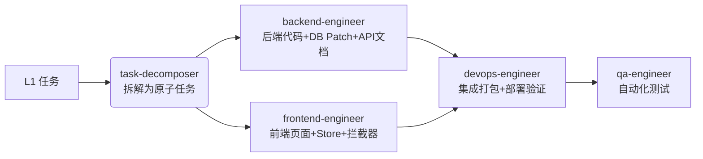

# CLAUDE.md
This file provides guidance to Claude Code (claude.ai/code) when working with code in this repository.

📌 项目核心定位
这是一个用于求职面试的Java全栈展示项目，目标是复刻"AI 数字员工平台"的核心能力。我的背景是 Python 转 Java，此项目用于展示我从架构设计到编码交付的完整工程能力。

🎯 核心目标
技术栈精准命中：严格使用 Java 17 + Spring Boot 3.x + Vue 3 (setup) + Element Plus。
解决真实痛点：实现一个轻量级的"统一 AI 网关"和"RAG 知识库问答"。
产出工程化代码：代码必须遵循阿里巴巴/Google Java Style，包含完善的异常处理和日志。

📚 文档体系与 Agent 协作（必读）
本项目采用"规范 + 任务 + Agent"三层结构，通过多 Agent 协作完成开发。Claude 在开始工作前必须理解：

### 规范文档层（权威约束）
| 文档 | 职责 | 何时查阅 |
| --- | --- | --- |
| CLAUDE.md （本文档） | 权威规范：技术栈约束、编码规范、架构约定、工作流程 | 每次对话开始时自动加载 |
| docs/核心任务.md | 任务清单：阶段目标、交付物、验收标准、当前进度 | 接到任务、状态汇报、阶段推进时 |

### Agent 协作层（按职责激活）
| Agent | 核心职责 | 红线（绝对不做） | 何时激活 |
| --- | --- | --- | --- |
| **task-decomposer** | L1 阶段任务拆解为原子任务；标注依赖、交付物、验收标准、推荐角色 | ❌ 不写代码 ❌ 不执行命令 ❌ 不修改非 `核心任务.md` 的文件 | 阶段启动前，将 L1 任务拆解为可执行清单 |
| **backend-engineer** | Java 后端业务代码（Controller/Service/Mapper）；DB Patches；API 契约文档 | ❌ 不打包 ❌ 不启动服务 ❌ 不联调验证 | 后端业务开发、数据库补丁、API 文档输出 |
| **frontend-engineer** | Vue 3 页面、Pinia Store、Axios 拦截器、路由守卫；**必须先读 API 文档** | ❌ 不打包 ❌ 不预览 ❌ 不 Mock 数据 ❌ 不改 CORS | 前端页面开发、状态管理、拦截器配置 |
| **devops-engineer** | Docker Compose 编排、db-patch 执行、环境脚本、前后端项目骨架、构建容器 | ❌ 不写业务代码 ❌ 不修改已发布的历史补丁 | 环境搭建、部署脚本、打包容器、集成联调 |
| **qa-engineer** (规划中) | 单元测试 (JUnit/Vitest)、E2E 测试 (Playwright)、覆盖率分析 | ❌ 不写业务代码 | 测试用例编写、自动化测试实现 |

### Agent 协作流程（标准链路）


### 关键约定
CLAUDE.md 是"宪法"：编码规范、技术选型、禁止事项以本文档为准
核心任务.md 是"作战地图"：阶段划分、具体任务、交付物清单以该文档为准
禁止重复维护：CLAUDE.md 中不再保留"核心功能开发清单"章节，统一引用 `docs/核心任务.md`
进度同步：每次阶段完成后，更新 `docs/核心任务.md` 中的进度标记，CLAUDE.md 仅保留状态更新协议

### 项目架构与目录结构（约定）
请按以下目录结构生成代码，保持模块清晰：
```
/backend                    # Spring Boot 后端 (Maven 多模块)
 ├── pom.xml                 # 父 POM (Spring Boot 3.3.x)
 ├── nexus-common            # 公共模块 (工具类、异常、统一响应)
 ├── nexus-infrastructure    # 基础设施 (多租户拦截器、JWT、数据库配置)
 ├── nexus-module-system     # 系统模块 (用户、角色、菜单)
 ├── nexus-module-ai         # AI 核心模块 (统一网关、RAG、Agent编排)
 ├── nexus-start             # 启动模块 (包含 Application 主类)
 └── */src/test              # 后端单元测试与集成测试代码 (JUnit 5 + Mockito)
/frontend                   # Vue 3 前端 (Vite)
 ├── src
 │   ├── api                 # 后端接口封装 (Axios)
 │   ├── views               # 页面 (登录、控制台、知识库管理、Agent编排)
 │   ├── components          # 公共组件
 │   └── __tests__           # 前端组件与 E2E 测试代码 (Vitest + Playwright)
/docker-compose             # 环境依赖 (PostgreSQL+pgvector, Redis, Ollama, 构建容器)
/db-patch                   # 数据库补丁 (命名规则见 db-patch 工作流章节)
/scripts                    # 环境检查与一键启动脚本 (check-env.sh 含容器健康检查 / up.sh)
/docs/test-cases            # 每个阶段交付后的测试案例设计 (TC-00, TC-01, ...)
```

### 技术选型与版本约束（严格遵守）
后端基础：Java 17, Spring Boot 3.3.x, Maven 3.9+
ORM/数据层：MyBatis-Plus 3.5.x (便于多租户实现)
数据库：PostgreSQL 16 + pgvector 扩展 (用于向量检索)
缓存/会话：Redis 7.x (用于存储 JWT 和租户信息)
AI 集成：Spring AI 或 OkHttp + 策略模式 (对接 Ollama/DeepSeek)
前端：Vue 3 (script setup) + TypeScript, Vite, Element Plus, Pinia
测试：JUnit 5 + Mockito (后端)；Vitest + Vue Test Utils + Playwright (前端)

### 编码规范与设计原则（必须遵守）
统一返回体：所有 API 返回 `Result<T>` 格式 (`code`, `msg`, `data`)。
全局异常处理：使用 `@RestControllerAdvice` 捕获业务异常，不返回堆栈信息给前端。
多租户强制隔离：使用 MyBatis-Plus 的 `TenantLineHandler` 自动注入 `tenant_id`，任何查询都必须带上租户条件（除非用 `@IgnoreTenant` 注解跳过）。
日志规范：关键流程（调用大模型、向量入库）必须打印 `log.info`，方便面试时展示调用链路。
Git 提交：请按功能点分批提交，commit message 使用 `feat: 添加统一AI网关` 格式。

### 针对"Python转Java"的特别限制（避免露怯）
不要出现 Python 语法：严禁在 Java 代码中使用 `_` 作为变量名，严禁滥用 `var`（只在类型明确且不可变时使用，如 `var list = new ArrayList<String>()`，否则必须显式声明类型）。
不要使用 `*` 导入：Java 代码必须明确写出导入的类名（如 `import java.util.List;`，严禁 `import java.util.*;`）。
Controller 层注解规范（Spring Boot 3.x 现代风格）：
统一使用 `@GetMapping`、`@PostMapping`、`@PutMapping`、`@DeleteMapping` 等组合注解，不要使用 `@RequestMapping(method = RequestMethod.GET)`。
必须显式指定 `produces` 和 `consumes` 属性（如 `@PostMapping(value = "/chat", produces = MediaType.APPLICATION_JSON_VALUE, consumes = MediaType.APPLICATION_JSON_VALUE)`），以明确接口契约，便于 Swagger/OpenAPI 文档生成。
异常处理要细：不要所有异常都 `catch Exception`，至少要分 `BusinessException`（业务异常，前端可展示）和 `SystemException`（系统异常，记录日志并返回通用错误）。

🐳 环境与部署约定
演示环境：Windows + WSL。整理并维护 `wsl.abc.md` 作为 WSL 参考文档；注意 AI 时代的文档可能不正确，遇到问题时要自己排查解决（用日志、官方文档交叉验证），不要照抄。
容器化：前端、后端、PostgreSQL、Redis、Ollama 各自独立容器部署，全部容器化。
国内镜像加速：镜像一律通过 Dockerfile `FROM` / compose `image:` 前缀走 `docker.m.daocloud.io` 加速（官方镜像走 `/library/` 路径），禁止修改 `/etc/docker/daemon.json`；这是第一步要生成的交付物。
构建容器（builder）：docker compose 中配置专门的打包容器 `nexus-builder`（git + mvn + npm + postgresql-client），负责前后端打包与 db-patch 迁移执行；builder容器不需要挂载源代码，直接使用git pull源码改动；仓库repo可以配置；buidler容器可以手工启动和手工退出; 当需要打包时，启动起来，手工在里面执行打包，打db patch的命令；包拷贝到一个共享目录，前后端容器重启时直接从共享目录获取最新的包。

🧭 任务执行协议（Task Execution Protocol）
为避免"接到需求就写代码"导致的架构失控，所有任务按粒度分级执行：

📐 任务分级标准
| 级别 | 判定标准 | 典型例子 | 交付物 |
| --- | --- | --- | --- |
| L1 阶段级 | 跨模块、影响架构、 >1天工作量 | 多租户实现、RAG 整体设计、Agent 编排 | ① 设计文档 ② 子任务拆解 ③ 代码 ④ 测试案例 |
| L2 模块级 | 单模块内、涉及多文件 | 统一 AI 网关策略模式、JWT 过滤器 | ① 简要设计说明（接口契约+类图） ② 代码 ③ 测试案例 |
| L3 任务级 | 单文件、明确需求 | 新增一个 DTO、修复一个 bug、调整配置 | ① 代码 ② 必要时补测试 |

📝 L1/L2 任务的标准流程
Step 1 - 任务分解（先输出，等我确认）
把大任务拆成 ≤5 个子任务，每个子任务明确：输入/输出/依赖/验收标准
输出到 `docs/design/<阶段>-<模块>.md`

Step 2 - 关键设计决策（写在设计文档里）
为什么选这个方案？备选方案是什么？trade-off 在哪？
接口契约（URL、请求体、响应体、错误码）
核心类图 / 时序图（用 Mermaid）

Step 3 - 我确认后再写代码
未经确认不要直接生成代码
代码必须与设计文档一致，偏离时要说明原因

Step 4 - 同步更新测试案例与自动化测试
按 `docs/test-cases/TC-XX.md` 规范补充测试案例设计；
由 `qa-engineer` 根据设计编写对应的自动化测试代码（unittest / e2e）。

🚀 L3 任务直接执行
无需设计文档，但 commit message 必须清晰，代码必须带注释说明意图。

⚠️ 特别约定
禁止"边想边写"：复杂逻辑必须先有设计再动手
禁止"文档滞后"：代码改完必须同步文档
面试友好：设计文档控制在 1-2 页 A4，重点是架构图和决策理由，不要写成论文

🔄 状态更新协议
每当我输入 `Status` 或 `继续下一个阶段`，请你：
阅读 `docs/核心任务.md`，回顾当前已完成的功能点和下一阶段目标
阅读现有代码，核对交付物是否齐全
更新 `docs/核心任务.md` 中的进度标记
给出下一步具体的开发指令