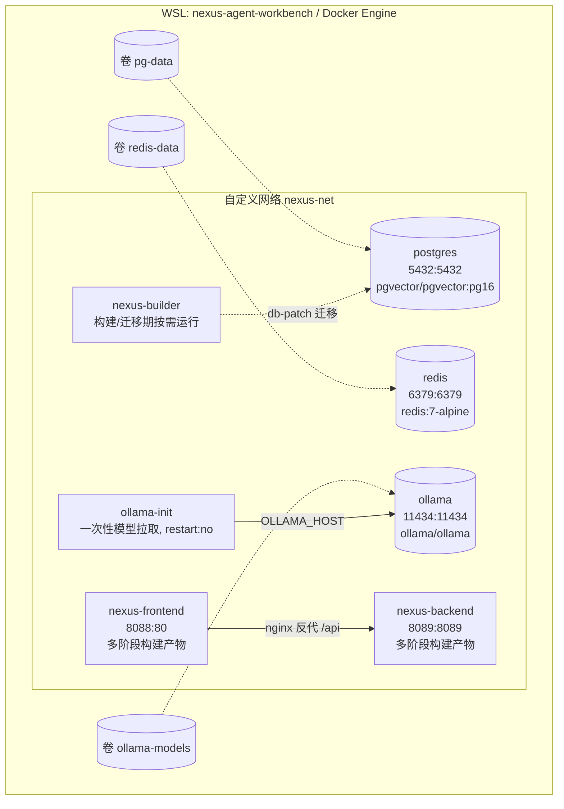
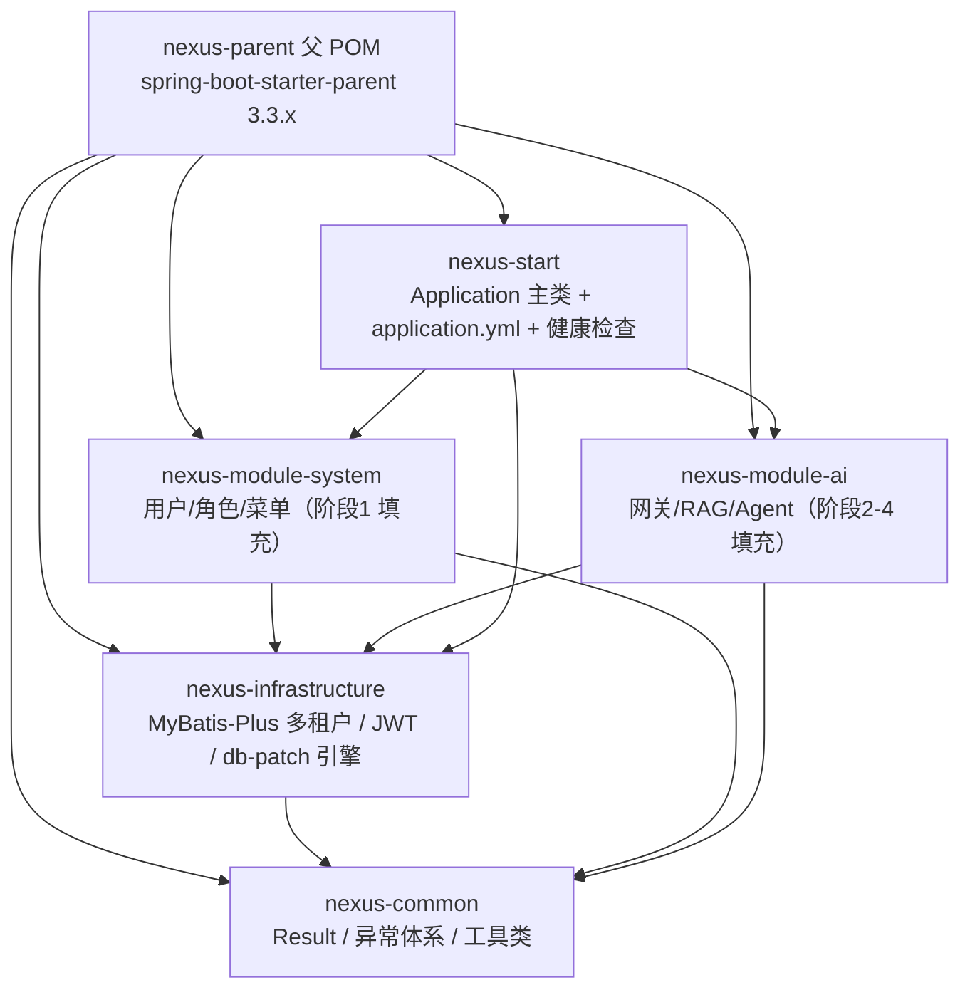

# 00 环境与部署 — task.1 设计文档（阶段0）

> 任务级别：**L1 阶段级** ｜ 状态：✅ 设计已确认（待编码） ｜ 对应任务：`docs/task/task.1+环境准备.md`
> 本设计经确认后编码；验证方案见文末「验收对照表」，测试案例 TC-00 在编码后生成。
> 约定速记：docker 与 compose 全部运行在 **WSL 发行版 `nexus-agent-workbench`** 内；Windows 侧调用 `wsl -d nexus-agent-workbench -- <命令>`；镜像加速统一走 `docker.m.daocloud.io` 前缀、不改 daemon.json（§2.3）；版本号/端口占用中带「待验证」字样的一律以实际环境为准，不臆造。

## 1. 总体架构与执行边界

```
Windows 11 宿主机（开发机）
 ├─ 代码仓库：C:\wp\nexus-agent-workbench（frontend 开发用 npm run dev 可在此运行）
 ├─ 一键触发：wsl -d nexus-agent-workbench -- bash /mnt/c/wp/nexus-agent-workbench/scripts/up.sh
 └─ WSL 发行版 nexus-agent-workbench（已就绪）
      └─ Docker Engine + compose（全部容器在此运行）
           ├─ postgres 5432 │ redis 6379 │ ollama 11434 │ backend 8089 │ frontend 8088
           ├─ nexus-builder（构建/迁移期按需运行：git+mvn+npm+psql，运行期不常驻）
           └─ 数据全用命名卷（WSL ext4 文件系统，避开 /mnt/c 9p 性能坑）
```

**执行边界（铁律）**

| 位置 | 做什么 | 不做什么 |
|------|--------|----------|
| Windows 宿主机 | 写代码、`npm run dev` 前端调试、通过 `wsl -d` 触发脚本 | 不直接跑 docker / docker compose |
| WSL 内 `nexus-agent-workbench` | docker、compose、`check-env.sh` / `up.sh`（.sh 脚本只在这里执行） | 不修改 Windows 侧配置 |

- 仓库路径映射：`C:\wp\nexus-agent-workbench` ↔ WSL 内 `/mnt/c/wp/nexus-agent-workbench`。
- Windows 侧一键触发方式写入 README 与 `wsl.abc.md`（可选提供 `up.cmd` 包装器，见 §8 待确认）。

---

## 2. 子任务 0.1 基础设施编排（docker-compose.yml）

### 2.1 compose 拓扑（网络 / 卷 / 端口 / 健康检查）



| 服务 | 镜像（版本待验证） | 端口 宿:容 | 卷 | 健康检查 | 关键配置 |
|------|-------------------|-----------|-----|----------|----------|
| postgres | `docker.m.daocloud.io/pgvector/pgvector:pg16` | 5432:5432 | pg-data → `/var/lib/postgresql/data` | `pg_isready -U nexus -d nexus` | `POSTGRES_DB/USER/PASSWORD` 走 `.env`，默认 dev 值见 §8 |
| redis | `docker.m.daocloud.io/redis:7-alpine` | 6379:6379 | redis-data → `/data` | `redis-cli ping` | dev 不设密码（仅容器内网 + 本机映射，生产需 requirepass，作为取舍记录） |
| ollama | `docker.m.daocloud.io/ollama/ollama:0.33.2`（2026-09-03 实测固定，与 latest 同 manifest） | 11434:11434 | ollama-models → `/root/.ollama` | `ollama list`（镜像内无 curl/wget，实测探活） | CPU 推理（已确定）；GPU 直通预留 |
| ollama-init | 复用 ollama 镜像（客户端模式） | 无 | 无（写进 ollama 服务卷） | 无（一次性） | `restart: "no"`、`OLLAMA_HOST=http://ollama:11434`、`depends_on: ollama(healthy)`，见 §2.5 |
| nexus-builder | 本地构建（git+mvn+node+postgresql-client，见 §2.4） | 无 | 仓库源码（构建上下文） | 无 | **不常驻**：按需 `docker compose run --rm builder …` 构建前后端包、执行 db-patch 迁移 |
| nexus-backend | 本地多阶段构建（见 §2.4） | 8089:8089 | 无 | `wget -qO- localhost:8089/actuator/health` | `server.port=8089`；`depends_on: postgres(healthy), redis(healthy)`；JVM 内存上限 `-Xmx` 预留 |
| nexus-frontend | 本地多阶段构建（见 §2.4） | 8088:80 | 无 | `wget -qO- localhost` | nginx 反代 `/api → nexus-backend:8089`；`depends_on: nexus-backend(healthy)` |

- **网络**：单一自定义 bridge 网络 `nexus-net`，容器间用服务名互访，不依赖宿主 DNS。
- **卷**：数据一律命名卷（落在 WSL ext4）。**决策**：不用 bind mount 映射 `/mnt/c` 下的数据目录 —— 9p 文件系统 IO 慢、权限模型残缺，PG 数据放上面有损坏风险；命名卷由 Docker 管理，也是面试可讲的点。
- **compose 顶层 `name: nexus`**：固定项目名，避免随目录名漂移。
- 端口规划默认值 5432/6379/11434/8089/8088，全部经 `.env` 变量化，冲突时改 `.env` 一处即可（冲突检测见 §4.2）。

### 2.2 镜像选型

| 选型 | 理由 | 备选与取舍 |
|------|------|-----------|
| `pgvector/pgvector:pg16` | 官方维护镜像，**pgvector 扩展已编译内置**，避免自装编译链；tag 与 PG 主版本一一对应 | 备选 `postgres:16` + 启动脚本 `apt install postgresql-16-pgvector`：安装慢且依赖网络；弃 |
| `redis:7-alpine` | 体积小（~30MB）、启动快，7.x 满足 JWT/租户缓存需求 | 备选 `redis:7`（Debian）：体积大；无收益 |
| `ollama/ollama` | 官方唯一发行通道，服务与 CLI 同镜像，init 容器可复用做拉取客户端 | 备选：宿主机裸装 ollama —— 违背"全部容器化"约定；弃 |
| 自建 `nexus-builder`（`maven:3.9-eclipse-temurin-17` + node 20 + git + postgresql-client） | **专门的打包容器**：一个镜像同时具备前后端构建工具链与 PG 客户端，兼任 db-patch 迁移执行器（§2.4/§3） | 备选：maven、node 两个独立构建镜像 —— 违背"专门的独立打包容器 + 共用构建阶段"约定；弃 |
| 后端运行镜像 `eclipse-temurin:17-jre-alpine` | 官方 JRE 17，体积远小于带 JDK 的镜像，无 JDK 即缩小攻击面 | 备选 `openjdk:17-jre-alpine`：已停维护；弃 |
| 前端运行镜像 `nginx:1.27-alpine` | 静态托管 + 反向代理一体，alpine 体积小 | 备选 node serve：运行时带整个 Node 运行时，资源浪费；弃 |

- 表中镜像在 Dockerfile/compose 中的实际写法一律带 `docker.m.daocloud.io` 加速前缀（§2.3）。

### 2.3 国内镜像加速（第一步交付物）：Dockerfile 前缀方式，不改 daemon.json

- **配置方式（用户规则）**：镜像加速 URL **直接写在 Dockerfile `FROM` 与 compose `image:` 字段**，统一使用前缀 `docker.m.daocloud.io`（DaoCloud 公共加速源）：
  - compose：`image: docker.m.daocloud.io/pgvector/pgvector:pg16`
  - Dockerfile：`FROM docker.m.daocloud.io/library/maven:3.9-eclipse-temurin-17`（官方镜像走 `/library/` 路径；非官方镜像的路径映射落地时实测验证）
- **禁止碰 `/etc/docker/daemon.json`**：不配置 daemon 级 registry-mirrors，`check-env.sh` 也不得提示修改（规则已写入 devops-engineer agent 定义）。
- **决策理由（对比 daemon.json 方案）**：daemon 级 mirror 是宿主机全局配置，需要 root 权限 + 重启 docker daemon，且会波及 WSL 内其他项目；Dockerfile 前缀方式**随仓库走、项目自包含、任意干净机器可复现**，符合演示项目"拿到仓库一键拉起"的定位。代价：镜像名带前缀略丑、更换源需改仓库文件（`grep` 定位 `docker.m.daocloud.io` 一处替换即可）。
- **降级机制**：前缀地址做成仓库内统一常量（`.env` 或构建脚本变量），源失效时改一处全量替换；候选备用源记录在 `wsl.abc.md`（落地实测后填写）。
- **验证方式（文档描述，落地时执行）**：`docker pull docker.m.daocloud.io/library/hello-world` 秒级完成即生效（未加速时典型表现为卡在拉取层/超时）。
- 配套：Maven 构建走阿里云 `settings.xml` 镜像、npm 走 npmmirror 源，同属"国内网络可达性"一组配置。
- ⚠️ 落地时需同步修订 `CLAUDE.md` 中"配置 registry-mirrors"的表述为"Dockerfile 前缀加速"（见 §8 项 7）。

### 2.4 专门的 nexus-builder 打包容器（运行期不常驻）

```
nexus-builder 镜像（一次性构建，含 git + mvn 3.9/JDK17 + node 20 + postgresql-client）：
  FROM docker.m.daocloud.io/library/maven:3.9-eclipse-temurin-17   ← 自带 mvn/JDK/git，补装 node 20（nodesource 源）与 psql
nexus-backend 镜像（多阶段）：
  stage 1  nexus-builder                  ──mvn -B -DskipTests package──▶  target/*.jar
  stage 2  eclipse-temurin:17-jre-alpine  ──COPY jar + 非 root 用户────▶  java -jar（server.port=8089）
nexus-frontend 镜像（多阶段）：
  stage 1  nexus-builder                  ──npm ci + npm run build─────▶  dist/
  stage 2  nginx:1.27-alpine              ──COPY dist + nginx.conf─────▶  nginx -g daemon off
```

- **专门的打包容器**：`nexus-builder` 是独立镜像/服务（compose 中定义，按需运行），一个容器装齐 git/mvn/npm 工具链，负责打前端、后端两个包 —— 满足 task.1"单独的专门用来打包的独立容器"验收；前后端运行镜像以它为**共用构建阶段**（stage 1），运行期各走瘦身镜像。
- **db-patch 迁移也由它执行**：builder 另含 postgresql-client 与 db-patch CLI（Java，见 §3.2），在 compose 网络内连 PG 执行补丁，实现"打包容器即迁移执行器"。
- **如何保证运行期不常驻**：builder 不进 `docker compose up -d` 的默认服务图（按需 `docker compose run --rm builder …` 触发构建/迁移，退出即销毁）；运行期 `docker compose ps` 只有运行服务（含已退出的 ollama-init），无 builder。
- **前后端共用构建阶段（结论：共用 builder + 拆分运行镜像）**：
  - 共用的收益：一个 builder 镜像同时服务前后端（用户要求），工具链升级只改一处；"共用"不等于缓存互相污染 —— BuildKit `cache mount` 将 `/root/.m2` 与 `node_modules` 缓存分开持久化，改前端不影响后端 Maven 层缓存。
  - 拆分的部分：运行镜像仍然各自瘦身（JRE / nginx），构建工具链不进入任何运行镜像 —— 镜像体积与攻击面不受 builder 影响。
- 构建上下文用 `.dockerignore` 收紧（排除 `.git`、`node_modules`、`target`），避免 /mnt/c 上下文传输拖慢构建。

### 2.5 Ollama 模型拉取策略（qwen2.5:7b、nomic-embed-text）

- **决策：compose 内置一次性 `ollama-init` 服务**（`restart: "no"`），`docker compose up -d` 本身即完成"就绪并拉取模型"，满足 0.1 验收的字面要求；init 脚本先 `ollama list` 判断已存在则跳过，保证重复 `up -d` 幂等、不重复下载。
- **备选 A（否决）**：依赖 up.sh 手动 `docker compose exec ollama ollama pull` —— 达不到"一次 compose up -d 拉起全部"的验收标准。
- **备选 B（保留为兜底）**：ollama 无"启动自动拉指定模型"的原生能力，init 服务是 compose 内唯一自包含方案；up.sh 仍会轮询 `/api/tags` 等两模型就绪（超时告警），模型文件在命名卷 `ollama-models` 中，一次下载永久复用。
- 体积预期：qwen2.5:7b ≈ 4.7GB、nomic-embed-text ≈ 0.3GB（下载慢属预期风险，见 §6）。

---

## 3. 子任务 0.2 db-patch 数据库补丁工作流

### 3.1 表结构契约 `t_db_patch`

```sql
CREATE TABLE t_db_patch (
    patch_id     BIGSERIAL    PRIMARY KEY,                  -- 自增主键
    file_name    VARCHAR(255) NOT NULL UNIQUE,              -- 补丁文件名（含 .sql 后缀，全局唯一）
    checksum     CHAR(64)     NOT NULL,                     -- 文件内容 SHA-256（十六进制，幂等保护核心）
    applied_at   TIMESTAMPTZ  NOT NULL DEFAULT now(),       -- 执行时间
    applied_by   VARCHAR(64)  NOT NULL DEFAULT 'nexus-builder', -- 执行来源（应用名/主机）
    exec_time_ms INTEGER      NOT NULL                      -- 执行耗时 ms（面试展示链路用）
);
```

- 命名规则：`YYYYMMDDHHmm_描述.sql`（例：`202609031000_初始化多租户基础表.sql`），**按文件名字典序即时间序**执行；编号格式同时兼容 Flyway 版本号约定（纯数字时间戳是合法版本号），保留未来迁移空间。
- 引擎位置：`nexus-infrastructure` 模块（依赖 DataSource 的通用组件），对外提供 `PatchCli`（Java main 类）；**由 builder 容器经 mvn 执行**（`mvn -pl nexus-infrastructure exec:java`，或预构建一个 runner jar），**不在后端启动流程中执行**。补丁目录 `/db-patch` 随仓库源码进入 builder 构建上下文，宿主目录为唯一真源。执行方式见 §3.2。

### 3.2 db-patch 执行流程（builder 容器内迁移）

```mermaid
sequenceDiagram
    participant UP as up.sh（WSL 内）
    participant BU as nexus-builder 容器
    participant CLI as PatchCli（Java, nexus-infrastructure）
    participant DB as PostgreSQL
    participant FS as /db-patch 目录（构建上下文）

    UP->>DB: postgres 健康就绪（pg_isready）
    UP->>BU: docker compose run --rm builder db-patch-migrate
    BU->>CLI: mvn exec 启动 PatchCli（nexus-net 网络内）
    CLI->>DB: 连接可用性探测
    CLI->>DB: 引导建表 CREATE TABLE IF NOT EXISTS t_db_patch
    CLI->>FS: 扫描 *.sql，按文件名字典序排序
    loop 每个补丁（升序）
        CLI->>DB: SELECT checksum FROM t_db_patch WHERE file_name = ?
        alt 记录不存在（未执行）
            CLI->>DB: BEGIN; 执行补丁 SQL; INSERT t_db_patch(file_name,checksum,exec_time_ms); COMMIT
            Note over CLI,DB: 单事务：SQL 失败即回滚，迁移终止
        else 记录存在且 checksum 一致
            Note over CLI: 跳过 —— 正常重跑的幂等行为
        else 记录存在但 checksum 不一致
            CLI->>CLI: log.error 记录文件名与新旧 checksum，退出码非 0
            Note over CLI,DB: 迁移报错终止：历史补丁被篡改，严禁二次执行
        end
    end
    CLI->>UP: 全部成功（退出码 0）→ up.sh 继续构建/启动后端前端
```

- 执行时机保护：补丁迁移在**后端启动之前**由 builder 完成；任一补丁失败则 up.sh 立即中止，后端根本不会被拉起 —— 比"启动后 503 门控"更简单直接（门控方案随执行位置迁移一并移除）。
- 追加保护（乱序检测）：新补丁文件名若小于已应用补丁的最大文件名（时间戳回退），报错终止，防止打乱时序。

### 3.3 checksum 幂等保护逻辑（决策表）

| 场景 | 行为 |
|------|------|
| 补丁未执行过 | 事务内执行 + 记录 checksum，失败回滚并终止迁移 |
| 已执行、checksum 一致（正常重跑迁移） | 静默跳过（幂等） |
| 已执行、checksum 不一致（文件被改动） | **报错终止迁移（up.sh 中止，后端不启动）** —— 这就是"已执行补丁再次执行必须报错终止"的实现：系统不允许任何已发布补丁的再次执行，篡改只能被检出而非被重放 |
| 文件名不匹配命名规则 | 警告并跳过（目录允许有说明性文件） |
| 文件名时间戳早于已应用最大时间戳 | 报错终止（乱序保护） |

- 变更纪律：表结构变更一律**新增补丁**，历史补丁只读（checksum 机制 + 评审约定双重保障）。

### 3.4 为什么自研 db-patch 而不是 Flyway/Liquibase（面试必问）

| 维度 | 自研 db-patch（选定） | Flyway | Liquibase |
|------|---------------------|--------|-----------|
| 核心需求匹配 | 只需"排序执行 + checksum 防篡改"，~百行代码 | 功能过剩：节点锁、多 schema、callback 全用不上 | 同左，还需维护 XML/YAML changelog DSL |
| 展示价值 | 亲手实现事务性迁移、幂等设计，面试可讲透每一行决策 | 用现成工具讲不出设计 | 同左 |
| 复杂度 | 零额外依赖，执行时机完全自控（迁移先于后端启动） | 引入版本耦合与命名/配置约定 | DSL 学习成本，团队维护负担 |
| 多租户扩展 | 引擎可扩展"建租户即建 schema/初始化数据" | 社区版多 schema 能力受限 | 支持但配置繁重 |
| 迁移路径 | 命名即 Flyway 兼容（时间戳=合法版本号），团队规模化时可平替 | — | — |

**结论**：本项目是求职展示项目，自研的价值在"能讲清楚数据库迁移的本质"；且命名规范预留了 Flyway 平替路径，是面试中主动交代的 trade-off。

---

## 4. 子任务 0.3 环境检查与一键启动脚本

### 4.1 脚本位置与触发

- `scripts/check-env.sh`、`scripts/up.sh` 存于仓库（Windows 侧可见），**只在 WSL `nexus-agent-workbench` 内执行**。
- Windows 一键触发（写入 README）：`wsl -d nexus-agent-workbench -- bash -c "cd /mnt/c/wp/nexus-agent-workbench && ./scripts/up.sh"`；可选提供根目录 `up.cmd` 薄包装（§8 待确认）。

### 4.2 check-env.sh 检查项清单（检查思路，落地实现）

| # | 检查项 | 思路（不执行探测，仅脚本逻辑设计） | 失败动作 |
|---|--------|-----------------------------------|----------|
| 1 | Docker daemon | `docker version --format '{{.Server.Version}}'` 退出码 | 报错并提示 `sudo service docker start` 排查路径 |
| 2 | compose 插件 | `docker compose version` | 报错，给出安装指引链接 |
| 3 | WSL 环境 | `uname -r` 含 microsoft 关键字（脚本自身就在 WSL 内，顺带自证） | 警告"请在 WSL 内运行" |
| 4 | 端口占用（双侧） | WSL 侧 `ss -ltnp` 查 5432/6379/11434/8089/8088；Windows 侧经 `powershell.exe -c "Get-NetTCPConnection -LocalPort ..."` 查同端口（WSL2 NAT 转发下 Windows 本机占用同样冲突） | 列出占用进程，提示改 `.env` 端口变量 |
| 5 | 镜像加速前缀 | 检查 compose/Dockerfile 中镜像引用是否含 `docker.m.daocloud.io` 前缀（grep 校验，防止漏写）；给出 `docker pull docker.m.daocloud.io/library/hello-world` 手动验证提示 | 列出缺失前缀的镜像引用位置；**不提示修改 daemon.json（用户规则）** |
| 6 | compose 配置合法性 | `docker compose config --quiet` | 报错终止 |
| 7 | 资源 | `free -h` 可用内存 < 8GB 警告（7B 模型推理需 5GB+） | 警告并提示 `.wslconfig` 调整建议 |
| 8 | 模型就绪 | `docker compose exec ollama ollama list` 或 `curl localhost:11434/api/tags` 含 qwen2.5:7b、nomic-embed-text | 提示等待或手动拉取命令 |

输出：逐项 `[PASS]/[WARN]/[FAIL]` 清单，FAIL 即退出码非 0（up.sh 据此中止）。

### 4.3 up.sh 一键拉起流程

```
1. bash scripts/check-env.sh            → 任一 FAIL 中止
2. docker compose build nexus-builder   → 先构建专门打包容器（git+mvn+npm+psql）
3. docker compose up -d postgres redis ollama → 基础设施先起，health 就绪后 ollama-init 拉模型
4. docker compose run --rm builder db-patch-migrate → 执行 db-patch 迁移（checksum 幂等，失败即中止）
5. docker compose build                 → 以 nexus-builder 为共用构建阶段，多阶段构建前后端镜像（BuildKit 缓存加速）
6. docker compose up -d                 → 拉起 backend / frontend（依赖 health 就绪）
7. 轮询 /api/tags 直到两模型就绪       → 超时（默认 30min，可配）给出断点续拉指引
8. 轮询 http://localhost:8089/api/health 至 UP；前端 http://localhost:8088 至 200
9. 打印服务清单表（地址/端口/状态/常用命令）
```

### 4.4 wsl.abc.md 结构规划

1. **环境约定**：发行版名、执行边界、触发命令、路径映射（本文档 §1 的浓缩版）；
2. **排查方法论（本文件的立身之本）**：每条记录固定四段式「现象 → 日志/证据 → 官方文档出处 → 结论」，明确"AI 文档可能过期，一律以日志 + 官方文档交叉验证"；
3. **踩坑记录表**：日期 / 现象 / 根因 / 解决 / 参考链接（表结构固定，逐次追加）；
4. **常见问题预案**：docker 未启动、端口冲突、/mnt/c 性能、内存 OOM、镜像拉取超时、Ollama CPU 慢（占位，遇到实际问题后填充）。

---

## 5. 子任务 0.4 前后端项目骨架

### 5.1 backend Maven 多模块



- 依赖规则：**只允许上层依赖下层，禁止反向/平级互依**；`nexus-common` 零第三方依赖（仅 JDK + 必要注解），保证最稳底座。
- 阶段0 范围内 module-ai / module-system 仅为**空壳模块**（占位 README + 包结构），保证 `mvn clean install` 链路先跑通，业务在后续阶段填充。
- 打包约定：仅 `nexus-start` 产出可执行 jar（spring-boot-maven-plugin），其余为普通 jar；`mvn clean install -DskipTests` 必须通过（验收）。
- 父 POM 统一管理版本：Java 17、依赖版本集中 `<dependencyManagement>`，子模块不重复写版本。

### 5.2 版本选型（落地时以 Maven Central / npm 实际存在版本为准）

| 组件 | 选型 | 说明 |
|------|------|------|
| Spring Boot | **3.3.x**（CLAUDE.md 锁定；落地取 3.3.x 最新补丁版，候选 3.3.13 待验证，任一 3.3.x 均可降级） | 严格遵守宪法约束 |
| MyBatis-Plus | `mybatis-plus-spring-boot3-starter` 3.5.x（具体版本待验证） | Boot3 专用 starter |
| JDK | Java 17（构建镜像 `maven:3.9-eclipse-temurin-17`） | 与运行镜像一致，无 JDK 版本漂移 |
| 前端 | Vue 3.4+（script setup）+ **TypeScript**、Vite 5.x、Element Plus 2.x、Pinia 2.x、vue-router 4、axios 1.x（均待验证 npm 最新稳定版） | 以 package.json 实际锁定为准 |
| Node | 20 LTS（构建镜像 `node:20-alpine`） | 与 Windows 侧本地开发用同一大版本，避免行为漂移 |

### 5.3 健康检查接口契约（`Result<T>` 统一返回体）

- **URL**：`GET /api/health`，`produces: application/json`（GET 无请求体）；另暴露 Spring Boot Actuator `GET /actuator/health` 供容器健康检查与编排探活。
- **响应**（HTTP 200；依赖探活失败时返回 HTTP 503）：

```json
{
  "code": 0,
  "msg": "success",
  "data": {
    "status": "UP",
    "service": "nexus-start",
    "version": "0.1.0",
    "timestamp": "2026-09-03T10:00:00+08:00",
    "checks": { "postgres": "UP", "redis": "UP", "ollama": "UP" }
  }
}
```

- 约定：`code = 0` 成功、非 0 失败（具体业务错误码阶段1 细化）；`checks` 为对各依赖的真实连通性探测（JDBC 探活 / redis ping / ollama /api/version），**不造假**——这是面试演示链路的第一步。

### 5.4 frontend Vite 骨架

```
frontend/
├── package.json / vite.config.ts / tsconfig.json / index.html
├── src/
│   ├── main.ts                    # createApp + Element Plus + Pinia + Router
│   ├── App.vue
│   ├── api/                       # Axios 封装（request.ts 拦截器 + Result<T> 解包）
│   │   └── health.ts              # GET /api/health
│   ├── router/index.ts
│   ├── stores/index.ts            # Pinia 实例（user 等阶段1 填充）
│   ├── views/                     # Login / Dashboard / Knowledge / Agent（阶段0 占位页）
│   └── components/
└── vite.config.ts                 # dev server 代理 /api → localhost:8089
```

- 验收：`npm install && npm run dev` 在 Windows 宿主机可启动，页面可加载且能调通后端健康检查（Vite dev proxy 打通全链路）。

---

## 6. 风险清单与应对

| # | 风险 | 影响 | 应对 |
|---|------|------|------|
| 1 | WSL2 内存不足（7B 模型推理需 5GB+ RAM） | Ollama OOM / 推理极慢 | check-env.sh 内存告警；文档建议 `.wslconfig` 调大（改动交用户）；Ollama 可降级小模型演示 |
| 2 | 国内拉取镜像失败/超时 | 首启卡死 | Dockerfile 前缀源可替换（仓库内一处常量）+ `docker pull` 实测步骤写入文档；失败时切换源重试 |
| 3 | Ollama 模型下载慢（≈5GB） | 首启耗时 30min+ | 模型落命名卷只下一次；up.sh 轮询 + 超时给出断点续拉指引；支持先手动 `ollama pull` 预热 |
| 4 | 端口冲突（5432/6379/8089 常见被 Windows 服务占用） | 容器起不来 | 双侧端口检查（§4.2）；端口全部 `.env` 变量化，冲突改一处 |
| 5 | /mnt/c 9p 文件系统性能 | 构建/IO 慢、PG 数据风险 | 运行数据全命名卷；构建上下文 `.dockerignore` 收紧；构建缓存持久化 |
| 6 | 首次构建依赖下载量大（Maven/npm） | 构建慢 | BuildKit cache mount；settings.xml / npmmirror 国内源 |
| 7 | 版本号臆测（镜像 tag / Boot 3.3.x 补丁版 / 前端依赖） | 构建失败 | 所有不确定版本在文档标注「待验证」，落地时以 registry 实际存在版本为准 |

## 7. 阶段验收对照表（逐条对应 task.1 验收标准）

| 验收标准（task.1 原文） | 验证方式 |
|------------------------|----------|
| 0.1 配置国内镜像加速 | Dockerfile/compose 镜像引用均含 `docker.m.daocloud.io` 前缀 + `docker pull docker.m.daocloud.io/library/hello-world` 实测秒级 |
| 0.1 一次 `docker compose up -d` 拉起 PG/Redis/Ollama | 干净环境执行 up -d，三服务 health 转 healthy，`docker compose ps` 全绿 |
| 0.1 Ollama 就绪并拉取两模型 | `/api/tags` 含 qwen2.5:7b、nomic-embed-text；重启后模型仍在（卷持久化） |
| 0.1 后端前端独立容器；单独的专门打包容器 builder 构建前后端包、运行期不常驻（共用构建阶段） | `docker compose ps` 无 builder；前后端镜像构建均以 nexus-builder 为 stage 1，运行镜像不含构建工具链 |
| 0.2 未执行补丁按文件名排序依次应用 | 清库重跑迁移，t_db_patch.file_name 顺序与目录字典序一致 |
| 0.2 已执行补丁再次执行报错终止 | 篡改任一已应用补丁内容（checksum 变化）→ builder 迁移报错终止并打印新旧 checksum |
| 0.2 变更走新增补丁 | 评审约定 + checksum 机制兜底 |
| 0.3 check-env.sh 覆盖 Docker/WSL/端口/镜像源/模型 | 逐项触发 PASS/WARN/FAIL 各路径 |
| 0.3 up.sh 一键拉起全套 | 干净环境一条命令完成 §4.3 全流程，最终健康检查 UP |
| 0.3 wsl.abc.md 记录排查经验 | 文件存在且遵循四段式记录法，随实践持续追加 |
| 0.4 `mvn clean install -DskipTests` 通过 | CI/本地执行退出码 0 |
| 0.4 健康检查返回 `Result<T>` 格式 | `curl localhost:8089/api/health` 输出符合 §5.3 JSON 契约 |
| 0.4 `npm run dev` 可启动 | Windows 侧启动成功，页面可达且能经 proxy 调通 /api/health |

**阶段总验收**：拿到仓库 → 执行 up.sh 一键拉起 → 后端健康检查、前端页面均可达（TC-00 测试案例将按本表展开）。

## 8. 待用户确认清单

| # | 事项 | 状态 |
|---|------|------|
| 1 | **端口规划**：5432/6379/11434/8089/8088 是否与 Windows 本机既有服务冲突（后端已定为 8089） | 采用默认值，冲突时改 `.env` |
| 2 | **镜像加速**：`docker.m.daocloud.io` 前缀写在 Dockerfile/compose，不改 daemon.json | ✅ 已确定（落地时实测可用性，不可用则换源） |
| 3 | **Ollama 运行模式**：CPU 推理（2026-09-03 已确定），GPU 直通作为预留项 | ✅ CPU 推理 |
| 4 | Spring Boot 3.3.x 具体补丁版本 | 3.3.x 最新补丁版（候选 3.3.13，待验证） |
| 5 | PG/Redis 开发凭据（.env） | db/user `nexus`、密码 `nexus123`；Redis 无密码（仅 dev） |
| 6 | 是否提供 Windows 侧 `up.cmd` 薄包装 | 提供（一行 wsl -d 封装） |
| 7 | `CLAUDE.md` 中"配置 registry-mirrors"表述改为"Dockerfile 前缀加速"（宪法与设计一致） | 落地时同步修订 |
