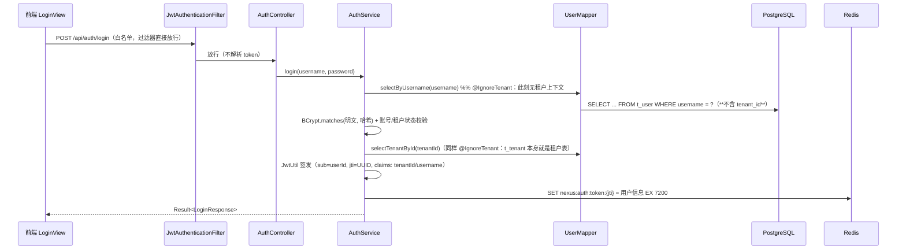
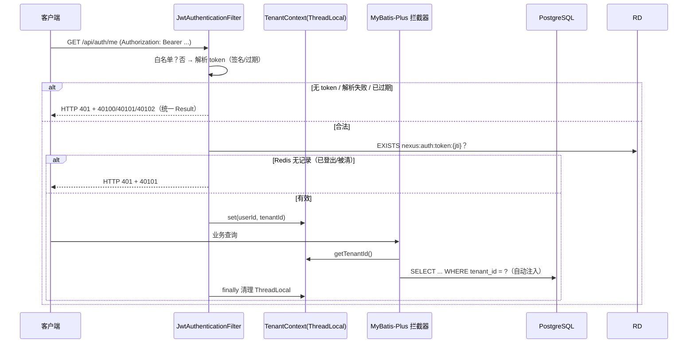

# 01 多租户与认证 — 本轮设计文档（阶段0 的 0.2 + 阶段1）

> 任务级别：**L1 阶段级** ｜ 状态：🚧 待确认（确认后编码） ｜ 对应任务：`docs/task/task.2+多租户认证.md`（阶段1）+ `docs/task/task.1+环境准备.md` 的 **0.2**（阶段0 唯一未开工项）
> 前置设计：`docs/design/00-环境与部署.md` —— **0.2 的引擎语义以该文档 §3 为准**（本文档只补「落地细节」，不重开已确认的设计）；阶段1 为新增设计。
> 验证方案见文末「验收对照表」，测试案例 TC-01 在编码后生成。
> 约定速记：docker/compose 全部运行在 WSL 发行版 `nexus-agent-workbench` 内；镜像加速走 `docker.m.daocloud.io` 前缀、不改 daemon.json；**未经实测的判据一律标注「待实测确认」**，不写成结论。

## 0. 本轮范围与为什么要连做

| 范围 | 来源 | 为什么必须连做 |
| --- | --- | --- |
| **0.2** db-patch 补丁工作流 | task.1 / 阶段0 | 阶段1 的 **1.3 多租户隔离** 与 **1.1 首条补丁** 都落在补丁上（`/db-patch` 目录当前**不存在**，`dbpatch/package-info.java` 仅占位）。不先建补丁链路，阶段1 的建表无处落地 |
| **1.1 ~ 1.5** 多租户 + 认证 | task.2 / 阶段1 | 阶段交付物 `/api/auth/login` + 前端登录页 |

阶段0 其余未完成项（0.3 的实机验收、0.4 的 2 项待验）**不在本轮范围**，见 §11 遗留清单。

---

## 1. 总体架构（本轮交付后的形态）

```mermaid
graph TD
    subgraph FE[前端 nexus-frontend]
        LV[LoginView 登录页] --> US[stores/user.ts<br/>token + 用户信息 + localStorage]
        US --> RQ[api/request.ts<br/>注入 Bearer / 401 自动登出]
        RG[router 守卫<br/>meta.public 白名单] --> US
    end

    subgraph BE[后端 nexus-start]
        F[JwtAuthenticationFilter<br/>OncePerRequestFilter] --> TC[TenantContext<br/>ThreadLocal]
        AC[AuthController<br/>/api/auth/*] --> AS[AuthService]
        AS --> UM[UserMapper]
        AS --> TM[TenantMapper]
        AS --> RD[(Redis<br/>登录态白名单)]
    end

    subgraph INFRA[nexus-infrastructure]
        TC --> TLH[TenantLineHandler<br/>自动注入 tenant_id]
        IT[IgnoreTenantAspect<br/>@IgnoreTenant 豁免] --> TC
        TLH --> MP[MyBatis-Plus 拦截器]
    end

    subgraph DBP[db-patch 工作流]
        PD[/db-patch/*.sql<br/>补丁唯一真源/] --> CLI[PatchCli<br/>零第三方依赖]
        CLI --> PG[(PostgreSQL 16 + pgvector)]
    end

    RQ -->|POST /api/auth/login| AC
    MP --> PG
```

**依赖方向不变**（父 POM 硬约束）：`common ← infrastructure ← module-system ← start`。本文档新增的类一律落在既有模块内，不新增模块。

---

## 2. 子任务 0.2 落地设计（引擎语义见 design 00 §3，本节只写新增决策）

### 2.1 up.sh 已固定的接口契约（**本设计必须适配它，不改脚本**）

`scripts/sh/up.sh` 第 4 步是三段式条件执行，已交付、已评审：

```bash
[ -d "${REPO}/db-patch" ]                                   # ① 目录存在？
compose run --rm -T --entrypoint sh builder -c "command -v db-patch-migrate"   # ② 命令在 PATH？
compose run --rm -T builder db-patch-migrate                                    # ③ 执行，非 0 即中止
```

→ 推出三条硬约束：**补丁目录在仓库根 `/db-patch`**、**`db-patch-migrate` 必须是 builder 容器 PATH 里的可执行命令**、**退出码必须如实反映成败**（up.sh 据此 `die`，后端不会被拉起）。

### 2.2 最终落地方案（**已实现**，2026-09-13）

本节最初在「builder 容器不挂载宿主源码、也没有源码」的前提下，比选过三条路（只读挂载 + javac 直跑 / Maven 现场解析 / 打进镜像）。随后 `CLAUDE.md` 的 builder 条目被改写为**容器内 git pull**，那个前提不复存在：

> 容器自己 clone 仓库 → **源码就在容器内的 `/workspace/repo`**，Maven 工具链也在手边。
> 于是「Java 代码从哪来、怎么编译」不再是个问题。

| 原备选 | 结局 |
| --- | --- |
| A 只读挂载源码 + `javac` 直跑 | ❌ **作废** —— 不再需要挂载源码（容器自己有 clone），`javac` 也不必现场跑 |
| B 迁移时跑 Maven | ⚠️ **部分采纳** —— 确实用 Maven 编译并解析 classpath，但**不用 `exec:java`**：它与 `System.exit` 交互会让退出码不可靠，而 up.sh 完全依赖退出码。改用 `java -cp` 直跑，由 `exec` 透传 |
| C 打进 builder 镜像 | ❌ **作废** —— 源码本就在容器内，无需"打进" |

**最终实现**（`docker-compose/builder/db-patch-migrate`，与镜像内其他入口脚本同一批）：

```sh
mvn -B -q -pl nexus-infrastructure -am -DskipTests install                      # 编译 + 装进本地仓库
mvn -B -q -pl nexus-infrastructure dependency:build-classpath \
    -Dmdep.outputFile="${CP_FILE}" -Dmdep.includeScope=runtime                   # 解析运行时 classpath
exec java -cp ".../nexus-infrastructure/target/classes:$(cat "${CP_FILE}")" \
     com.nexus.infrastructure.dbpatch.PatchCli --patch-dir="${PATCH_DIR}"
```

- **为什么先 `install` 再 `build-classpath`**：`install` 把 parent / common / infrastructure 一并装进本地仓库（走 `builder-m2` 卷），使第二条命令能**脱离 reactor 会话**独立解析 `nexus-common`；否则它只能从仓库找，而那儿还没有。
- **依赖缓存**：`builder-m2` 命名卷 → 第二次起是秒级，不会重复下载百 MB 级依赖。
- **`exec` 的意义**：java 的退出码直接成为脚本退出码，中间不经过任何包装。

### 2.3 builder 容器（compose 实测定义）

```yaml
  builder:
    image: nexus-builder:dev
    profiles: ["build"]          # 作用变了：不再是"运行期不常驻"，而是让裸 up -d 不拉起它
    restart: "no"
    command: ["sleep", "infinity"]   # 常驻但不干活，等着被 exec 进去
    environment:
      NEXUS_REPO_URL: ${NEXUS_REPO_URL:-https://github.com/KeanuCao/nexus-agent-workbench.git}
      NEXUS_REPO_BRANCH: ${NEXUS_REPO_BRANCH:-main}
      NEXUS_REPO_DIR: /workspace/repo
      NEXUS_ARTIFACT_DIR: /artifacts
      # ⚠️ 容器内端口 5432，不是 .env 的 PG_PORT（那是宿主映射端口）
      NEXUS_PG_HOST: postgres
      NEXUS_PG_PORT: "5432"
      NEXUS_PG_DB: ${PG_DB:-nexus}
      NEXUS_PG_USER: ${PG_USER:-nexus}
      NEXUS_PG_PASSWORD: ${PG_PASSWORD:-nexus123}
    volumes:
      - builder-src:/workspace            # 容器内的 git 工作区（不是宿主源码的映射）
      - builder-m2:/root/.m2/repository   # ⚠️ 必须是 /root/.m2/repository，挂 /root/.m2 会遮蔽 settings.xml
      - builder-npm:/root/.npm
      - build-artifacts:/artifacts        # ★ 产物共享目录
```

- **刻意不写 `depends_on: postgres`**：只有 `db-patch-migrate` 需要数据库，`build-backend` / `build-frontend` 不需要。绑上去会让"只想编译一下"也得先等 PG 就绪；真去跑迁移而 PG 没起时，脚本会以明确的连接错误退出。
- **本方案不需要 JDBC 驱动包**（原 §2.4 的 `libpostgresql-jdbc-java` 已作废）：驱动作为 `nexus-infrastructure` 的 runtime 依赖，由 Maven 一并解析进 classpath。

### 2.4 源码同步与「必须先 push」

`git-sync` 脚本（镜像内 `/usr/local/bin/git-sync`）：

```sh
git fetch --prune origin
git checkout --force --detach "origin/${NEXUS_REPO_BRANCH}"   # detached：构建工作区不做提交
git clean -fd                                                 # 清未跟踪文件，但保留 .gitignore 的产物
```

两个刻意的选择，都写在脚本注释里：

- **detached HEAD 而非分支**：这是构建工作区，永远不该在这里提交；detached 到 `origin/<branch>` 让每次同步的结果唯一确定。
- **`clean -fd` 而非 `-fdx`**：`-x` 会连 `target/`、`node_modules/` 一起删，等于每次同步都强制全量重建 —— 那是把增量构建的意义抹掉。

> **⚠️ 新架构最重要的一条工作流约束**：容器只能拿到**已 push 到远端**的提交。
> 宿主改了东西不 commit + push，构建出来的就是旧的。排查"我明明改了怎么没生效"时，第一件事是确认推没推。
>
> **约定工作流（2026-09-13 用户拍板）：先合并再构建。**
> 功能分支开发完 → 合并进 `main` → push → 构建。于是 `NEXUS_REPO_BRANCH` 恒为 `main`，
> 不需要跟着开发分支来回改（少一个"忘了改回来"的坑）。代价是**每次想构建都得先合并** ——
> 未合并的分支内容，容器一律看不到。

### 2.5 产物共享目录与"镜像不再自包含"

| 项 | 内容 |
| --- | --- |
| 共享卷 | `build-artifacts`，布局 `/artifacts/backend/app.jar`、`/artifacts/frontend/**` |
| 写入方 | builder 容器（`build-backend` / `build-frontend`，均**先写临时名再原子替换**，避免后端容器读到半个 jar） |
| 读取方 | `nexus-backend` → `/artifacts/backend/app.jar`（只读挂载）；`nexus-frontend` → nginx `root /artifacts/frontend`（只读挂载） |

**运行镜像退化为「JRE / nginx + 入口脚本」**，构建是秒级的。前端 `Dockerfile` / `nginx.conf` 的头部注释写明了两种**失败形态不同**，排查时别混淆：

- 后端：入口脚本预检 jar 存在性 → 缺失时**启动即崩**并打印三步手工修复命令；
- 前端：nginx 不会因 root 为空而拒绝启动 → 表现为**全部 404 + 容器 unhealthy**。

### 2.6 PatchCli 的硬约束（**已写进类注释**）

1. **零第三方编译期依赖**：只 import `java.*`。不做 Spring 容器装配（`@Component` / `@Autowired` 一律不用）。
   > 这条在旧方案里是**被 javac 直跑逼出来的**；新架构下不再是被迫，但仍然保留 ——
   > 引擎的行为不依赖任何框架的隐式约定，可以直接读、直接测。
2. **退出码分级**（不是笼统的"非 0"）：`0` 成功或全部幂等跳过 / `1` 参数或环境错 / `2` checksum 不一致 / `3` 乱序 / `4` SQL 执行失败 / `5` 连接失败 / `9` 未预期。
   up.sh 只判"非 0"，分级纯粹为**排查**服务：看到 `2` 就知道是补丁被改过，不用翻日志。
3. **连接凭据全部来自环境变量**（`NEXUS_PG_*`），不硬编码，与 `.env` 同源。
4. **`Statement` 而非 `PreparedStatement` 执行补丁 SQL**：一个补丁文件里通常有多条语句，而 JDBC 的扩展查询协议只允许单条；`Statement.execute` 走简单查询协议，支持多语句。
5. **checksum 前把 CRLF 归一化为 LF**（**这是对 design 00 §3.1"文件内容 SHA-256"的一处有意偏离**）。
   理由：本项目开发在 Windows、执行在 Linux 容器，行尾差异极易被误判成"补丁被篡改"，而它并非语义变更；归一化后任何**语义**改动仍会改变哈希，检测力不减。
   代价：checksum 不再等于 `sha256sum` 的直接输出，复现要用 `tr -d '\r' < 补丁.sql | sha256sum`。
6. **单事务包住"执行 SQL + 写记录"两件事**：只写了一半的迁移记录比没有记录更危险（下次迁移会以为它执行过了）。任一步失败即整体回滚。
7. **回滚失败不得盖掉主故障**：连接已断时 `rollback()` 自己会抛异常，用 `rollbackQuietly` 吞掉它并记日志，保证报出来的是"补丁 SQL 为什么错"。

### 2.7 语义重申（design 00 §3.3 的落地口径）

task.1 原文写「已执行补丁再次执行必须报错终止」，design 00 §3.3 已细化为三种情形，本轮按后者实现：

| 场景 | 行为 | 退出码 |
| --- | --- | --- |
| 补丁未执行过 | 单事务内执行 SQL + 写 `t_db_patch` 记录 | 成功 |
| 已执行、**checksum 一致** | **静默跳过**（正常重跑迁移的幂等行为） | 0 |
| 已执行、**checksum 不一致** | `log.error` 打印文件名与新旧 checksum → **终止迁移** | 非 0 |
| 文件名不匹配 `YYYYMMDDHHmm_描述.sql` | 警告并跳过（目录允许放说明文件） | 0 |
| 文件名时间戳**早于**已应用最大时间戳 | **终止**（乱序保护） | 非 0 |

---

## 3. 阶段1 关键设计决策

| # | 决策 | 备选 | 理由 / trade-off |
| --- | --- | --- | --- |
| D1 | **JWT 无状态 + Redis 白名单**：token 带 `jti`，Redis 存 `nexus:auth:token:{jti}` 作为"仍有效"的凭据，登出即 DEL | 纯 JWT 无状态 | 纯 JWT **无法登出/强制下线**（签发即有效到过期）。1.2 的验收明确要求「Token 与 Redis 联动，登出即失效」→ 必须白名单。代价：每请求一次 Redis 读（本机 <1ms），且 **Redis 不可用时鉴权 fail-closed**（全部 401），已在 §10 风险表登记 |
| D2 | **登录按 `username` 全局唯一**，不传租户编码 | 登录传 `tenantCode + username` | task.2 的 1.3 验收点名「`@IgnoreTenant` 场景（如**登录按 username 查用户**）可正确跳过」→ 设计即按全局唯一用户名的口径走：`t_user.username` 建全局唯一约束，登录时豁免租户条件查出用户，再用其 `tenant_id` 签发 token。代价：多租户下不同租户不能有同名用户（演示场景可接受，且是必须说清的取舍） |
| D3 | **多租户 fail-closed**：无租户上下文且未标 `@IgnoreTenant` 时，`TenantLineHandler` **抛异常**，而不是注入 `tenant_id IS NULL` 或放行 | ① 无上下文时返回 null（MP 会拼出 `tenant_id = null`）<br>② 无上下文时跳过条件 | ①/② 都是**静默漏租户**——一条忘记加豁免的查询会跨租户返回全表数据，而这正是多租户最危险的失效形态。fail-closed 把「漏标注解」从**数据泄露**降级为**启动即报错的 500**。取舍：`@IgnoreTenant` 漏标会让登录直接不可用（暴露得早，是优点） |
| D4 | **`@IgnoreTenant` 用自研注解 + AOP 切面**实现 | MyBatis-Plus 自带的 `@InterceptorIgnore(tenantLine="true")` | MP 那个是**通用插件总开关**（还能关分页、乐观锁），命名不表达"忽略租户"这一具体意图，颗粒度不可控。自研注解能带 `value()` 写**豁免原因**，并在切面里 `log.warn` **留痕**——"租户隔离的每一次破例都有审计记录"是面试可直接讲的点。代价：多一个 `spring-boot-starter-aop` 依赖 + 一个切面类 |
| D5 | **密码用 BCrypt**，只引 `spring-security-crypto`，**不引 `spring-boot-starter-security`** | ① 手写 SHA-256+盐<br>② 引完整 Security starter | ① 自研口令哈希是负面信号（加盐/迭代/时序安全都要自己兜）。② 引入 starter 会把**整个请求链**交给 Security 过滤器链（默认全拦截），与「自研 JWT 过滤器 + 五模块骨架」冲突，配置成本远大于收益。只取 `BCryptPasswordEncoder` 一个类是最小侵入 |
| D6 | **新增 `UnauthorizedException`**（HTTP 401），与 `BusinessException`（HTTP 200）并列 | 给 `BusinessException` 加 httpStatus 字段 | 前端 `request.ts` **已经**在 401 分支预留了「清 token + 跳登录」的钩子（现有代码 `if (status === 401)`），契约已经定了。把 HTTP 语义塞进业务异常会污染 `BusinessException` 的契约（它承诺"HTTP 200 + 业务码"）。新增一个与 `NOT_FOUND`(404) 同构的异常出口更干净 |
| D7 | **前端不引 `pinia-plugin-persistedstate`**，token 持久化在 store 内手写（localStorage，约 20 行） | 引持久化插件 | `frontend/node_modules` 已安装完毕，新增依赖需要联网 `npm install`；为一个「存一个字符串」的需求引插件不划算。逻辑收敛在单个 store 文件内，可读性不降 |
| D8 | **本阶段前端不引 Vitest/Playwright**，前端验收 = `npm run type-check` + 手工用例（见 TC-01） | 补齐前端测试框架 | 同上：需要联网装依赖。且 task.2 的 1.5 验收标准全是**交互行为**（登录跳转、401 登出），手工用例足以覆盖。**此项列为待确认**（§12） |

---

## 4. 数据库设计（补丁 2 条）

### 4.1 补丁清单

| 文件名 | 内容 | 对应子任务 |
| --- | --- | --- |
| `202609131000_初始化多租户基础表.sql` | ① `t_db_patch` 冗余引导建表 ② `CREATE EXTENSION IF NOT EXISTS vector` ③ `t_tenant` ④ 两个种子租户 | task.1 的 1.1（首条补丁规划）+ 1.3 |
| `202609131010_初始化用户表.sql` | ① `t_user`（含全局唯一用户名 + `tenant_id` 外键 + 索引）② 两个种子用户（每租户一个） | 1.3 |

> 时间戳按落地当日生成（`YYYYMMDDHHmm`），上表为**预计值**；两条补丁必须**按字典序**即时间序，且**一经提交不得再改**（checksum 机制会拦）。

### 4.2 `t_tenant`（tenant.1 只定最小集，字段级细节归本轮）

| 字段 | 类型 | 约束 | 说明 |
| --- | --- | --- | --- |
| `tenant_id` | BIGSERIAL | PK | 自增主键（MP 需配 `IdType.AUTO`，否则默认雪花 ID 与 BIGSERIAL 冲突） |
| `tenant_code` | VARCHAR(64) | NOT NULL UNIQUE | 人类可读租户标识（`default` / `demo`），供运维与未来「按租户编码登录」扩展 |
| `tenant_name` | VARCHAR(128) | NOT NULL | 租户名称（前端展示） |
| `status` | SMALLINT | NOT NULL DEFAULT 1 | 1=启用 0=停用（登录时校验） |
| `created_at` / `updated_at` | TIMESTAMPTZ | NOT NULL DEFAULT now() | 审计字段 |

### 4.3 `t_user`

| 字段 | 类型 | 约束 | 说明 |
| --- | --- | --- | --- |
| `user_id` | BIGSERIAL | PK | 同上，`IdType.AUTO` |
| `tenant_id` | BIGINT | NOT NULL，FK → `t_tenant`，**索引** | **多租户隔离字段**（`TenantLineHandler` 注入的就是它） |
| `username` | VARCHAR(64) | NOT NULL **UNIQUE（全局）** | 见 D2：登录的唯一检索键，故必须全局唯一 |
| `password` | VARCHAR(100) | NOT NULL | **BCrypt 哈希**（60 字符，留余量；明文一律不入库） |
| `nickname` | VARCHAR(64) | | 展示名 |
| `status` | SMALLINT | NOT NULL DEFAULT 1 | 1=启用 0=停用（登录时校验） |
| `created_at` / `updated_at` | TIMESTAMPTZ | NOT NULL DEFAULT now() | 审计字段 |

### 4.4 种子数据（阶段验收「预设租户账号」）

- 租户：`default`（默认租户）、`demo`（演示租户）。
- 用户：每租户一个，**供"两租户数据互不可见"的实测**（1.3 验收）。
- ⚠️ **密码哈希必须由 `BCryptPasswordEncoder` 真实生成后回填**，不得手写、不得编造。生成与校验方式：编码阶段生成 → **以登录接口实跑作为最终判据**（见 §9 验收对照表）。明文口令与哈希的对应关系记入 `docs/api/README.md` 的**开发态说明**（演示项目，非生产凭据）。

---

## 5. 接口契约（先落 `docs/api/README.md`，再落代码）

> 纪律：`docs/api/README.md` 是前后端唯一事实源，**先改文档再改代码**。本节为其增量摘要。

### 5.1 `POST /api/auth/login`

| 项 | 值 |
| --- | --- |
| 请求 | `{"username":"...","password":"..."}`（`consumes`/`produces` 均显式声明 `application/json`） |
| 鉴权 | **无**（白名单） |
| 成功 | HTTP 200 + `code=0`，`data` 见下 |
| 失败 | 用户名/密码错误 → HTTP **200** + `code=10100`；账号停用 → `10101`；租户停用 → `10102` |

```json
{
  "code": 0,
  "msg": "success",
  "data": {
    "token": "eyJhbGciOiJIUzI1NiJ9...",
    "tokenType": "Bearer",
    "expiresIn": 7200,
    "user": {
      "userId": 1,
      "username": "admin",
      "nickname": "默认管理员",
      "tenantId": 1,
      "tenantCode": "default",
      "tenantName": "默认租户"
    }
  }
}
```

- **`msg` 对失败原因不区分颗粒度**：用户名不存在与密码错误**统一回**「用户名或密码错误」（防用户枚举）。这条要写进契约，前端不得据此文案做分支。

### 5.2 `POST /api/auth/logout`

| 项 | 值 |
| --- | --- |
| 请求 | 无 body |
| 鉴权 | **需要** `Authorization: Bearer <token>` |
| 成功 | HTTP 200 + `code=0`、`data=null`（Redis 中该 `jti` 立即失效） |
| 失败 | 无 token / 已失效 → HTTP **401** + `40100/40101` |

### 5.3 `GET /api/auth/me`

| 项 | 值 |
| --- | --- |
| 鉴权 | 需要 token |
| 成功 | HTTP 200 + `data` = 5.1 里的 `user` 对象 |
| 为什么需要 | D1 选了 Redis 白名单 → **本地存有 token 不等于服务端仍认**（可能在别处登出、或 Redis 被清）。前端刷新页面后调它做一次真实校验，避免"假登录态"。这也是 1.5「无 Token 访问受保护页跳转登录」之外的第二道闸 |

### 5.4 错误码增量（**不复用既有值**，编码分段沿用 design 00 §1.3）

| code | 常量 | HTTP | `msg` | 归属 |
| --- | --- | --- | --- | --- |
| 10100 | `LOGIN_FAILED` | 200 | 用户名或密码错误 | 1xxxx 业务 |
| 10101 | `ACCOUNT_DISABLED` | 200 | 账号已停用，请联系管理员 | 1xxxx 业务 |
| 10102 | `TENANT_DISABLED` | 200 | 租户已停用，请联系管理员 | 1xxxx 业务 |
| 40100 | `UNAUTHENTICATED` | 401 | 未登录，请先登录 | 4xxxx 请求侧 |
| 40101 | `TOKEN_INVALID` | 401 | 登录状态无效，请重新登录 | 4xxxx 请求侧 |
| 40102 | `TOKEN_EXPIRED` | 401 | 登录已过期，请重新登录 | 4xxxx 请求侧 |

- `40101` / `40102` 分开的理由：过期可以引导用户"重新登录即可"，而**无效**（伪造/签名错/Redis 无记录）是异常信号，前端提示语不同、排查方向也不同。
- `GlobalExceptionHandler` 增加一个 `UnauthorizedException` 出口（HTTP 401 + 对应 code），**不打堆栈、warn 级别**，与 `BusinessException` 的处理风格一致。

---

## 6. 后端实现结构

### 6.1 新增/改动文件清单

```
backend/
├── pom.xml                                   [改] dependencyManagement 增 jjwt（Boot BOM 不覆盖）
├── nexus-common/
│   ├── result/ResultCode.java                [改] 追加 §5.4 的 6 个错误码
│   └── exception/UnauthorizedException.java  [新] 与 BusinessException 并列（D6）
├── nexus-infrastructure/
│   ├── pom.xml                               [改] +jjwt(api/impl/jackson) +spring-boot-starter-aop +spring-boot-starter-data-redis
│   └── src/main/java/com/nexus/infrastructure/
│       ├── tenant/TenantContext.java         [新] ThreadLocal：userId/tenantId + 豁免计数
│       ├── tenant/TenantLineHandlerImpl.java [新] 注入 tenant_id；fail-closed（D3）
│       ├── tenant/IgnoreTenant.java          [新] @IgnoreTenant(value="原因")（D4）
│       ├── tenant/IgnoreTenantAspect.java    [新] 切 Mapper，压/弹豁免栈 + log.warn 留痕
│       ├── config/MybatisPlusConfig.java     [新] 装配 TenantLineInnerInterceptor
│       ├── security/JwtProperties.java       [新] nexus.jwt.* 配置绑定
│       ├── security/JwtUtil.java             [新] 签发/解析/校验（jjwt）
│       ├── security/JwtAuthenticationFilter.java [新] OncePerRequestFilter
│       ├── security/TokenStore.java          [新] Redis 白名单（StringRedisTemplate）
│       └── dbpatch/PatchCli.java             [新] 迁移入口（零第三方依赖，§2.6）
├── nexus-module-system/
│   ├── pom.xml                               [改] +spring-security-crypto（仅 BCrypt，D5）
│   └── src/main/java/com/nexus/module/system/
│       ├── entity/{Tenant,User}.java         [新] @TableName + @TableId(AUTO)
│       ├── mapper/{TenantMapper,UserMapper}.java [新] UserMapper#selectByUsername 标 @IgnoreTenant
│       ├── dto/{LoginRequest,LoginResponse,UserInfoVO}.java [新]
│       ├── service/AuthService.java + impl   [新] 登录/登出/取当前用户
│       └── controller/AuthController.java    [新] /api/auth/*
└── nexus-start/
    ├── resources/application.yml             [改] +nexus.jwt.*、+mapper SQL 日志、+MP 配置
    └── handler/GlobalExceptionHandler.java   [改] +UnauthorizedException 出口
```

**`nexus-start` 的 `scanBasePackages = "com.nexus"` 已就位**，无需改动；另需在某个配置类上加 `@MapperScan("com.nexus.**.mapper")`（MyBatis-Plus 的 Mapper 需显式扫描）。

### 6.2 登录时序



### 6.3 受保护请求的鉴权 + 租户注入



**ThreadLocal 必须在 `finally` 清理** —— 线程池复用下不清理会造成「上一个请求的租户串到下一个请求」，这是多租户最隐蔽的事故形态，写进 `TenantContext` 的类注释。

### 6.4 白名单（可配置）

`nexus.security.whitelist`（默认值）：`/api/auth/login`、`/api/health`、`/actuator/**`。
理由：`/api/health` 是容器与脚本的探活口（**0.3 的三个脚本都在调它**，加了鉴权会全线 FAIL）；`/actuator/**` 是 compose healthcheck 的探活口。
**除白名单外一律需要 token** —— 默认拒绝，不默认放行。

---

## 7. 前端实现结构

| 文件 | 动作 | 要点 |
| --- | --- | --- |
| `src/api/auth.ts` | 新 | `login` / `logout` / `getCurrentUser`，复用 `request<T>` 解包 |
| `src/stores/user.ts` | 新 | token + 用户信息；`login` / `logout` / `restore`；**手写 localStorage 读写**（D7），读取一律 try/catch（隐私模式/被清站点数据下不能崩） |
| `src/api/request.ts` | 改 | ① 请求拦截器注入 `Authorization: Bearer`（**在拦截器函数体内**取 store，避免模块级循环依赖）② 401 分支接上既有的 TODO：清 store + `router.push({path:'/login', query:{redirect}})`，并加**防抖**（并发多请求同时 401 只跳一次） |
| `src/router/index.ts` | 改 | 守卫接上既有的 TODO：`!userStore.token && !to.meta.public` → 跳 `/login?redirect=`；**已登录访问 `/login` 直接回控制台** |
| `src/views/LoginView.vue` | 改 | 表单 + 非空校验 + 提交中禁用 + 错误提示（用 `toDisplayMessage`）；成功后跳 `query.redirect` 或 `/dashboard` |
| `src/components/AppNav.vue` | 改 | 登录态显示当前用户 + 租户名 + 「退出登录」；未登录显示「登录」；`/login` 改为不占菜单位或仅在未登录时出现 |

**循环依赖**：`request.ts ⇄ stores/user.ts ⇄ api/auth.ts` 是经典环。约定：`request.ts` **不在模块顶层 import store**，只在拦截器回调内按需 `useUserStore()`；router 跳转在 401 分支内 `import router from '@/router'`（router 不反向依赖 store 的顶层，仅在守卫内调用）。

---

## 8. 测试案例与自动化测试

- **`docs/test-cases/TC-01.md`**：按 task.2 的 15 条验收标准逐条展开（前置条件 / 步骤 / 预期 / 实测记录栏）。
- **后端单元测试**（`backend/*/src/test`，JUnit 5 + Mockito）：
  - `JwtUtilTest`：签发→解析回环；过期；篡改签名；**`parse` 对伪造 token 必须抛异常而非返回 null**
  - `TenantContextTest`：设置/读取/清理；**豁免栈的压弹配平**（嵌套与异常路径下都不能泄漏）
  - `AuthServiceTest`（Mockito）：用户不存在 / 密码错 / 账号停用 / 租户停用 / 正常登录（断言签发了 token 且写入了 Redis）
  - `JwtAuthenticationFilterTest`：无 token / 伪造 / 过期 / Redis 无记录 四条 401 路径 + 白名单放行路径
- ⚠️ **`qa-engineer` 仍在「规划中」**（CLAUDE.md 状态）→ 上述测试由本轮编码一并交付；等 qa-engineer 就位后再按 TC-01 复核补齐。
- ⚠️ **`docs/test-cases/` 目录当前不存在**，连 task.1 要求的 **TC-00 也未生成** —— 属阶段0 的文档债，见 §11。

---

## 9. 验收对照表（逐条对应 task.2 与 task.1 的 0.2 原文）

| # | 验收标准（原文） | 验证方式 |
| --- | --- | --- |
| 0.2-1 | 未执行补丁按文件名排序依次应用 | **在一次性沙箱库上从零重放真实补丁目录**，比对 `t_db_patch.file_name` 顺序与目录字典序（2026-09-17 订正：原文「清空 `t_db_patch` 与业务表后重跑」已废 —— 删业务表不算无害，见 `docs/design/00-环境与部署.md` §7 与 TC-00 §2） |
| 0.2-2 | 已执行补丁再次执行报错终止（checksum + 记录表幂等保护） | ① 重跑迁移 → 全部跳过、退出码 0；② **篡改一个已应用补丁的字符**（实测用 `qa/fixtures/db-patch/` 的探针补丁，不碰业务补丁）→ 迁移**报错终止（退出码非 0）**并打印新旧 checksum |
| 0.2-3 | 涉及表结构变更一律新增补丁，严禁改历史补丁 | 评审约定 + 上条 checksum 机制兜底 |
| 1.1-1 | 所有 API 返回 `Result<T>`（code/msg/data） | `curl` 逐个接口核对；含 401 出口 |
| 1.1-2 | 全局异常不返回堆栈；业务异常可展示、系统异常记日志 | 触发 `BusinessException`（密码错）与 `SystemException`（停 PG）各一次，核对响应体 |
| 1.1-3 | 无 `*` 导入、无 Python 风格命名 | 静态检查：`grep -rn "import .*\*;"` → 0 命中；`_` 作标识符 → 0 命中 |
| 1.2-1 | 无 Token / 过期 / 伪造 Token 返回 401 统一格式 | 三条路径各 `curl` 一次，核对 HTTP 401 + `code` + `Result` 结构 |
| 1.2-2 | 合法 Token 放行，后续接口可取到当前用户与租户 | `GET /api/auth/me` 返回的 userId/tenantId 与 token 一致 |
| 1.2-3 | Token 与 Redis 联动，登出即失效 | 登出后**用同一个 token** 再调 `/api/auth/me` → 必须 401 |
| 1.3-1 | 任何查询自动带 `tenant_id` 条件（**SQL 日志可见**） | `logging.level.com.nexus.module.system.mapper: debug` → 日志出现 `WHERE ... tenant_id = ?` 且参数为当前租户 |
| 1.3-2 | 两个租户的数据互不可见 | 用租户 A 的 token 查用户列表 → **只能看到 A 的用户**；换 B 的 token 复跑 |
| 1.3-3 | `@IgnoreTenant` 场景（登录按 username 查用户）可正确跳过 | 登录日志里的 SQL **不含** `tenant_id` 条件；且登录成功本身即证明（fail-closed 下若豁免失效会直接 500） |
| 1.4-1 | 正确账号密码返回 Token | `curl` 登录 → 200 + `code=0` + `data.token` 非空 |
| 1.4-2 | 密码错误返回业务错误码（`BusinessException`），不抛堆栈 | 200 + `code=10100`，响应体无 `Exception`/堆栈字样 |
| 1.4-3 | 返回的 Token 可访问受保护接口 | 拿 token 调 `/api/auth/me` → 200 |
| 1.5-1 | 登录成功进入控制台 | 浏览器：登录 → 落在 `/dashboard`，导航栏显示用户名与租户 |
| 1.5-2 | 无 Token 访问受保护页跳转登录 | 清 localStorage 后直访 `/dashboard` → 跳 `/login?redirect=/dashboard` |
| 1.5-3 | 401 自动登出 | 在控制台手动把 localStorage 的 token 改坏 → 触发任一受保护请求 → 自动回登录页且 token 被清 |
| **阶段** | 预设租户账号登录成功拿到 Token，前端进入控制台 | 上述 1.4-1 + 1.5-1 的组合实测 |
| 0.3/0.4 回归 | **不得破坏既有交付物** | `/api/health` 仍 200 且三项 UP；`check-health.sh` 复跑无新增 FAIL（**白名单是这条的保障**） |

> **实机验证排在 18:00 之后**（重活：镜像重建 + Maven 全量构建）；编码与静态检查不受此限。

---

## 10. 风险清单

| # | 风险 | 影响 | 应对 |
| --- | --- | --- | --- |
| 1 | **Redis 不可用 → 全员 401**（D1 的 fail-closed 副作用） | 环境半挂时表现为"谁都登不进" | 明确写进契约与 TC：鉴权依赖 Redis 是**有意**的设计；README/C 层排查顺序写明「先看 `checks.redis`」 |
| 2 | `libpostgresql-jdbc-java` 包名/落地路径与预期不符 | 迁移脚本拿不到驱动 | 脚本 glob 兜底 + 缺失时**明确报错**（不静默继续）；落地实测后回填本文档 §2.4 |
| 3 | AOP 切面对 MyBatis Mapper（JDK 动态代理）不生效 | `@IgnoreTenant` 失效 → 登录直接 500（fail-closed 会把问题暴露得早） | 切点写成 `execution(* com.nexus..mapper..*(..))` + 反射读注解（不依赖 `@annotation` 对接口方法的匹配语义）；上单元测试 + 登录实测双保险 |
| 4 | `javac` 现场编译耗时/失败 | 迁移失败 → up.sh 中止 | PatchCli 保持单文件零依赖；失败信息区分「编译失败」与「运行失败」 |
| 5 | 种子密码哈希与口令不匹配 | 登录必失败 | 哈希由 `BCryptPasswordEncoder` 生成；**以登录实跑为最终判据**（§4.4） |
| 6 | jjwt 版本臆测 | 构建失败 | 落地时以 Maven Central 实际存在版本为准；本文档版本号标注「待实测」 |
| 7 | builder 服务新增挂载改变既有行为 | 影响 0.1 已验收项 | 挂载**只读**且仅 builder（profiles 隔离、run --rm）；up.sh 第 2/4 步复跑验证 |

---

## 11. 本轮不做的（防止范围蔓延）+ 阶段0 遗留清单

**本轮明确不做**：
- `/api/auth/me` 之外的任何用户管理接口（增删改查、角色、菜单）—— 阶段1 目标只有「跑通登录」。
- 前端 Vitest/Playwright（见 D8，待确认）。
- 刷新 token / 滑动续期 / 记住我（TTL 固定 2h，写在取舍里）。
- `t_tenant` / `t_user` 的写入接口（种子数据由补丁落库；MP 自动填充 `MetaObjectHandler` 留到有写入需求时再加）。

**阶段0 遗留（本轮不碰，但必须记录）**：
| # | 遗留项 | 出处 |
| --- | --- | --- |
| 1 | **`docs/test-cases/TC-00.md` 未生成** —— 目录本身不存在，与 CLAUDE.md「每阶段必须生成 TC」相悖 | task.1 要求 |
| 2 | 0.3 的 5 项待实机验收（up.sh 九步端到端、check-env 负路径、双侧端口留档、前端 WARN 归零、healthy→unhealthy 耗时） | task.1 0.3 现状表 |
| 3 | 0.4 的 2 项待验（`npm run dev` 启动、停 ollama 后 check-health 的 FAIL 路径） | task.1 0.4 现状表 |
| 4 | `data.timestamp` 时区写法两侧不一致（文档 `+08:00` vs 实际 `Z`） | task.1 待确认事项 1 |

---

## 12. 待你确认的事项

| # | 事项 | 备选 | 我的建议 |
| --- | --- | --- | --- |
| 1 | **前端测试框架**（D8） | (a) 本阶段不引，手工用例；(b) 本轮补 Vitest + Vue Test Utils | **(a)** —— 需联网装依赖，且 1.5 的验收全是交互行为。若你要在简历上说"前端有单测"，那选 (b) |
| 2 | **种子用户明文口令** | 由你定，或我取 `admin123` / `demo123`（演示项目、随仓库提交） | 取简单可记的演示口令，并在契约文档里写明"仅 dev" |
| 3 | **`t_user.username` 全局唯一**（D2 的直接后果：多租户不能重名） | (a) 全局唯一（本设计）；(b) `(tenant_id, username)` 联合唯一 + 登录传租户编码 | **(a)** —— task.2 的 1.3 验收点名了"登录按 username 查用户"，(b) 会让那条验收失去着力点 |
| 4 | **JWT 有效期** | 2h / 8h / 24h | **2h**（演示够用，且便于演示"过期→401→重新登录"） |
| 5 | **是否连做 0.3/0.4 的遗留验收** | 本轮不碰 / 顺手清掉 | **本轮不碰**（先把登录链路打通，遗留项单独一轮） |

---

## 13. 变更记录

| 日期 | 变更 | 说明 |
| --- | --- | --- |
| 2026-09-13 | 首版 | 0.2 落地设计（迁移入口选型 A）+ 阶段1 全量设计（D1~D8 决策、补丁 2 条、接口 3 个、错误码 6 个） |
| 2026-09-13 | **§2 整节重写** | `CLAUDE.md` 的 builder 条目被改写为「容器内 git pull + 手工启停 + 产物落共享目录」，§2.2 的三选一前提消失。原选型 A（只读挂载 + javac 直跑）与 C（打进镜像）**均作废**；B 部分采纳（用 Maven 编译与解析 classpath，但**不用 `exec:java`**，改 `java -cp` 直跑以保退出码保真）。§2.3~§2.5 换成实测的 compose 定义、git-sync 策略与共享目录方案 |
| 2026-09-13 | **新增决策 D9** | 产物分发走**共享命名卷**而非镜像层：builder 写、前后端只读挂载。代价是运行镜像不再自包含（裸 `up -d` 不再可靠），收益是改代码不必重建镜像。**该决策由用户直接写入 `CLAUDE.md`，非本设计推导** |
| 2026-09-13 | PatchCli 新增 5 条硬约束 | 退出码分级（非笼统"非 0"）；`Statement` 而非 `PreparedStatement`（多语句）；CRLF 归一化后再算 checksum；单事务包住"执行+记录"；回滚失败不得盖掉主故障。详见 §2.6 |
