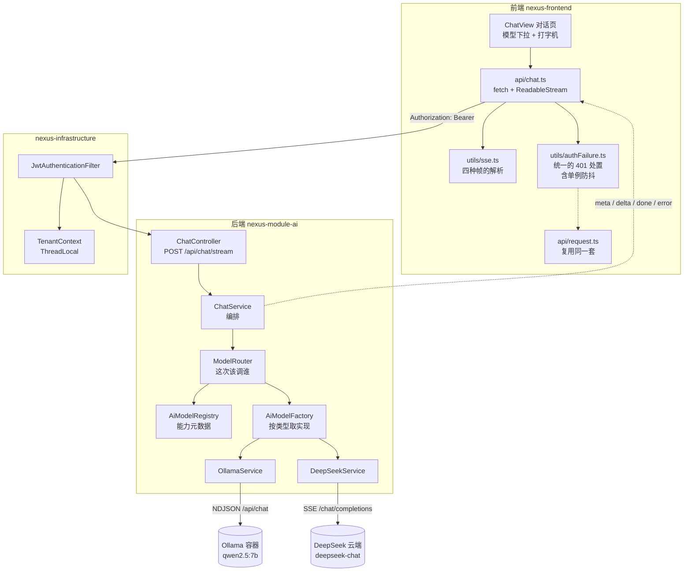
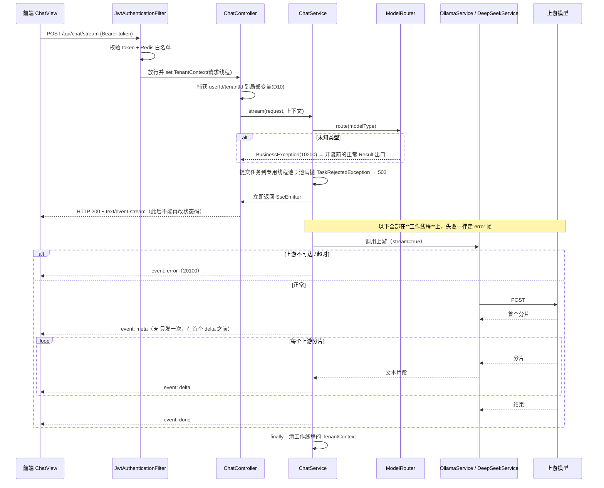

# 02 统一 AI 网关 — 阶段2 设计文档

> 任务级别：**L1 阶段级** ｜ 状态：🚧 待确认（确认后编码） ｜ 对应任务：`docs/task/task.3+统一AI网关.md`
> 前置设计：`docs/design/01-多租户与认证.md`（鉴权过滤器 / 白名单 / 租户上下文 / 错误码分段）——本文档**不重开**已确认的决策，只做增量。
> **本版已按三份开工前评审（前端 / 后端 / devops）全面修订**，处置对照见 §0.1；评审留档在 `docs/agent-log/20260918-阶段2设计评审-*.md`。
> 约定速记：**未经实测的判据一律标注「待实测确认」**，不写成结论（沿用 01 的纪律）。

## 0. 本轮范围

| 范围 | 来源 | 交付物 |
| --- | --- | --- |
| 2.1 模型服务抽象与实现 | task.3 | `AiModelService` 接口 + `OllamaService` + `DeepSeekService` |
| 2.2 工厂模式动态切换 | task.3 | `AiModelFactory`（按 `modelType` 取实现）+ 模型注册表 |
| 2.3 SSE 流式输出接口 | task.3 | `POST /api/chat/stream`（`SseEmitter`） |
| 2.4 前端对话页 | task.3 | 对话页 + 模型下拉 + `fetch` 流式读取 + 打字机渲染 |

**阶段交付物**：`/api/chat/stream` 接口 + 前端对话页
**阶段验收标准**（task.3 原文）：选择「本地 Qwen」走 Ollama、选择「云端 DeepSeek」走 DeepSeek，均能实时打字机输出。

阶段1 的实机联调遗留、阶段0 的剩余验收**不在本轮范围**。

### 0.1 开工前评审的处置（2026-09-20）

三份评审共提 **11 个 🔴**。逐条处置如下 —— 本版文档已是处置后的状态：

| 来源 | 评审发现 | 处置 |
| --- | --- | --- |
| 后端 🔴1 | `SseEmitter` 属 `spring-webmvc`，module-ai 类路径够不着 → 编译失败 | §4.1 pom 显式加 `spring-web` + `spring-webmvc` |
| 后端 🔴2 | module-ai 无测试依赖 → §7 的单测编不过 | §4.1 pom 加 `spring-boot-starter-test`(test) |
| 后端 🔴3 | 全仓无 Bean Validation，`@NotBlank` 编译不过；且 Boot 3 不带 hibernate-validator 会**静默失效** | §4.1 引 `spring-boot-starter-validation`(nexus-start) + `jakarta.validation-api`(module-ai, provided) |
| 后端 🔴4 | **降级链在四处互相矛盾** | **用户拍板：本轮不做**，整体归入 §10.1 演进方向 |
| 后端 🔴5 | §3.3 的「开流前 503」与 §4.2 时序图形而上学冲突 | **用户拍板：全异步**，开流后失败统一走 `event: error`；§3.3 表重写 |
| 前端 🔴1 | 契约文档未落地就不能开工 | §6.7 明确前置；`docs/api/README.md` §6 + `openapi.yaml` **先落再编码** |
| 前端 🔴2 | `fetch` 漏 `Content-Type` → 第一条请求就 415 | §5.1 坑列表补齐 |
| 前端 🔴3 | §3.5 的 curl 写 8080，真实是 8089（**同一文档内部矛盾**） | §3.5 改为从 `.env` 取端口 |
| 前端 🔴4 | UTF-8 多字节字符被分片切断 → **静默乱码** | §5.1 坑列表 + `{stream:true}` 写死 |
| 前端 🔴5 | §5 清单漏 `request.ts`，而两处要求"复用"它未导出的内部 | §5 文件表加 `request.ts [改]` + `utils/authFailure.ts` |
| devops 🔴1 | §6.0 第 0 步「commit+push」不完整，**未合并分支会让构建静默用旧代码** | §6.0 第 0 步补"确保提交在 `NEXUS_REPO_BRANCH` 上"+ 判据 |

另有 20 余条 🟡/🟢 一并修订（帧协议边界、资源释放、超时拆分、nginx/Vite 两条链路、`.env.local` 创建步骤等），不逐条列举。

---

## 1. 总体架构



**依赖方向**（父 POM 硬约束）：`common ← infrastructure ← module-ai ← start`。本文档新增的类一律落在 `nexus-module-ai` 的 `com.nexus.module.ai.gateway` 包（`nexus-module-ai/README.md` 已约定该包名），**子包 `config` / `controller` / `dto` / `impl` 都挂在这个包下**，不新增模块。

> ⚠️ **`nexus-module-ai` 看不到 `nexus-start`**：健康探针 `OllamaProbe` 在 `nexus-start`，网关**够不着它**。同理 `SseEmitter` 所属的 `spring-webmvc` **不会**经 `nexus-infrastructure` 传递过来（它只声明了 `spring-web`）—— 必须由 module-ai 自己声明（§4.1）。

---

## 2. 关键设计决策

| # | 决策 | 备选 | 理由 / trade-off |
| --- | --- | --- | --- |
| **D1** | **HTTP 客户端用 Spring 6.1 `RestClient`**；**流式读取走 `exchange(ExchangeFunction)`，在回调内部逐行读**，绝不在回调返回后再读 | ① OkHttp ② JDK `HttpClient` ③ WebClient | 项目已有先例（`OllamaProbe` 类注释写明「不引入 OkHttp/WebClient 等重量级依赖」），一个项目两套 HTTP 客户端是坏味道。**⚠️ 本决策初版写错了 API**：`RestClient` **没有** `RestTemplate` 那套 `execute(requestCallback, responseExtractor)`，它唯一的原始响应入口是 `exchange(ExchangeFunction)` —— 实施时由 backend-engineer 在源码中核实后订正（见 §12 变更记录）。**为什么必须"在回调内读"（已源码级核实，非推断）**：① `DefaultRestClient.exchangeInternal` 在回调返回后的 `finally` 里才 `close()`；② 而 `SimpleClientHttpResponse.close()` 会调 `StreamUtils.drain(responseStream)` —— **把剩余响应读空再关**。所以回调之后再读不是"可能已失效"，而是**必定读到一条已被 drain 到 EOF 的流**（症状是"一个字都没有"而非"分片不连续"，极易误判成上游没返回）。在回调内读则无论 Spring 关不关都安全。**代价**：写法比 OkHttp 啰嗦。**仍待实测确认**：JDK `HttpURLConnection` 是否真**增量**交付分片（"流在不在"已解决，"是否分片到达"未解决）—— 判据见 §8 的 2.3-1；退路是换 JDK `HttpClient`（同样零依赖） |
| **D2** | **不引 Spring AI**，自研 `AiModelService` + 策略/工厂 | Spring AI 的 `ChatModel` / `ChatClient` | 阶段2 的**交付物本身就是「工厂 + 策略模式」**（task.3 的 2.1/2.2）。引 Spring AI 等于把要展示的东西换成框架自带实现。**代价**：流式解析、消息体拼装自己写（Ollama 与 DeepSeek 各约 60~80 行）。阶段3 RAG 若 pgvector 集成成本过高可重新评估（那时是引其 **VectorStore**，不影响本层抽象） |
| **D3** | **SSE 而非 WebSocket** | WebSocket / 长轮询 / 一次性响应 | 对话是「一次提问 + 一段流式回答」，数据流**单向**。SSE 是普通 HTTP 响应（任何代理都放行）、后端 `SseEmitter.send()` 一行；WebSocket 要 Upgrade 握手 + 独立协议栈 + nginx 额外配置。**取舍**：SSE 只支持 UTF-8 文本、不支持二进制。**这是面试必答项** |
| **D4** | **每帧仍是一个完整的 `Result<T>`**，事件名只用于分发 | ① 裸文本帧 ② 只给 delta 发裸文本 | CLAUDE.md 要求「所有 API 返回 `Result<T>`」，而流式接口的响应体是事件流。本决策**不是开例外，而是把统一响应体搬进事件帧**：`event: delta` 的 `data` 就是 `{"code":0,"msg":"success","data":{...}}`，前端复用同一套解包/成功判定。**代价**：每帧多约 40 字节信封，长回答几千帧即几十 KB —— 演示规模可接受。⚠️ **连带代价**：备选②（delta 发裸文本）一旦启用，§3.2 的「换行不需要转义」这条前提立刻失效（见 §5.1-5），届时必须重做解析器 |
| **D5** | **路由与调用分离**：`ChatService`（编排）→ `ModelRouter`（选谁）→ `AiModelService`（怎么调） | 全塞进 `ChatService` 里 `if (modelType == ...)` | 这是为**「后端自动选模型」预留的那一刀**（§10.1）。分开后自动路由 = **新增一个 `ModelRouter` 实现**，provider 与前端一行不动。**代价**：本轮多一个接口 + 一个实现类（约 30 行），是**刻意预留，不是过度设计** |
| **D6** | **`modelType` 可空**；`null` = 交给后端决定（本轮解析为默认模型） | 必填 | 契约向后兼容。**这是四个预留里唯一"以后要改就得动前端"的点** —— 留了它，自动路由上线时前端只需在下拉加一个「自动」选项。（§10.1 缝①） |
| **D7** | **本轮不做降级链**：用户选了哪个模型就调哪个，失败即如实报错（`event: error` + `20100`） | ① 试错降级（首个分片前失败则换备用模型） ② 前置健康检查后决定 | **用户在 2026-09-20 拍板选"不做"**。核心理由：做降级会引入一个**会骗过验收**的失效形态 —— 没配 `DEEPSEEK_API_KEY` 时选「云端 DeepSeek」会被静默改用本地 Qwen，于是验收 2.2-1（`meta.model` 必须是 `deepseek-chat`）以"看着跑通了其实是本地模型"的方式**假通过**。且 task.3 的范围只是「对话无阻碍」。**归入 §10.1 演进方向**。另：`OllamaProbe` 在 `nexus-start`、module-ai 够不着，所以"前置健康检查"这条路本来也不通 |
| **D8** | **同步阻塞调用 + 专用有界线程池**，不用 WebFlux | WebFlux / 虚拟线程 | 项目是 Spring MVC + MyBatis-Plus 的**阻塞式栈**，为一条接口引 WebFlux 会把两套编程模型混在一个应用里。Java 17 没有虚拟线程。**代价**：每个进行中的流占**一个我们自己的池线程**直到结束（注意：Tomcat 的请求线程在 `SseEmitter` 返回后即被释放，被占用的是本池），池大小即并发流上限（取 `16`），**池满时明确拒绝并返回 503**（`AbortPolicy` + 捕获 `TaskRejectedException`），而不是排进无界队列（无界队列 + 长连接 = 内存慢性泄漏） |
| **D9** | **本阶段不落库**：多轮上下文由前端持有 `messages` 数组、每次全量上送 | 建 `t_chat_message` 表持久化 | task.3 的范围不含会话管理。无状态后端让本阶段零 DB 补丁；契约**已经**是 `messages` 数组，将来落库不必改前端。**代价**：刷新页面即丢上下文 —— **前端必须给用户一句提示**（§5.4），否则用户以为记录坏了 |
| **D10** | **租户/用户上下文显式透传到工作线程** | 依赖 `ThreadLocal` 自动可见 | **已核实成立**：`TenantContext` 是纯 `ThreadLocal`、过滤器在 `finally` 里 `clear()`、跨线程绝不可见 → 工作线程里**必然没有**租户上下文。在 D3(fail-closed) 的既有设计下，那里任何一次数据库访问都会**直接抛异常**。**本阶段聊天链路不访问数据库，所以这个坑本轮不会自曝**；但它是阶段3 RAG 的必经之路，届时会表现成一个没有上下文的 500。现在做成本约 10 行。**待实测确认**：`JwtAuthenticationFilter` 的 `clear()` 究竟在**控制器返回 emitter 时**执行，还是在**异步完成之后**由容器线程执行（Servlet 异步语义下过滤器链是被挂起的，后者更可能）—— 若为后者，被污染的是**容器线程池**而非工作线程，阶段3 的排查方向不同。判据：`finally` 里打一行带线程名的日志，跑一次 `/api/chat/stream` 对比时序 |

---

## 3. 接口契约（**先改 `docs/api/README.md` §6 + `openapi.yaml`，再改代码**）

> 纪律同 01：`docs/api/README.md` 是前后端唯一事实源，**先改文档再改代码**。本节为其增量摘要 —— **摘要不等于契约**，两者必须一致。

### 3.1 `POST /api/chat/stream`

| 项 | 值 |
| --- | --- |
| URL | `/api/chat/stream`（前端 `baseURL='/api'` + `url='/chat/stream'`） |
| Method | `POST`（消息内容在 body，不进 URL/访问日志；`EventSource` 只能 GET，这也是前端不用它的原因之一，见 §5.3） |
| `consumes` | `application/json`（显式声明，CLAUDE.md 硬要求） |
| `produces` | `text/event-stream`（显式声明） |
| 鉴权 | **必需** `Authorization: Bearer <token>`。**不加白名单** |
| 成功 | HTTP **200** + `Content-Type: text/event-stream` + 事件流（§3.2） |

请求体：

```json
{
  "messages": [
    { "role": "user",   "content": "你好" },
    { "role": "assistant", "content": "你好！有什么可以帮你的？" },
    { "role": "user",   "content": "介绍一下你自己" }
  ],
  "modelType": "OLLAMA"
}
```

| 字段 | 类型 | 必填 | 说明 |
| --- | --- | --- | --- |
| `messages` | array | 是 | 会话历史**全量上送**（D9 无状态）。至少 1 条，最后一条必须是 `role=user` |
| `messages[].role` | string | 是 | `user` / `assistant`（本阶段不支持 `system`） |
| `messages[].content` | string | 是 | 非空、去空白后非空 |
| `modelType` | string | **否** | `OLLAMA` / `DEEPSEEK`；**`null` 或缺省 = 由后端决定**（D6，本轮解析为 `nexus.ai.default-model`）。未知取值 → `10200` |

**三条补充约束**（评审补充，原版没写）：

1. **允许连续同角色**。失败或停止后前端若回滚该轮 assistant 消息，数组会以 `role=user` 结尾，下一次提问再 push 一条 `user` 就成了连续两条 —— 这是**契约允许**的（两个上游都接受），前端不必为此做特殊处理。
2. **`modelType` 用 `String` 承接、由后端 `ModelType.parse()` 转枚举**。若 DTO 直接声明为枚举类型，Jackson 遇未知值会抛 `HttpMessageNotReadableException` → 落兜底处理器 → **500 + 50000**，而不是我们要的 `10200`。（§3.3 已补该异常的出口，但 `String` + 显式 parse 才是正解。）
3. **`messages[].content` 上限**：单条 8KB、总长 64KB（超出 → `40001`）。防的是误贴大段文本把上游上下文撑爆 —— 上游报错的话排查方向会被带偏。

### 3.2 事件帧格式（四种，**顺序固定**）

```
event: meta
data: {"code":0,"msg":"success","data":{"modelType":"OLLAMA","model":"qwen2.5:7b","servedBy":"user-selected"}}

event: delta
data: {"code":0,"msg":"success","data":{"content":"你"}}

event: delta
data: {"code":0,"msg":"success","data":{"content":"好"}}

event: done
data: {"code":0,"msg":"success","data":{"finishReason":"stop","deltaCount":2,"durationMs":842}}
```

| 事件名 | 时机 | `data` 载荷 | 说明 |
| --- | --- | --- | --- |
| `meta` | **第一帧，仅有且必有一帧** | `modelType`、`model`（真实模型名）、`servedBy` | 见下方**发出时机**规则。`servedBy` 本轮取值 `user-selected` / `default`，是自动路由的预留位（§10.1 缝②） |
| `delta` | 0~N 帧 | `content`（增量文本片段，**不是累积全文**） | 前端做**追加**，不做替换 |
| `done` | 正常结束 | `finishReason`、`deltaCount`、`durationMs` | `finishReason`：`stop`（模型正常结束）/ `length`（触达 token 上限）/ `timeout`（**服务端软上限**截断） |
| `error` | 异常结束 | `{"deltaCount": N}` | **形状定死为对象**（不是 `null`）—— `Result.failure(code,msg)` 产生的 `data` 是 `null`，而这里必须携带 `deltaCount` 让前端知道"已经吐了多少"（§4.1 因此有 `dto/ChatStreamError.java`） |

**三条时序规则 + 一条解析前提**（评审补充，原版含糊）：

1. **`meta` 的发出时机**：「开流前」指的是**对客户端开流前**、而非「调用上游前」。具体定为：**在首次取到上游响应（首个分片）之后、第一个 `delta` 之前发出，且只发一次**。这样既满足"模型必须在有内容前定下"，也不会因为上游连接慢而让客户端干等。
2. **终止帧唯一**：`done` **xor** `error`，有且仅有一个；**服务端发完终止帧立即 `complete()`**。
3. **SSE 字段解析**（跨端协议边界，前后端都要遵守）：
   - 取 `event:` / `data:` 后的值时，**先剥掉至多一个前导空格**再 trim。各家实现（含 Spring 的 `SseEmitter`）是否带空格并不统一 —— 按示例字面写 `slice(6)` 会因一个空格**匹配不到任何事件名**，表现为页面一直空白而 curl 完全正常（与 §6.5 的 nginx 缓冲同类，都是"后端没问题"的迷惑性故障）。
   - 行终止符按规范允许 `\r\n` / `\r` / `\n` 三种；**Spring 实际发哪种待实测确认**。零成本兜底：入缓冲区时先 `replace(/\r\n/g, '\n')`。
4. **为什么 `data:` 行里不会出现真换行**（`sse.ts` 解析器的前提）：D4 保证每帧 `data` 都是 JSON，Jackson 会把内容里的换行序列化成 `\n` 两个字符、引号转成 `\"`。**因此换行不需要额外转义**。⚠️ 两个前提一旦破坏立刻出坑：① 若改用 D4 的备选②（裸文本），② **绝不能开 Jackson 美化输出**（`indent-output` 会往 `data:` 里塞真换行）。当前 `application.yml` 无任何 jackson 配置 = 安全默认值，**不要为了调试去开它**。

### 3.3 失败形态总表（**全异步口径**，2026-09-20 用户拍板）

`SseEmitter` 返回的那一刻，HTTP 响应头（`200` + `text/event-stream`）**已经发出去了**。据此把所有失败分成两侧：

- **开流前**（控制器**尚未返回** emitter）→ 走既有 `GlobalExceptionHandler`，返回正常 `Result<T>` + 对应 HTTP 状态码。
- **开流后**（emitter 已交给容器）→ 状态码无法再改，**一律只能写 `event: error` 帧**。

| 失败点 | 时机 | 载体 | HTTP | code |
| --- | --- | --- | --- | --- |
| 无 token / 过期 / 伪造 | 开流前 | `Result` | 401 | `40100`/`40102`/`40101`（既有，过滤器出口） |
| 请求体校验失败 / JSON 畸形 | 开流前 | `Result` | 200 | `40001` |
| `modelType` 取值未知 | 开流前 | `Result` | 200 | `10200` |
| **模型线程池已满**（D8） | 开流前 | `Result` | 503 | `20100` |
| **上游模型不可达 / 超时** | 开流后 | `event: error` 帧 | *(已是 200)* | `20100` |
| **上游中途报错 / 服务端软上限截断** | 开流后 | `event: error` 帧 | *(已是 200)* | `20100` |
| 未预期的内部异常 | 开流后 | `event: error` 帧 | *(已是 200)* | `50000` |
| 客户端主动断开 | — | 无（连接已没了） | — | 服务端在 `send()` 抛异常时取消上游并释放资源（§4.4） |

> **`20100` 有两种载体**（503 + `Result`、200 + `error` 帧），这是**有意的**：池满是本服务侧的、同步可判的，能给出真正的 503；上游不可达只在工作线程上才暴露，那时响应头已发。前端**两种都要处理**（成本极低：先看 `Content-Type`，再按帧解析）。
> **为什么不必再加一个码区分池满**：两者的用户动作相同（稍后重试），而排查方向已由 HTTP 状态码区分开（503 且有 `Result` = 本服务；200 + `error` 帧 = 上游）。

### 3.4 错误码增量（**不复用既有值**，分段沿用 `ResultCode` 类注释）

| code | 常量 | HTTP | `msg` | 归属 |
| --- | --- | --- | --- | --- |
| 40001 | `PARAM_INVALID` | **200** | 请求参数不合法 | 4xxxx 请求侧（`ResultCode` 注释已预留「参数校验等后续阶段补充」） |
| 10200 | `CHAT_MODEL_UNSUPPORTED` | 200 | 不支持的模型类型 | 1xxxx 业务（task.3 的 2.2 验收点名「未知类型抛业务异常」） |
| 20100 | `CHAT_UPSTREAM_UNAVAILABLE` | 503 / *流内* | 模型服务暂时不可用，请稍后重试 | 2xxxx 可用性 |

**`40001` 为什么配套 HTTP 200 而不是 400**：`docs/api/README.md` §1.2 的表格已把「参数不合法」明确归入"业务失败 → HTTP 200"，并给了理由（业务失败不污染前端的 axios 失败分支）；`openapi.yaml` 头部同样只列举了 401/404/500/503。选 400 就必须**在同一次改动里**改这两份已发布契约 —— 收益不抵成本。**保持 200 + 40001，零契约改动。**

`GlobalExceptionHandler` 需**新增两个出口**（warn 级、不打堆栈，与既有风格一致）：

- `MethodArgumentNotValidException` → 200 + `40001`
- `HttpMessageNotReadableException` → 200 + `40001`（畸形 JSON；也是 §3.1 那条"`modelType` 用 String 承接"的兜底）

### 3.5 curl 验证（对应验收标准 2.3-1）

> ⚠️ **端口必须从唯一真源取，不要写死**（原版这里写死了 `8080`，与本文档 §6.5 的 8089 自相矛盾 —— 同一份文档两个端口）。

```bash
# 前置：进入仓库根目录；后端宿主端口从 docker-compose/.env 取
cd /c/wp/nexus-agent-workbench
BACKEND_PORT=$(grep -E '^BACKEND_PORT=' docker-compose/.env | cut -d= -f2)

# ① 拿 token（账号见 docs/api/README.md §5.5 开发态演示账号）
TOKEN=$(curl -s -X POST "http://localhost:${BACKEND_PORT}/api/auth/login" \
  -H 'Content-Type: application/json' \
  -d '{"username":"admin","password":"admin123"}' | grep -o '"token":"[^"]*"' | cut -d'"' -f4)

# ② 流式对话（-N 关掉 curl 自身缓冲，否则看不出增量）
curl -N -X POST "http://localhost:${BACKEND_PORT}/api/chat/stream" \
  -H "Authorization: Bearer ${TOKEN}" \
  -H 'Content-Type: application/json' \
  -d '{"messages":[{"role":"user","content":"用三句话介绍杭州"}],"modelType":"OLLAMA"}'
```

**判据**：`meta` 帧立刻出现，随后 `delta` 帧**逐条随打随出**（不是等几秒后一次性倾泻）—— 这就是「可见增量分片」的全部含义。

> `grep -o '"token":"[^"]*"'` 不会误命中 `"tokenType":"Bearer"`（正则要求 `token` 后紧跟引号）。
> `qa/scripts/lib/tc-common.sh` 已有"从 `.env` 取端口"的实现，TC-02 的脚本化步骤直接复用，不要重写。

---

## 4. 后端实现结构

### 4.1 新增 / 改动文件清单

```
backend/
├── nexus-common/
│   └── result/ResultCode.java                    [改] +§3.4 的 3 个码
├── nexus-module-ai/
│   ├── pom.xml                                   [改] ★ 本轮必须新增依赖（原版"无需新增依赖"是错的）：
│   │                                                   spring-web + spring-webmvc（编译期，SseEmitter 在 webmvc；不写 version）
│   │                                                   spring-boot-starter-test（test，§7 的单测要用）
│   │                                                   spring-boot-starter-validation（§11-6 定案：一条解决编译期+运行期）
│   │                                                   ⚠️ 刻意不用 starter-web 补依赖（会把 Tomcat 与整条 MVC 链带进非 start 模块）
│   │                                                   ⚠️ jakarta.servlet-api 在 infrastructure 里是 provided，而
│   │                                                      provided 不传递 —— 若代码出现 servlet 类型需自己再声明
│   └── src/main/java/com/nexus/module/ai/gateway/
│       ├── AiModelService.java                   [新] provider port。★ 签名定为**回调式**：
│       │                                             stream(messages, ModelDescriptor, Consumer<Chunk>, CancelToken)
│       │                                             不用"返回 Stream<String>"——那会把"流何时被消费、
│       │                                             资源何时关"变成开放问题，也让"首个分片"难以表达
│       ├── ModelType.java                        [新] 枚举 + parse(String)：失败抛 BusinessException(10200)
│       ├── ModelDescriptor.java                  [新] 能力元数据：modelName / 是否支持工具调用 / 上下文长度 / 成本档位（§10.1 缝④）
│       ├── AiModelRegistry.java                  [新] ModelType → (实现 + Descriptor) 注册表，启动时装配
│       ├── AiModelFactory.java                   [新] 按 ModelType 取实现
│       ├── ModelRouter.java                      [新] 接口：route(request) → 选定 provider
│       ├── impl/UserSelectedModelRouter.java     [新] 本轮唯一实现：用 modelType，缺省取默认（§10.1 缝①）
│       ├── ChatService.java + impl/…             [新] 编排：路由 → 调 provider → 转帧 → 推 SseEmitter
│       ├── dto/ChatRequest.java                  [新] messages + modelType(String，可空)
│       ├── dto/ChatMessage.java                  [新] role + content（+ 校验注解）
│       ├── dto/ChatStreamMeta.java               [新] meta 帧载荷
│       ├── dto/ChatStreamDone.java               [新] done 帧载荷
│       ├── dto/ChatStreamError.java              [新] error 帧载荷（★ 定形状为 {deltaCount}，见 §3.2）
│       ├── impl/OllamaService.java               [新] POST /api/chat，解析 NDJSON
│       ├── impl/DeepSeekService.java             [新] POST /chat/completions，解析 OpenAI 风格 SSE
│       ├── config/AiProperties.java              [新] nexus.ai.* 绑定。★ 注册方式定为 @Component +
│       │                                             @ConfigurationProperties（靠 scanBasePackages="com.nexus"
│       │                                             扫到，**无需改 nexus-start**）；不要照抄 NexusHealthProperties 的
│       │                                             @EnableConfigurationProperties 写法（那个在 NexusApplication 里，
│       │                                             而它是 module-ai 的下游）
│       ├── config/AsyncConfig.java               [新] 专用线程池（D8，AbortPolicy）
│       └── controller/ChatController.java        [新] POST /api/chat/stream
└── nexus-start/
    ├── pom.xml                                   [改] 本段无需改动（validation 依赖落在 module-ai，§11-6）
    ├── resources/application.yml                 [改] +nexus.ai.*（§6.2）
    └── handler/GlobalExceptionHandler.java       [改] +§3.4 的两个出口
```

> `nexus-start` 的 `scanBasePackages = "com.nexus"` 已就位 → 新包自动被扫描，无需改动。

### 4.2 一次流式对话的时序（全异步）



### 4.3 上游协议不同 —— 这才是"统一网关"的价值

| 上游 | 接口 | 流格式 | 请求体 |
| --- | --- | --- | --- |
| Ollama | `POST /api/chat` | **NDJSON**（每行一个 JSON 对象） | `{"model":"qwen2.5:7b","messages":[...],"stream":true}` |
| DeepSeek | `POST /chat/completions` | **OpenAI 风格 SSE**（`data: {...}` 行 + `data: [DONE]`） | `{"model":"deepseek-chat","messages":[...],"stream":true}` |

**两家上游的行协议不一样**，差异全部消化在 `OllamaService` / `DeepSeekService` 内部，出口统一成 §3.2 的一种帧协议。

> 这正面回答了「为什么要叫统一网关，不直接 nginx 转发代理」—— 转发代理抹不平协议差异，也做不了统一鉴权、路由与降级（降级见 §10.1）。

### 4.4 资源释放与超时（task.3 验收 2.3-2）

| 关注点 | 做法 |
| --- | --- |
| **客户端断开（主判据）** | ★ **worker 里每次 `emitter.send(...)` 用 try/catch 包住**：捕获 `IOException` 或 Spring 6.1 的 `AsyncRequestNotUsableException` → 置取消标志 + **关闭上游 `InputStream`**（关流即断上游）+ 打 §4.5 第四条日志。**这是必然发生且最可靠的信号**；只注册回调不处理 send 异常的话，会出现"curl 已 Ctrl-C、后端既没日志也没关上游" → 验收 2.3-2 直接不过，且上游继续烧算力 |
| 断开检测（补充） | 另注册 `onCompletion` / `onError` / `onTimeout` 作为补充。**待实测确认**：客户端断开时回调是否必然触发 |
| 上游读取超时 | 显式设读超时（`read-timeout-ms`，**不要**沿用探针的 `probe-timeout-ms: 2000` —— 那是探活口径）。⚠️ 它是**两次读之间的空闲超时**，不是流总时长。另：Ollama 在 CPU 上**冷启动加载 qwen2.5:7b** 的首 token 可能超过 60s，届时表现为"第一次问必失败、第二次就好" —— 若实测撞上，把 `read-timeout-ms` 提到 120s（**待实测确认**） |
| **流总时长上限（两个机制，别混）** | ★ 拆成两个键：**emitter 硬超时**（`SseEmitter` 构造时传入，到点连接直接结束，**发不出任何帧**）与**服务端软上限**（自己的定时任务，在硬超时**之前**触发，发 `event: done` 且 `finishReason=timeout`）。两者必须留出间隔（如 290s / 300s），否则软上限永远来不及发 |
| Spring MVC 异步超时 | `spring.mvc.async.request-timeout` 显式配（默认走容器值，长回答会被中途切断）；`SseEmitter` 构造时显式传同一来源的值，不依赖全局默认 |
| **nginx 缓冲** | ⚠️ **见 §6.5 的 `proxy_buffering off`** —— 不关掉它，SSE 会在生产链路上退化成"一次性返回"，且**后端日志一切正常**，极难排查 |
| 线程池满 | 拒绝并返回 503 + `20100`（D8），不排队 |

### 4.5 日志（CLAUDE.md 宪法："调用大模型必须打 `log.info`"）

每个流四条，构成可串起来的调用链路（面试演示用）：

```
[chat] 开始 stream: userId=1 tenantId=1 modelType=OLLAMA messages=3
[chat] 路由结果: provider=ollama model=qwen2.5:7b servedBy=user-selected
[chat] 流结束: provider=ollama deltaCount=87 durationMs=8420 finishReason=stop
[chat] 客户端断开，已取消上游调用: provider=ollama deltaCount=12 durationMs=2100
```

**不打印消息正文**（隐私 + 日志体积）；只打条数、模型、耗时、分片数。

---

## 5. 前端实现结构

| 文件 | 动作 | 要点 |
| --- | --- | --- |
| `src/views/ChatView.vue` | 新 | 模型下拉（本地 Qwen / 云端 DeepSeek）+ 消息列表 + 输入框 + 发送；流式期间禁用发送、显示「停止」按钮（行为见 §5.4） |
| `src/api/chat.ts` | 新 | `streamChat(req, handlers)`：`fetch` + `ReadableStream`；**不走 axios**。wire 类型（`ChatMessage` / `ChatRequest` / `ChatStreamMeta` / `ChatStreamDone` / `ChatStreamError`）就定义在本文件，对齐 `api/auth.ts` 的既有风格（每个 wire 结构 export 一个 interface 并注明契约出处） |
| `src/utils/sse.ts` | 新 | 把字节流切成帧；帧的**判别联合**类型（`{event:'meta', data: ChatStreamMeta} \| ...`）定义在本文件；信封类型用 `import type { Result } from '@/api/request'` 复用（type-only import 编译期擦除，不引入运行时耦合） |
| `src/utils/authFailure.ts` | **新（★ 评审补）** | 从 `request.ts` 抽出 `handleUnauthorized` **连同模块级防抖标志 `redirectingToLogin` 一起搬过来**（标志必须跟着走，否则"单例防抖"是假的）；`request.ts` 与 `chat.ts` 都从这里 import。**抽取时保持对 `@/router` 的动态 import**（`request.ts` 里已注明存在 request → user store → api/auth → request 的环，改静态 import 会在模块初始化期闭合） |
| `src/api/request.ts` | **改（★ 评审补）** | ① 改为从 `utils/authFailure.ts` import 登出处置；② 导出 `isResult`（或移到 `api/result.ts`）—— D4 说该帧协议让前端"复用同一套解包/成功判定"，但它当前是模块私有。**若不改这两个文件，"复用"只是纸面上的** |
| `src/router/index.ts` | 改 | 新增 `/chat` 路由：写 `meta: { title: '对话' }`、**不要**加 `public`、`name` 不要叫 `login`，既有守卫即正确处理 |
| `src/components/AppNav.vue` | 改 | 已登录菜单加「对话」入口（按 `v-if="userStore.isLoggedIn"` 控制，与既有「登录」项对称） |

### 5.1 五条必须写进代码注释的坑（★ 评审从 3 条补到 5 条）

1. **`EventSource` 用不了**（§5.3）—— 不是选择问题，是能力限制。
2. **`fetch` 不走 axios 拦截器 → 有两个头要自己补，不是一个。**
   - `Authorization`（前缀取 `userStore.tokenType`，**不要按 §1 架构图里那个 `Bearer` 硬编码** —— `request.ts` 已按契约文档立好这条规矩，照图写会退回硬编码，正是 CLAUDE.md 记的那次 tokenType 矛盾的同款）。
   - ⚠️ **`Content-Type: application/json`**：axios 实例同时注入了它，而 `fetch` 在未显式给头时会给 body 自动打上 **`text/plain;charset=UTF-8`** → 后端按宪法声明了 `consumes=application/json` → **第一条请求就 415**，且响应体不是 `Result`，会把排查方向带偏成"网关问题"。
   - 另外 `fetch` **不对非 2xx 抛错**，必须自己判 `response.ok`；判断响应类型要用 `includes('application/json')`（失败形态的 `application/json` 实测带 `;charset=UTF-8`、成功形态的 `text/event-stream` 不带（两边实测分别于 2026-09-20 / 2026-09-21）—— 形态不一致，全等比较会误判；SSE 那半刻意不加，规范中 `charset` 仅为兼容遗留服务端、事件流恒为 UTF-8）。
3. **`delta` 是增量不是全量** → 追加到当前气泡，不要整体替换（写错的表现是"屏幕上永远只有最后一个字"）。
4. **`TextDecoder` 必须带 `{stream: true}`**（★ 这是最隐蔽的一条）：`reader.read()` 返回 `Uint8Array`，中文是多字节 UTF-8，一个汉字被 TCP 分片劈成两半时，少了这个参数会解成 U+FFFD **且不抛异常**。叠加两个放大因素：① 本项目 delta 是"你""好"级别的单字帧；② 分片边界撞在汉字中间是必然而非偶然。**症状是屏幕上随机出现乱码而后端日志、curl 一切正常**。写法：`const decoder = new TextDecoder('utf-8')`，每块 `decoder.decode(value, { stream: true })`，流结束后再 `decoder.decode()` 收尾一次。**单测覆盖不到**（§10.2 不引 Vitest），只能靠注释 + 验收时盯中文。
5. **解析器不能按示例字面写死**：`event:` 后的值要**先剥一个前导空格**再比较（§3.2 规则 3）；入缓冲区时先 `replace(/\r\n/g, '\n')` 归一。

### 5.2 打字机渲染

`delta` 到达即追加。**不做**人为的逐字延迟动画 —— 模型吐字本身就有节奏，再叠一层反而卡顿。若首帧前的等待明显（本地模型冷启动），显示"思考中"占位即可。

### 5.3 为什么不用 `EventSource`

| | `EventSource` | `fetch` + `ReadableStream` |
| --- | --- | --- |
| 自定义请求头（`Authorization`） | ❌ **不支持**（WHATWG 标准：构造函数无 headers 选项） | ✅ |
| 请求方法 | 只能 GET（消息体无处放） | 任意 |
| 自动重连 | 内置 | 自己实现（本场景不需要：断了就是断了） |
| 解析 | 内置 | 手写（约 30 行） |

该项目鉴权走 `Authorization: Bearer`（阶段1 既定），**`EventSource` 带不了这个头，直接出局**。

### 5.4 流的三个出口与「停止生成」（★ 评审补）

**三个出口，任一即收尾并复位按钮**：收到 `done`、收到 `error`、**或 `reader.read()` 返回 `done`（EOF）**。

第三项不可省：后端崩溃或 nginx 断流时，连接会在**没有任何终止帧**的情况下 EOF，若只认前两个，页面会**永久停在"生成中"、停止按钮永远可点**。EOF 且无终止帧时，按 `error` 展示通用文案。

**「停止生成」按钮的行为**（原版只写了按钮、没写行为，而它恰好是验收 2.3-2 的复现动作）：

- 用 `AbortController` 中断 `fetch`；
- ⚠️ `abort()` 会让 `await reader.read()` 抛 `AbortError`，**`catch` 里必须按 `err.name === 'AbortError'` 分流**，否则用户主动停止会弹一条"请求失败/无法连接后端" —— 高频翻车点；
- 保留已吐出的文本，追加「（已停止）」标记；
- 复位按钮。

**`error` 帧到达后的 UI**：保留已渲染文本 + 标记该气泡失败 + `ElMessage(msg)`。

### 5.5 两条 UI 提示（成本一行，省掉一次误报）

- **刷新即丢上下文**（D9）：页面加载时给一句 `el-alert` —— "本阶段对话不落库，刷新后上下文清空"。不说的话用户会以为聊天记录坏了。
- **失败/停止轮次的历史**：若该轮 assistant 文本为空则**回滚该条 user 消息**，否则保留两条并标记不完整（避免把半截文本喂回模型）。

---

## 6. 配置增量（**逐个文件标明改哪里**）

### 6.0 要不要重建容器？（**先看这一节**）

**一句话结论：本任务只需要重建前端镜像（因为改了 `nginx.conf`），其他镜像都不需要重建。**

原因是阶段0 那次架构变更（`docs/design/01-多租户与认证.md` §2.5）：**运行镜像里根本不含产物**。前后端镜像只装「JRE / nginx + 入口脚本」，产物由 builder 容器写进命名卷 `build-artifacts`，容器启动时从挂载点读。所以**改了代码只需重建"产物"，不用碰镜像**。

| 改动类型 | 重建镜像？ | 重建产物？ | 容器动作 | 生效判定 |
| --- | --- | --- | --- | --- |
| 后端 Java 源码 | ❌ | ✅ builder `build-backend` | **`restart nexus-backend`** | jar 在启动时读进 JVM → 必须重启。★ **另需确认产物真的是新的**：看 `build-backend` 输出的 `[build-backend] 产物已就绪：`+`ls -lh` 那行时间戳，**以及** git-sync 输出的当前提交 —— 本项目实测过 `builder-m2` 持久卷**静默复用旧构件**，让"配置没生效"长得像"构建成功" |
| `application.yml`（§6.2） | ❌ | ✅ 同上（yml **打进 jar**） | **`restart nexus-backend`** | 同上 |
| 前端源码（§5） | ❌ | ✅ builder `build-frontend` | **不用动容器** | nginx 的 root 指向共享卷、`nginx.conf` **未开 `open_file_cache`**（默认 off）→ 逐请求读盘 → 浏览器强刷即可。**待实测确认**：项目里此条**没有实测留档**（`up -d` 是空操作那条有），判据 = `build-frontend` 后 `curl -s localhost:8088/ \| grep <新内容>` 不重启容器 |
| `nginx.conf`（§6.5） | ✅ **`build nexus-frontend`** | ❌ | `up -d nexus-frontend` | 该文件是 `COPY` 进镜像的（`frontend/Dockerfile:28`） |
| `docker-compose.yml` / `.env.local`（§6.3/6.4） | ❌ | ❌ | **`up -d nexus-backend`**（重建容器） | ⚠️ **`restart` 不会重新读环境变量** —— 必须 `up -d` 让 compose 重建容器 |
| `docs/api/*`（§6.7） | ❌ | ❌ | ❌ | 纯文档 |

**完整执行顺序**（本任务首次上线，含 §6.2~6.5 全部改动）：

```bash
# 0. 宿主侧两步，都必须在切进 WSL 之前做完：
#    ① commit + push
#    ② ★ 确保该提交在 NEXUS_REPO_BRANCH（当前 = main）上！
#       因为 git-sync 执行的是 `git checkout --force --detach origin/${NEXUS_REPO_BRANCH}`，
#       代码若在**未合并**的特性分支上被 push，第 2 步拉到的是 main（不含本任务代码），
#       而第 3 步照样 exit 0、日志正常、产物却是旧的 —— 正是本节想消灭的那类"改了没生效"。
#       当前仓库就是这个形态：main=6965d58（已合并阶段0），开发分支未合并。
#       两条路：先把 PR 合并进 main；或临时把 docker-compose/.env 的 NEXUS_REPO_BRANCH
#       改成该分支名（改完必须 `up -d builder` 重建容器才吃到新变量，restart 不够）。

# 0.5 ★ 创建 docker-compose/.env.local（内容：DEEPSEEK_API_KEY=<真实密钥>）
#     必须在第 6 步之前完成！因为 env_file 的 required: false 意味着文件缺失时
#     第 6 步会**静默**创建一个没有密钥的容器，只有第 7 步能发现，
#     而那时补文件还不够，必须再 `up -d nexus-backend` 一次（restart 无效）。

# 1. 起 builder（它不常驻，用完可停）
wsl -d nexus-agent-workbench -- bash -c "cd /mnt/c/wp/nexus-agent-workbench/docker-compose && docker compose up -d builder"

# 2. 拉取【已 push 且已在 NEXUS_REPO_BRANCH 上】的代码
#    ★ 判据：输出里 `[git-sync] 同步完成，当前提交：` 那一行 == 刚 push 的 commit
wsl -d nexus-agent-workbench -- bash -c "cd /mnt/c/wp/nexus-agent-workbench/docker-compose && docker compose exec -T builder git-sync"

# 3. 重建后端产物（含新 application.yml + nexus-module-ai 全部新类）
wsl -d nexus-agent-workbench -- bash -c "cd /mnt/c/wp/nexus-agent-workbench/docker-compose && docker compose exec -T builder build-backend"

# 4. 重建前端产物（含新对话页）
wsl -d nexus-agent-workbench -- bash -c "cd /mnt/c/wp/nexus-agent-workbench/docker-compose && docker compose exec -T builder build-frontend"

# 5. 重建前端镜像（★ 唯一需要重建镜像的一步，因为 nginx.conf 改了）
wsl -d nexus-agent-workbench -- bash -c "cd /mnt/c/wp/nexus-agent-workbench/docker-compose && docker compose build nexus-frontend"

# 6. 让 compose 重建前后端容器（同时吃到新产物、新 nginx.conf、新 env_file）
wsl -d nexus-agent-workbench -- bash -c "cd /mnt/c/wp/nexus-agent-workbench/docker-compose && docker compose up -d --force-recreate nexus-backend nexus-frontend"

# 7. 核对密钥真进了容器（★ 用 printenv，不要用带嵌套引号/$ 的写法 —— 见下方警告）
wsl -d nexus-agent-workbench -- bash -c "cd /mnt/c/wp/nexus-agent-workbench/docker-compose && docker compose exec -T nexus-backend printenv DEEPSEEK_API_KEY | wc -c"
# 期望 >1（值长度 + 换行）；无密钥时为 0
```

> ⚠️ **不要用 `sh -c 'test -n \"\$VAR\"'` 那类写法**：`wsl -d ... -- bash -c "..."` 的双层包装下 `$` 会被吃掉。项目已两次踩到 —— `docs/agent-log/20260903-step2-manifest.md` 记过 `$img` 展开丢失并立了规矩「经此包装的命令默认放弃内层变量」。上面第 7 步的 `printenv | wc -c` 形式**完全不含 `$`**，三个 shell 下都稳。
> ⚠️ **由此产生一条"两套写法并存"的判据，别去统一它们**：本节 7 步用的是 `wsl -d … -- bash -c "…"` 包装（**恰好完全不含 `$`**，所以安全）；而 `docs/agent-log/20260920-builder容器内依赖核查指令.md` 那份清单含 `"$(cat …)"` 这类展开，**必须在 WSL 内直接执行**。判据只有一条：**命令里有没有 `$`** —— 有就不能包装。有人为了"统一风格"把任一边改成另一边，代价是其中一套静默失效。
> 💡 **可选加固**：`builder` 走 `profiles: ["build"]`，虽然项目已实测"显式点名会激活 profile"，但那是**拼写敏感**的隐式行为。给每条 compose 子命令都带上 `--profile build` 可以彻底消掉这类故障（多打几个字，换掉一整类"命令看着对却没生效"）。
> ⚠️ 排查时**别裸跑 `docker compose config`**（不带 `--quiet`）—— 它会把 `.env.local` 的值原样打出来。`check-env.sh` 用的是 `--quiet`，安全。

**三个反直觉点**（都踩得起、但排查很费时间）：

1. **`docker compose up -d nexus-backend` 不会重启一个"配置没变"的运行中容器。** 只重建了 jar 而没改 compose 时，`up -d` 是**空操作**，JVM 里还是旧 jar（本项目已有实测留档：`docs/design/00-环境与部署.md:439`「不是 `up -d` —— 对运行中的容器那是空操作，实测 `StartedAt` 不变」）。**反过来**，只改了 `env_file` 时 `restart` 又不够（环境变量只在**创建**容器时注入）。**口诀：jar 变 → `restart`；配置变 → `up -d`；两者都变或拿不准 → `up -d --force-recreate`。**
2. **前端源码改动连容器都不用重启** —— nginx 逐请求读共享卷里的静态文件。改完前端只要 `build-frontend` + 浏览器强刷（`Ctrl+Shift+R`）。
3. **`nexus-backend` 的镜像在本任务里一次都不用重建**。改 Java 代码、改 `application.yml`、加依赖，全都只走"builder 重建 jar + 重启容器"。这是阶段0 那次"产物走共享卷"改造带来的真实收益。
   （反例备忘：若动了 `docker-compose/backend/Dockerfile` / `entrypoint.sh`，或要升级基础 JRE 镜像，它**照样得重建** —— "后端永远不用重建镜像"是过度断言，本任务范围内成立而已。）

**不需要跑 db-patch 迁移**：本阶段不新增任何表（D9 不落库），`db-patch/` 本轮零改动，`up.sh` 的**第 5 步**（不是第 4 步）迁移是空跑。

> 💡 **迭代成本的提醒**：`application.yml` 是打进 jar 的，所以**每调一次超时参数都要重打包 + 重启后端**（Maven 分钟级）。若后续觉得这个循环太慢，可给 `nexus-backend` 加外部配置挂载（`--spring.config.additional-location`）；**本轮不做**（多一个挂载点就多一处"配置从哪来"的歧义）。

### 6.1 改动清单

本轮共动 **5 个文件 + 新建 1 个**（另加 §6.7 的两份契约文档）；`.gitignore` **不动**（理由见 §6.6）。

| # | 文件（仓库相对路径） | 动作 | 内容 |
| --- | --- | --- | --- |
| 1 | `backend/nexus-start/src/main/resources/application.yml` | 改 | `nexus.ai.*` + `spring.mvc.async.request-timeout` |
| 2 | `docker-compose/docker-compose.yml` | 改 | `nexus-backend` 服务新增 `env_file` |
| 3 | `docker-compose/.env.local` | **新建** | 真实 `DEEPSEEK_API_KEY`（**已被忽略，不入库**） |
| 4 | `docker-compose/frontend/nginx.conf` | 改 | `location /api/` 内**补一行** `proxy_buffering off` |
| 5 | `backend/nexus-module-ai/pom.xml` + `backend/nexus-start/pom.xml` | 改 | §4.1 的依赖增量（**原版"无需新增依赖"是错的**） |
| 6 | `docs/api/README.md` + `docs/api/openapi.yaml` | 改 | 契约落点（§6.7） |

### 6.2 `backend/nexus-start/src/main/resources/application.yml`

**改法**：在既有 `nexus:` 块内、`jwt:` 与 `security:` 之间插入 `ai:`；在同文件的 `spring:` 块内新增 `mvc:`（该键当前不存在）。

> ⚠️ **以下为节选，勿整块替换**：`nexus.ai` 插在 `nexus.jwt` 与 `nexus.security` 之间，`spring.mvc` 插进既有 `spring:` 块（该块已有 `application`/`datasource`/`data`/`lifecycle` 四个子键）。**其余键一个都不能动** —— 整块替换会删掉 `management` 顶层块，导致 `/actuator/health` 不再暴露 → **后端容器 healthcheck 直接失效**。

```yaml
nexus:
  # ── 以下为节选，插在既有 nexus.jwt 与 nexus.security 之间 ──
  ai:
    # modelType 缺省（null）时用哪个 provider（D6）
    default-model: ${NEXUS_AI_DEFAULT_MODEL:OLLAMA}
    stream-timeout-ms: 300000     # emitter 硬超时（到点连接直接结束）
    soft-timeout-ms: 290000       # 服务端软上限（发 done + finishReason=timeout），必须早于硬超时
    read-timeout-ms: 60000        # 上游两次读之间的空闲超时（不要沿用 probe-timeout-ms=2000，那是探活口径）
    ollama:
      # 与既有 nexus.health.ollama.base-url 指向同一环境变量，保持"环境层面单一真源"
      base-url: ${OLLAMA_BASE_URL:http://ollama:11434}
      chat-path: /api/chat
      model: ${OLLAMA_CHAT_MODEL:qwen2.5:7b}
    deepseek:
      base-url: ${DEEPSEEK_BASE_URL:https://api.deepseek.com}
      chat-path: /chat/completions
      model: ${DEEPSEEK_CHAT_MODEL:deepseek-chat}
      # 密钥**只能**来自环境变量；为空时 DeepSeekService 启动打 warn、调用时直接返回 20100，
      # 不发无谓的网络请求（容器缺密钥也要能照常启动，见 §6.4）
      api-key: ${DEEPSEEK_API_KEY:}
    executor:
      core-size: 4
      max-size: 16        # 并发流上限（D8）
      queue-capacity: 0   # 不排队：满了直接拒绝并返回 503 + 20100

spring:
  # ── 以下同样为节选：插进既有 spring: 块（它已有 application/datasource/data/lifecycle）──
  mvc:
    async:
      request-timeout: 300000   # 毫秒；不配则走容器默认值，长回答会被中途切断
```

两点刻意为之：

- **不写 `server.tomcat.connection-timeout`**。它是"接受连接后等待**请求行**到达"的超时，管的是请求开始**之前**，与响应持续时长无关 —— 网上不少 SSE 教程会顺手配上它，属于照抄。配上反而会让空闲 keep-alive 连接多占 5 分钟。
- **`SseEmitter` 构造时显式传 `stream-timeout-ms`**（从 `AiProperties` 读），不依赖 `spring.mvc.async.request-timeout` 这个全局默认值兜底；两处同源，避免"配了个值却不生效"。

⚠️ **以下变量名都不在 compose 的 `nexus-backend.environment` 里** —— 也就是说**在 `.env` 里改它们，容器收不到**，改的只是宿主变量。这与 `docs/api/README.md` §4.7 第 3 条记的 `PG_PASSWORD` 是同一类坑。清单写全：

`OLLAMA_BASE_URL` / `DEEPSEEK_BASE_URL` / `NEXUS_AI_DEFAULT_MODEL` / `OLLAMA_CHAT_MODEL` / `DEEPSEEK_CHAT_MODEL`

→ 改它们**只能改本 yml 的默认值**（= 重打包 + 重启后端）。唯一例外是 `DEEPSEEK_API_KEY`，走 §6.3 的 `env_file`（它直接把变量注入容器，不经过 compose 插值）。

### 6.3 `docker-compose/docker-compose.yml`

**改法**：在 `nexus-backend` 服务的 `environment:` 块**之后**、`volumes:` 之前，新增 `env_file:`。

```yaml
  nexus-backend:
    # …（image / build / container_name / restart / ports 不变）
    environment:
      # …（既有 SERVER_PORT / POSTGRES_* / REDIS_* 全部不动）
    # ★ 阶段2 新增：把密钥从 gitignored 文件注入容器。
    #   required: false —— 文件不存在时**不阻断**整栈启动（缺密钥只影响云端模型那一半），
    #   这是有意的降级：栈永远能起来。代价见 §6.0 第 0.5 步的警告。
    env_file:
      - path: .env.local
        required: false
    volumes:
      - build-artifacts:/artifacts:ro
```

> **为什么用 `env_file` 而不是 `${DEEPSEEK_API_KEY:-}` 插值**：插值走"宿主 shell 环境 + `docker-compose/.env`"两个来源，而 `.env` 是**提交进仓库**的（`.gitignore` 第 6 行的例外），密钥绝不能放；放 shell 则要求每次开新终端都 `export`，而 `scripts/sh/up.sh` 是通过 `wsl -d ... -- bash -c` 调起的**非交互 shell，不读 `~/.bashrc`** —— 那个 `export` 很可能压根不生效。`env_file` 直接读文件，与调用方式无关。
> **相对路径基准**是 **compose 项目目录**，默认 = compose 文件所在目录（`docker-compose.yml:23` 的既有注释一致）；只有显式传 `--project-directory` 才会变，本项目没这么用。docker 起来后可用 `docker compose config` 核对（`env_file` 会归一化成绝对路径）。
> `environment:` 的优先级**高于** `env_file`，不会冲掉既有 `POSTGRES_*`/`REDIS_*`。
> **待实测确认**：`required: false` 这个长语法需要 Compose ≥ 2.24。**好消息是失败很响亮**：`check-env.sh` 检查点 6 跑 `docker compose config --quiet`，语法不被支持时**直接 FAIL**，而 `up.sh` 第 1 步就是它 → 整条链路中止，不会静默。**验证方式**：跑一次 `./scripts/sh/check-env.sh`，看检查点 2 打印的 `docker compose version --short`（该检查点本来就会打印），检查点 6 会连带验证 `env_file` 长语法。

### 6.4 `docker-compose/.env.local`（**新建，不提交**）

```bash
# nexus 本地密钥（本文件已被 .gitignore 第 3 行的 .env.local 覆盖，不会入库）
DEEPSEEK_API_KEY=sk-你的真实密钥
```

**放置位置必须是 `docker-compose/.env.local`**（与 compose 文件同目录），**不是仓库根的 `.env`**。

**验证是否真的注入进容器了**（不含密钥值本身，安全）：

```bash
cd /mnt/c/wp/nexus-agent-workbench/docker-compose
docker compose up -d nexus-backend
docker compose exec -T nexus-backend printenv DEEPSEEK_API_KEY | wc -c
# 期望 >1（值长度 + 换行）；无密钥时为 0
```

**密钥缺失时的预期行为**（不是故障，是 §6.2 约定的降级）：后端照常启动；日志出现 DeepSeekService 的 warn；选「云端 DeepSeek」→ `event: error`（`20100`）；选「本地 Qwen」→ 正常。此时阶段验收的云端那半测不了。

### 6.5 `docker-compose/frontend/nginx.conf`

**改法**：在既有 `location /api/` 块内**补一行**（其余行全部保留）。

> ✅ **`proxy_read_timeout 300s` 已经在位**（`nginx.conf:45`，注释已写明「AI 接口长耗时/流式输出预留」）—— 本轮**不需要**再动超时。
> ❌ **缺的是 `proxy_buffering off`**：nginx 默认会把上游响应攒进缓冲区再转发，分片就被"攒"起来一次性发出。**这是 SSE 上生产最经典的坑，且后端日志完全正常、直连后端端口也正常**，只在走 nginx 时退化成一次性返回。

```nginx
    location /api/ {
        proxy_pass http://nexus-backend:8089;
        proxy_http_version 1.1;
        proxy_set_header Host              $host;
        proxy_set_header X-Real-IP         $remote_addr;
        proxy_set_header X-Forwarded-For   $proxy_add_x_forwarded_for;
        proxy_set_header X-Forwarded-Proto $scheme;
        proxy_connect_timeout 10s;
        proxy_read_timeout  300s;  # AI 接口长耗时/流式输出预留
        proxy_send_timeout  300s;
        # ★ 阶段2 新增：不关缓冲，/api/chat/stream 的分片会被 nginx 攒起来一次性下发，
        #   而直连后端与后端日志**都正常**，极难排查。整段 /api/ 生效，
        #   对其余接口（都是小 JSON）无副作用 —— 别当成冗余配置删掉。
        proxy_buffering off;
    }
```

三条边界说明：

- **不加 `proxy_set_header Connection ''`**：那是为 upstream keepalive 连接池用的，本场景是单个长连接请求。
- **不加 `X-Accel-Buffering`**：它是**响应头**（由后端按响应设置）、不是请求头，用 `proxy_set_header` 发出去没有意义。全局 `proxy_buffering off` 已覆盖它。若将来只想给流式接口单独关缓冲，那时才改用后端设 `X-Accel-Buffering: no` 的细粒度做法。
- **不要把 `text/event-stream` 加进 `gzip_types`**：gzip 自带缓冲，会重新引入同类问题（当前未含它，保持即可）。

⚠️ **这只是两条链路中的一条**：容器 nginx（宿主 8088）之外，前端开发常用 Windows 侧 `npm run dev`（5173），那条走 **Vite 的 `server.proxy` → 宿主后端端口**，与 nginx 完全无关，**SSE 在 Vite 代理下的缓冲行为本轮未验**。
→ **判据约定：SSE 的验收与排查一律走 8088**；用 5173 判定"SSE 坏了"不成立，不要拿它当依据。

**待实测确认**：改完需复跑 `/api/health` 与 `scripts/sh/check-health.sh`，确认前端静态页与其余接口无回归（§8 最后一行）。`check-health.sh` 第 6 段只做功能探活（状态码 + body 判 `"code"`），`check-env.sh` 不解析 `nginx.conf` —— 所以**复跑 `./scripts/sh/check-health.sh` 就是齐全的回归判据**。

### 6.6 `.gitignore` —— **不动**

`.gitignore` 第 3 行的 `.env.local` 不带斜杠 → 按 gitignore 规则可匹配**任意层级**，因此 `docker-compose/.env.local` 已被覆盖。已用工具验证，不是推断：

```
$ git check-ignore -v docker-compose/.env.local
.gitignore:3:.env.local	docker-compose/.env.local     # 命中，已被忽略

$ git check-ignore -v docker-compose/.env
（无输出，exit=1）                                    # 未命中 → 仍会提交
```

第 6 行的 `!docker-compose/.env` 只反选那一个具体路径，不会连带把 `.env.local` 放进来 —— 这正是它安全的原因。（该结论已由 devops 评审独立复跑确认。）

### 6.7 契约文件（**先落这两份，再写代码**）

| 文件 | 动作 |
| --- | --- |
| `docs/api/README.md` | 新增 **§6 对话接口**（§3 的四种帧 + §3.3 失败形态表 + §3.5 的 curl）。**现有 §1~§5 编号一律不动**，原「变更记录」由 §6 顺延为 §7（追加在其后，不触碰被 `scripts/` 按编号引用的 §4） |
| `docs/api/openapi.yaml` | 新增 `paths./api/chat/stream`（`produces: text/event-stream`）。⚠️ OpenAPI 3.0.3 **无法原生描述事件流**：只能把响应声明为 `text/event-stream` + `type: string`，帧格式写在 `description` 里 —— 这是规范的限制，不是遗漏，要在文件里写明指向 `README.md` §6 |

---

## 7. 测试案例与自动化测试

- **`docs/test-cases/TC-02.md`**：按 task.3 的验收标准逐条展开，步骤遵守「可被另一个人无损复现」的硬要求（命令类给完整可复制命令 + token 获取落 `qa/scripts/`，复用 `tc-common.sh` 的取端口实现）。2.3-2 需**两条**复现路径：curl 侧 `Ctrl-C`、**前端侧点「停止生成」按钮**。
- **后端单元测试**（JUnit 5 + Mockito，放 `nexus-module-ai/src/test`）：
  - `ModelTypeTest`：`OLLAMA`/`DEEPSEEK` 解析正确；未知值抛 `BusinessException(10200)`
  - `UserSelectedModelRouterTest`：`modelType` 有值 → 用它；`null` → 默认模型（D6 的行为判据）
  - `OllamaServiceTest` / `DeepSeekServiceTest`：**喂固定分片文本，断言解析出的片段序列**（NDJSON 与 OpenAI SSE 各一组），**必须含"半行/半个事件"的跨分片边界样本**
  - `ChatServiceTest`：正常流（meta 只发一次、delta 序列正确、done 收尾）；**上游不可达 → 发 `error` 帧（20100）而非抛异常**（D7 的直接判据）；池满 → 503
- ⚠️ 网络协议解析这类"喂样本断言输出"的单测**成本低、防回归价值高**，是本轮唯一必须写的测试类型；真实连通性交给 TC-02 的实机用例。

---

## 8. 验收对照表（逐条对应 task.3 原文）

| # | 验收标准（原文） | 验证方式 |
| --- | --- | --- |
| 2.1-1 | 两个实现各自可独立完成对话 | 分别用 `modelType=OLLAMA` / `DEEPSEEK` 各跑一次 §3.5 的 curl，`delta` 帧有内容 |
| 2.1-2 | 关键流程有 `log.info` 链路日志 | 后端日志出现 §4.5 的四条（至少前三条） |
| 2.2-1 | 传 OLLAMA / DEEPSEEK 分别命中对应实现 | `meta` 帧的 `model` 字段分别为 `qwen2.5:7b` / `deepseek-chat`，且日志 `provider=` 对应 |
| 2.2-2 | 未知类型抛业务异常 | 传 `modelType=XXX` → HTTP 200 + `code=10200`，响应体无堆栈 |
| 2.3-1 | curl 可见增量分片而非一次性返回 | §3.5 的命令，`delta` 帧随打随出。**必须走 nginx 端口（8088）与直连后端端口各测一次** —— 直连正常、走 nginx 一次性返回，正是 §6.5 那个坑。**待实测确认**（D1） |
| 2.3-2 | 客户端中断时 SSE 资源正确释放 | ① curl 侧：流进行中 `Ctrl-C` → 后端日志出现 §4.5 第四条；② **前端侧：点「停止生成」→ 同上**。且上游不再继续（Ollama 侧观察 GPU/日志） |
| 2.4-1 | 下拉切换模型，实时打字机输出 | 前端切换下拉 → 两轮对话均逐字出字，`meta` 帧的 `model` 随之变化。**走 8088**（见 §6.5 的链路约定） |
| 2.4-2 | 多轮上下文保持 | 连问两轮，第二轮的回答能引用第一轮内容（前端全量上送 `messages` 的直接效果） |
| 2.4-3 | 中文不乱码 | 用中文长回答跑一次，屏幕**无 U+FFFD**（§5.1-4 那条静默坑的判据） |
| **阶段** | 选本地 Qwen 走 Ollama、选云端 DeepSeek 走 DeepSeek，均能实时打字机输出 | 上述 2.1-1 + 2.4-1 的组合实测 |
| 0/1 回归 | **不得破坏既有交付物** | `/api/health` 仍 200 且三项 UP；`check-health.sh` 复跑无新增 FAIL；登录/401 三态不受影响；**nginx 改动后前端静态页仍正常** |
| 契约 | 契约文档先于代码 | `docs/api/README.md` §6 + `openapi.yaml` **先落**，且含四种帧格式与 §3.3 失败形态表 |

> **实机验证排在 18:00 之后**（重活：镜像重建 + Maven 全量构建）；编码与静态检查不受此限。

---

## 9. 风险清单

| # | 风险 | 影响 | 应对 |
| --- | --- | --- | --- |
| 1 | **密钥没真正注入容器 / 容器无外网** | 云端那半验收测不了，且**看起来像代码写错了** | 密钥已确认具备。注入用 §6.3 的 `env_file`，判据是 §6.4 的 `printenv \| wc -c`。`required: false` 保证缺文件时栈照常启动 —— 故障只表现为"选 DeepSeek → `20100` error 帧"。**编码前先用一条命令探外网**：`docker compose exec -T nexus-backend sh -c 'wget -qO- --timeout=5 https://api.deepseek.com >/dev/null && echo OK \|\| echo FAIL'` |
| 2 | **nginx `proxy_buffering` 未关** | SSE 在生产链路上退化成一次性返回，而**后端日志完全正常** | §6.5 已给配置；验收 2.3-1 **必须走 nginx 端口各测一次**，否则测不出 |
| 3 | **RestClient 不真增量交付 / 响应流已被 drain** | 2.3-1 不过 | D1 已把实现形状定成"`exchange` 回调内读"（**"响应流已被关闭"这一半已源码级核实并规避**：`SimpleClientHttpResponse.close()` 会 drain 到 EOF）；"**是否真增量**"仍待实测，退路是换 JDK `HttpClient` |
| 4 | **上游报文解析的跨分片边界** | 一个 JSON/SSE 事件被 TCP 切成两半 → 解析失败或丢字 | 按行缓冲累积、只处理完整行；单测专门喂"半行"样本（§7）。**前端另有字节级边界** —— §5.1-4 的 `{stream:true}` |
| 5 | `SseEmitter` 与 `TenantContext` 的线程错配（D10） | 本阶段不自曝（聊天链路不读库）；阶段3 会变成没有上下文的 500 | D10 提前做掉（约 10 行）；`clear()` 的确切时机**待实测** |
| 6 | 线程池满时的行为 | 演示时并发几个标签页就 503 | 明确拒绝 + `20100` + 日志；池上限取 16 |
| 7 | 三个超时量级不一致 | 表现为"莫名在某个固定秒数断流" | §6.2 显式配且量级一致：读 60s < 软上限 290s < emitter 硬超时 300s = nginx 300s |
| 8 | 前端 `fetch` 绕过 axios 拦截器（§5.1-2） | 401 不自动登出；且**漏 `Content-Type` 会 415** | 抽 `utils/authFailure.ts` 统一处置；TC-02 加"对话页 token 失效"用例 |
| 9 | **代码不在 `NEXUS_REPO_BRANCH` 上就构建** | 静默构建旧代码，"改了没生效" | §6.0 第 0 步 + 把 `git-sync` 的输出行升格为判据 |
| 10 | Compose 版本低于 2.24 不支持 `env_file.required` | 整栈起不来 | **失败很响亮**（`check-env.sh` 检查点 6 直接 FAIL），不会静默；见 §6.3 |

---

## 10. 演进方向与本轮不做的

### 10.1 演进方向：模型自动路由（**设计预留，本轮不实现**）

**目标形态**：像 Claude Code 那样，用户不选模型 —— 后端按任务自动定。

**为什么现在几乎零成本**：因为本设计已经把「选谁」与「怎么调」分开了（D5）。自动路由上线时**不需要动** `AiModelService`、两个 provider 实现、前端渲染逻辑，只新增一个 `ModelRouter` 实现。四处预留与落点：

| 缝 | 落点 | 本轮已做 |
| --- | --- | --- |
| ① 契约可空 | `ChatRequest.modelType` 可空，`null` = 后端决定 | ✅ D6 |
| ② 结果可见 | `meta` 帧的 `servedBy` + `model` 字段 | ✅ §3.2 |
| ③ 分层 | `ChatService` → `ModelRouter` → `AiModelFactory` → `AiModelService` | ✅ D5 |
| ④ 判据可读 | `ModelDescriptor` 携带能力元数据（工具调用 / 上下文长度 / 成本档位） | ✅ §4.1 |

**策略的三档演进**（面试叙事，不必都实现）：

1. **静态规则**：关键词/消息长度 → 长度超阈值走云端，否则走本地。最便宜，先上线。
2. **小模型当路由器**：用本地小模型对任务分类，再决定谁上。多一次调用，但判断更准。
3. **能力匹配**：按 `ModelDescriptor` 硬约束筛（如需要工具调用只有部分模型支持），再在候选里按成本/延迟排序。

**降级链**（本轮**明确不做**，见 D7）：把它排在自动路由**之后** —— 因为降级一旦生效，`servedBy` 会从 `user-selected` 变成 `fallback`，**用户选了 A 却得到 B**，这件事只有在"用户已经不选模型"的前提下才不别扭。届时再补 `nexus.ai.fallback-model` 配置键与触发条件（仅当尚未吐出第一个 token 时才能换 —— 开流后无法无缝切换）。

**为什么本轮不真写 `AutoRouter`**：没有第二个真实消费者，写了也验收不了（用例造不出来），而本轮验收标准是"用户选模型能跑通"。**预留缝 ≠ 提前实现**。

### 10.2 本轮明确不做（防范围蔓延）

- **降级链**（D7，用户 2026-09-20 拍板）：见 §10.1
- **会话持久化**：无 `t_chat_message` 表、无会话列表、刷新即丢（D9，前端给提示）
- **`system` 角色 / Prompt 模板管理**：`messages` 只收 `user`/`assistant`
- **模型参数可调**（temperature / top_p / max_tokens 透传）：先用上游默认值
- **多模态**（图片/文件输入）：阶段3 RAG 是另一个入口
- **前端 Vitest/Playwright**：沿用 01 的 D8（本阶段不引），前端验收 = `npm run type-check` + TC-02 手工用例。**代价**：§5.1-4 那条字节级坑**机器测不出来**，只能靠注释 + 验收 2.4-3 盯中文
- **流式响应落库/审计**：不记录消息正文（§4.5）

---

## 11. 决策记录（**无未决项**）

原 6 项待确认已全部定案，本阶段**可以开工**：

| # | 事项 | 定案 | 时间 / 方式 |
| --- | --- | --- | --- |
| 1 | 密钥注入方式 | `docker-compose/.env.local` + `env_file`（§6.3/6.4） | 2026-09-18 |
| 2 | 默认模型（`modelType` 为 `null` 时） | `OLLAMA`（本地、免费、断网可演示） | 2026-09-18 |
| 3 | `modelType` 取值风格 | 大写枚举 `OLLAMA` / `DEEPSEEK`（与 task.3 原文逐字一致） | 2026-09-18 |
| 4 | **本轮是否做降级链** | **不做**（D7 重写，整体归入 §10.1） | 2026-09-20 用户拍板 |
| 5 | **开流前失败的载体** | **全异步**，开流后一律 `event: error`（§3.3 重写） | 2026-09-20 用户拍板 |
| 6 | **是否引 Bean Validation** | **引**：`nexus-module-ai` 加一条 `spring-boot-starter-validation`（**不写 version**）。它同时带编译期 `jakarta.validation-api` 与运行期 `hibernate-validator`，且 module-ai 是 nexus-start 的依赖 → 运行期自然进 fat jar。**一条依赖解决，不拆两个 pom** | 2026-09-20 用户拍板 |
| 7 | **是否授权改 `request.ts`** | **授权**：抽 `utils/authFailure.ts`（含防抖标志）+ 导出 `isResult`（§5 文件表） | 2026-09-20 用户拍板 |
| 8 | `content` 上限 | 采纳建议值：8KB/条、64KB/总（§3.1 第 3 条） | 建议即定案 |
| 9 | `read-timeout-ms` 初值 | 采纳保守值 60s；实测 Ollama 冷启动首 token 超时再调（§4.4） | 建议即定案 |

---

## 12. 变更记录

| 日期 | 变更 | 说明 |
| --- | --- | --- |
| 2026-09-18 | 首版 | 阶段2 全量设计：D1~D10 决策、四种事件帧协议、3 个新错误码、nginx 缓冲配置、§10.1 自动路由预留 |
| 2026-09-18 | §6 整节重写（按文件定位）；新增 §6.0「要不要重建容器」 | 按「文件 → 改法 → 原文位置」逐个写明；订正 nginx 整块替换、删掉 `server.tomcat.connection-timeout`；密钥落点定为 `docker-compose/.env.local`（`git check-ignore` 实测） |
| 2026-09-18 | 三份开工前评审（前端/后端/devops） | 共 11 🔴 + 20 余 🟡；留档 `docs/agent-log/20260918-阶段2设计评审-*.md` |
| 2026-09-20 | **全篇重写（按评审修订）** | ① **用户拍板两项**：降级链**不做**（D7 重写、§4.2 去降级分支、§7 去降级用例、整体归入 §10.1）、**全异步**（§3.3 失败形态表重写，开流后一律 `error` 帧）。② **补齐依赖**：module-ai 加 `spring-web`/`spring-webmvc`/`spring-boot-starter-test`、validation（原版"无需新增依赖"是错的，会编译失败）。③ **D1 实现形状定死为 extractor 形式**（`exchange()` 后读流有被 close 的风险），`AiModelService` 签名定为回调式、去掉二选一。④ **前端从 3 条坑补到 5 条**（`Content-Type`→415、`TextDecoder{stream:true}`→静默乱码），文件表补 `request.ts` + `utils/authFailure.ts`。⑤ **§3.5 端口改为从 `.env` 取**（原版写死 8080，与本文档 §6.5 的 8089 自相矛盾）。⑥ **帧协议补三条时序规则**（meta 发出时机、终止帧唯一、SSE 字段剥空格）。⑦ **§6.0 补第 0 步的分支判据与第 0.5 步**（`.env.local` 创建）、第 7 步换成不含 `$` 的写法、补 `management` 块警告。⑧ **D10 拆成"已核实 / 待实测"两句**。⑨ 超时拆成硬超时与软上限，`finishReason` 增加 `timeout` |
| 2026-09-20 | **订正 D1 的 API（实施阶段回抛）** | D1 初版写的 `execute(requestCallback, responseExtractor)` **在 `RestClient` 上不存在** —— 那是 `RestTemplate` 的 API。实施时由 backend-engineer 在源码中核实后改用 `RestClient.exchange(ExchangeFunction)`（其唯一的原始响应入口），**安全性质与原意完全一致**（在回调内读）。同时它的担忧被**源码级证实**：`DefaultRestClient.exchangeInternal` 在回调返回后的 `finally` 才 `close()`，而 `SimpleClientHttpResponse.close()` 会 `StreamUtils.drain(responseStream)` **把剩余响应读空再关** → 回调后再读不是"可能已失效"而是"**必定读到已 drain 到 EOF 的流**"，症状是"一个字都没有"（极易误判成上游没返回）。§9 风险 3 同步更新。**"是否真增量"仍属待实测** | ① §11-6 定案为"module-ai 一条 `starter-validation` 解决编译期+运行期"，§4.1 相应改为**不拆两个 pom**（原写的 `jakarta.validation-api` + nexus-start 双处分散作废）。② §4.1 补两条依赖陷阱：**不用 `starter-web` 补依赖**、**`provided` 不传递所以 `jakarta.servlet-api` 需自己声明**（均由 builder 容器核查指令那轮发现）。③ §6.0 补"两套命令写法并存"的判据（**看有没有 `$`**）与 `--profile build` 加固建议 —— 来源同上，见 `docs/agent-log/20260920-builder容器内依赖核查指令.md` |
