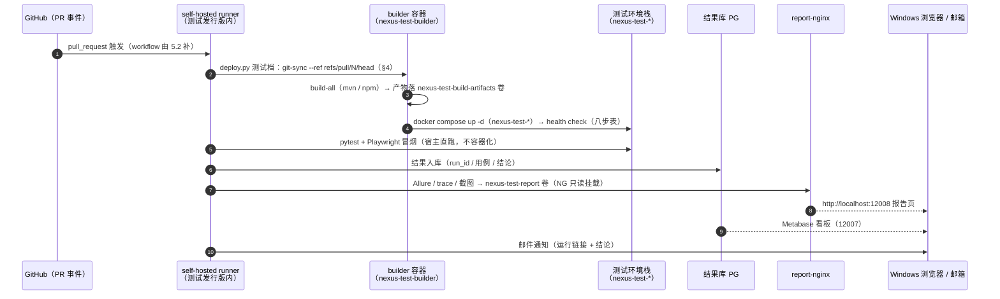
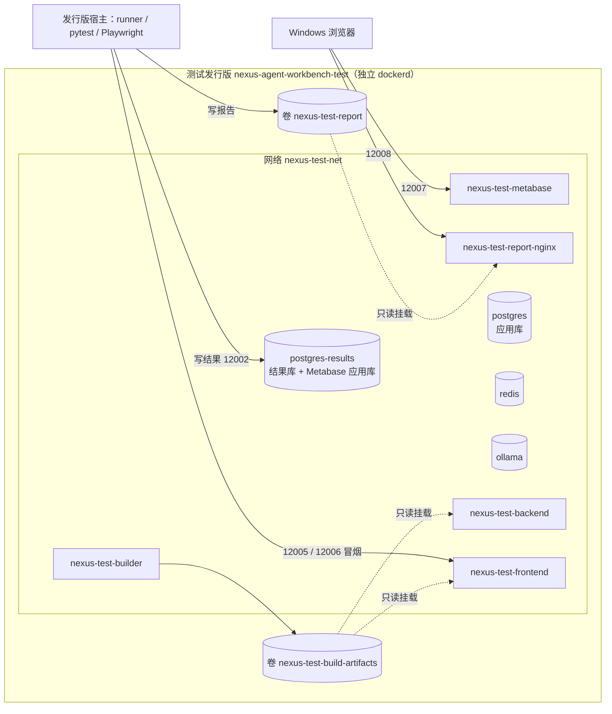
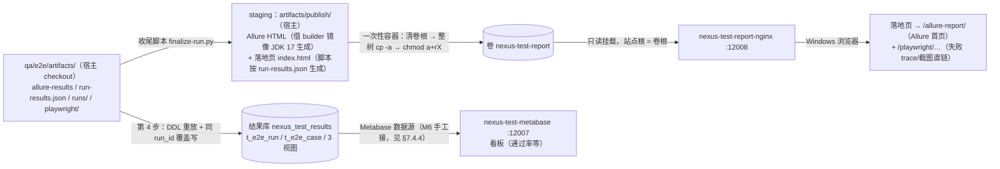

# 05 自动化测试 — task.6 设计文档（阶段5）

> 任务级别：**L1 阶段级** ｜ 状态：✅ **已确认（2026-10-08，D1/D2/D3 均按推荐）** ｜ 对应任务：`docs/task/task.6+自动化测试.md`
> 本文档覆盖子任务 **5.1 测试环境编排与部署链路复用**；5.2 / 5.3 / 5.4 / 5.5 只留占位（§7）。
> ✅ **§5 两处事项已拍板（2026-10-08）：E1 = (b)、E2 = (a)**；**本设计已确认，可进入编码**（L1 流程 Step 3）。
> 🏷️ 环境术语：`nexus-agent-workbench` = **开发环境**（dev）；`nexus-agent-workbench-test` = **测试环境**（test，**不挂 /mnt/c**）。
> **测试发行版内是独立 dockerd**（2026-10-08 实测：`dockerd` 进程在发行版内、`docker ps -a` 为空）——开发环境走 Docker Desktop，两者互不可见。
> **既成决策（不得改写）**：测试环境**完全独立**、不访问开发环境任何服务；**自带 Ollama**（M4-①）；**两个 PG 容器**（被测应用库 / 结果库，Metabase 应用库跟结果库实例，M4-②）；**不依赖云端模型**（M4-③，workflow 不需要 DeepSeek secret）。
> 引用：`docs/design/00-环境与部署.md` §2（拓扑与卷约定）；`docs/design/01-多租户与认证.md` §2（builder 链路）；`qa/README.md`；`CLAUDE.md`；[`deploy.py`](../../scripts/py/deploy.py) + `.claude/skills/deploy/SKILL.md`（部署真源）。

---

## 1. 阶段总览

PR 打开/更新 → GitHub Actions 的 **self-hosted runner**（跑在测试发行版 `nexus-agent-workbench-test` 内）拉起 →
**拉 PR 代码**（builder 容器内 git，按 PR ref）→ **builder 打包** → `docker compose up` 测试环境（`nexus-test-*`）→
**health check**（复用 `deploy.py` 八步，**非交互档**）→ **pytest + Playwright 冒烟**（在发行版**宿主**上直跑，**不容器化**）→
结果写 **Postgres 结果库** + Allure / trace / 截图落**命名卷** → **Nginx 暴露报告** → **邮件通知**。



---

## 2. 测试环境拓扑



### 2.1 服务清单

> **服务名保持与开发环境一致**（`postgres` / `redis` / `ollama` / `builder` / `nexus-backend` / `nexus-frontend`），
> 带 `nexus-test-` 前缀的是**容器名 / 卷名 / 网络名 / 项目名**（跨环境可见的标识），理由见 §3.1。
> 镜像 tag 一律 `nexus-test-*:dev`（与开发环境的 `nexus-*:dev` 区分；独立引擎下本不会撞，但名字要能一眼分清）。

| 服务名 | 镜像（均带加速前缀） | 容器名 | 宿主端口 | 命名卷 | 健康检查 | 依赖顺序 |
|---|---|---|---|---|---|---|
| postgres | `docker.m.daocloud.io/pgvector/pgvector:pg16` | nexus-test-postgres | 12001:5432 | nexus-test-pg-data | `pg_isready -U nexus -d nexus` | — |
| postgres-results | 同上（复用同一镜像，结果库不用向量扩展，多占 ~600MB 可忽略） | nexus-test-postgres-results | 12002:5432 | nexus-test-pg-results-data | `pg_isready` | — |
| redis | `docker.m.daocloud.io/library/redis:7-alpine` | nexus-test-redis | 12003:6379 | nexus-test-redis-data | `redis-cli ping` | — |
| ollama | `docker.m.daocloud.io/ollama/ollama:0.33.2` | nexus-test-ollama | 12004:11434 | nexus-test-ollama-models | `ollama list` | — |
| ollama-init | 复用 ollama 镜像（一次性） | nexus-test-ollama-init | 无 | 无（写进 ollama 卷） | 无（`restart: "no"`） | after ollama healthy |
| builder | `nexus-test-builder:dev`（`build: ./builder`，profiles: ["build"]） | nexus-test-builder | 无 | builder-src / builder-m2 / builder-npm / build-artifacts | 无（手工启停） | —（刻意不 depends_on postgres，同 dev） |
| nexus-backend | `nexus-test-backend:dev` | nexus-test-backend | 12005:8089 | build-artifacts(ro) | `wget -qO- localhost:8089/actuator/health` | after postgres + redis healthy |
| nexus-frontend | `nexus-test-frontend:dev` | nexus-test-frontend | 12006:80 | build-artifacts(ro) | `wget -qO- 127.0.0.1`（⚠️ **必须 127.0.0.1**，`localhost` 会解析到 ::1 而 nginx 只听 IPv4 —— 已知假故障） | after nexus-backend healthy |
| metabase | `docker.m.daocloud.io/metabase/metabase:<tag>`（⚠️ **非官方命名空间，前缀后不加 `/library/`**；tag 待实测选定，见 §6-2） | nexus-test-metabase | 12007:3000 | 无（应用库 = 结果库 PG 实例） | `curl -fsS 127.0.0.1:3000/api/health`（✅ 2026-10-10 实测：镜像内自带 curl/wget；容器内返回 `{"status":"ok"}`） | after postgres-results healthy |
| report-nginx | `docker.m.daocloud.io/library/nginx:1.27-alpine` | nexus-test-report-nginx | 12008:80 | nexus-test-report(ro) | `wget -qO- 127.0.0.1/healthz`（自定义站点，见 §7.4.2） | — |

- 前端 nginx 站点配置沿用 `docker-compose/frontend/nginx.conf`（`proxy_pass http://nexus-backend:8089` 按**服务名**写，服务名不变即可零改动复用）。
- 测试档**不挂** `.env.local`（M4-③：不依赖云端模型）；`.env.test` 不放任何敏感值（随仓库提交，与 `.env` 同性质）。
- 结果库实例上要预建**两个 database**（结果库 + Metabase 应用库 `metabase_app`）——实现方式（init 脚本 or M6 手工建库）由 5.5 / M6 落，此处只记约束。

### 2.2 网络与命名卷

| 类型 | 名称（`name:` 显式固定，避免随项目名/目录漂移） | 挂给谁 | 用途 |
|---|---|---|---|
| 网络 | nexus-test-net（bridge） | 全部服务 | 容器间服务名互访 |
| 卷 | nexus-test-pg-data | postgres | 被测应用库数据 |
| 卷 | nexus-test-pg-results-data | postgres-results | 结果库 + Metabase 应用库 |
| 卷 | nexus-test-redis-data | redis | 会话/租户缓存 |
| 卷 | nexus-test-ollama-models | ollama / ollama-init | 模型（≈6GB，只下一次） |
| 卷 | nexus-test-builder-src | builder | 容器内 git 工作区 |
| 卷 | nexus-test-builder-m2 | builder | Maven 本地仓库缓存 |
| 卷 | nexus-test-builder-npm | builder | npm 缓存 |
| 卷 | nexus-test-build-artifacts | builder(写) / backend,frontend(ro) | 产物共享目录（app.jar + dist） |
| 卷 | nexus-test-report | 收尾脚本 finalize-run.py(写) / report-nginx(ro) | Allure HTML + trace + 截图（布局与站点指向见 §7.4.2） |

### 2.3 与开发环境的对照

| 维度 | 开发环境（dev） | 测试环境（test） | 关系 |
|---|---|---|---|
| 引擎 | Docker Desktop（WSL 集成） | 测试发行版内**独立 dockerd** | 结构性隔离（`docker ps -a` 互不可见） |
| 发行版 | `nexus-agent-workbench` | `nexus-agent-workbench-test`（**不挂 /mnt/c**） | 新增 |
| 项目名 | `name: nexus` | `name: nexus-test` | 新增 |
| 网络 | nexus-net | nexus-test-net | 新增 |
| 容器名 | nexus-*（5 常驻 + init + builder） | nexus-test-*（同构） | 新增 |
| 宿主端口 | 5432 / 6379 / 11434 / 8089 / 8088 | 12001~12008（§2.4） | 已核实无交集 |
| Dockerfile | `docker-compose/{backend,frontend,builder}/` | **同一批**（相对路径零改动复用，见 §3.3） | **复用** |
| builder 入口脚本 | `git-sync` / `build-*` / `db-patch-migrate` | 同一批（`git-sync` 需加 ref 参数，§4.1-⑦） | 复用 + 扩展 |
| 补丁目录 | `/db-patch`（宿主） | 同目录（随 PR 代码进 builder 工作区） | **复用** |
| 部署脚本 | `scripts/py/deploy.py`（八步） | 同一脚本 + 测试档（§4） | 复用 + 扩展 |
| 结果库 / 统计 | 无 | postgres-results + 结果表/视图（5.5）+ Metabase | 新增 |
| 报告 | 无 | nexus-test-report 卷 + report-nginx | 新增 |
| 模型 | qwen2.5:7b + bge-m3（卷内常驻） | 同两款，**重下 ≈6GB** | 重拉 |

### 2.4 端口分配（两种口径，**给推荐**）

**口径 A —— 草稿第 4 条字面：所有容器端口都发布，且落 12000~13000。**
即 §2.1 表里的 12001~12008 全部作为 `ports:` 发布。

**口径 B —— 推荐：只发布"跨出 docker 边界"所必需的端口；其余不写 `ports:`。**

| 端口 | 服务 | 谁会用 | 口径 B 是否发布 |
|---|---|---|---|
| 12002 | postgres-results | 发行版宿主上的 pytest 写结果 | ✅ |
| 12005 | nexus-backend | 宿主的冒烟（`deploy.py` 直连判据） | ✅ |
| 12006 | nexus-frontend | 宿主的 Playwright / 人工看页面 | ✅ |
| 12007 | metabase | **Windows 浏览器**（M6 / M7） | ✅ |
| 12008 | report-nginx | **Windows 浏览器**（M7 看 Allure） | ✅ |
| 12001 | postgres | 只被容器内消费者（builder / backend）使用 | ❌ 不发布 |
| 12003 | redis | 同上 | ❌ 不发布 |
| 12004 | ollama | 同上 | ❌ 不发布 |

- **推荐 B 的理由**：① 未发布的端口**结构性不可能**与宿主任何服务冲突（比"落 12xxx 段"更强的保证）；② 少 3 个宿主监听面；③ 人工排查不必走端口 —— `docker compose exec` 进容器即可（psql / redis-cli / `ollama list` 都有）。
- **B 与草稿字面的差异要说清**：草稿写"所有容器端口都放到 12000~13000"，B 把它读作"**凡是发布的端口**都必须落在该段内"；若要求逐字合规，直接用 A（端口表就是 §2.1 那一段），本设计其余部分不受影响。
- ✅ **口径已定（2026-10-08，用户拍板）：B**。
- ⚠️ 12xxx 段与 Windows 侧既有服务是否冲突**未实测**（§6-1）；WSL2 会把发行版监听的端口自动转发到 Windows `localhost`（⚠️ 订正：dev 的 8088/8089 是 **Docker Desktop** 转发的，不能作为本条佐证 —— 见 §6-9），所以"发布"的判据是**发行版侧监听**。

### 2.5 资源约束（与开发环境同机共存）

- **7B CPU 推理需 5GB+ 内存**（`check-env.sh` 检查点 7 的既有阈值）；测试环境**自带第二套 Ollama**（M4-①）⇒ 两套模型服务可能同时驻留。
- M1 交接物预期"`wsl --shutdown` 会连带停掉开发环境"（该验证本身标注为"缓做"）⇒ 两发行版**很可能共享同一个 WSL2 虚拟机资源池**，`.wslconfig` 的内存/CPU 上限是**全局**的（属用户侧手工项）。⚠️ 未实测（§6-6）。
- 注意事项：CI 触发时避免开发环境同时跑重量操作；RAG / 对话类用例在 CPU 推理下慢（单条超时阈值由 5.4 定，别照抄）。
- 磁盘：**948G 可用**（M1 实测）；第二套镜像（ollama 8.45GB + pgvector 621MB + redis 58MB + Metabase）+ 模型 ≈6GB ≈ **+15GB** ⇒ 无风险。

---

## 3. 资产复用边界

### 3.1 复用清单

| 资产 | 位置 | 测试环境怎么用 | 改动 |
|---|---|---|---|
| backend 运行镜像（Dockerfile + entrypoint.sh） | `docker-compose/backend/` | `context: ./backend`（相对 compose 文件目录，§3.3） | **无** |
| frontend 运行镜像（Dockerfile + nginx.conf） | `docker-compose/frontend/` | 同上；nginx.conf 的反代按**服务名** `nexus-backend:8089` 写，服务名不变即零改动 | **无** |
| builder 镜像（Dockerfile + settings.xml + 5 个入口脚本） | `docker-compose/builder/` | 同上；产物仍落 build-artifacts 卷、前后端只读消费 | `git-sync` 加 `--ref`（§4.1-⑦） |
| db-patch 补丁目录 | `db-patch/` | 随 **PR 代码**进 builder 工作区（容器内 clone），迁移照跑 | **无** |
| 部署八步 | `scripts/py/deploy.py`（+ SKILL.md） | 同一脚本 + 测试档参数 | §4 |
| 夹具 / 冒烟用例 | `qa/` | 5.4 / 5.5 落（`qa/e2e/` 已有 `.gitkeep`） | — |
| `scripts/sh/*`（up.sh / check-env / check-health / probe.sh） | `scripts/sh/` | **不复用、不动** —— 见下方 ⚠️ | 不动 |

- ⚠️ **不要在测试发行版里跑 `scripts/sh/*`**：它们把 `docker-compose/docker-compose.yml`、`.env`、`nexus-*` 容器名**写死**为开发口径（`probe.sh` 第 56~58 行），在测试引擎上只会得到一片"找不到容器"的假故障。探针库是否参数化，本阶段**不动**（避免把 5.1 扩成三套脚本的改造）。
- 镜像 tag / 容器名带 `nexus-test-` 前缀；**服务名保持与开发一致**——这是零改动复用 nginx.conf、后端 `POSTGRES_HOST: postgres`、builder `NEXUS_PG_HOST: postgres` 的前提（它们全按服务名写）。

### 3.2 测试 compose 的形态：独立文件（推荐） vs override 叠加

| 形态 | 说明 | 取舍 |
|---|---|---|
| **独立文件**（推荐） | 另写一份完整的 `docker-compose.test.yml`（服务名同 dev；容器名/卷名/网络名/项目名带 `nexus-test-`） | ① "测试环境完全独立"表达为**结构**而非一堆覆盖；② 无合并语义的坑；代价：约 300 行重复 ⇒ 评审时逐行核对两文件 diff，**差异只允许出现在白名单内**（命名 / 端口 / 结果库 / Metabase / 报告 Nginx / 不发布端口 / 不挂 `.env.local`） |
| override 叠加（`-f 开发.yml -f test.yml`） | 少重复 | override **无法删服务**；`name:` / `container_name` / `ports` 的合并（追加 vs 替换）语义琐碎且**本项目未实测** ⇒ 容易"看着覆盖了、其实没生效" |

### 3.3 build 相对路径的既有实测口径（2026-09-11 实测，compose v5.1.4）

- `build.context` 相对 **compose 文件所在目录**；`build.dockerfile` 相对**已解析的 context**（`<context>/<dockerfile>`）。
- `docker compose config` **不解析** `dockerfile`、不做路径存在性检查 ⇒ 静态预检要用
  `docker compose -f <测试 compose> build --print` + 逐路径 `test -e`。
- 现状写法 `context: ./backend` + `dockerfile: Dockerfile` → `docker-compose/backend/Dockerfile`（存在）。
  ⇒ **测试 compose 只要落在 `docker-compose/` 目录里，这三段 build 照抄即成立**（E2 候选 (a) 的零改动论据）；落在别处就要写 `../../docker-compose/backend` 之类，易错。

---

## 4. `deploy.py` 复用方案（本设计的重头）

> 执行位置：CI 里 runner 就在测试发行版内，**直接** `python3 <checkout>/scripts/py/deploy.py <测试档参数>`
> —— 不经 `wsl -d` 层，也不涉及 `MSYS_NO_PATHCONV`（那是 Windows 侧调用才有的坑）。
> 脚本本身从 runner 的 checkout（= PR head）取，`_find_repo_root` 的标记在 checkout 根同样成立（§4.1-①）。

### 4.1 九个参数化点（逐条：现状 → 改法 → 影响面）

**① 仓库根定位**
- 现状：`_find_repo_root` 按标记上溯（标记 = 存在 `docker-compose/docker-compose.yml`），已不写死层级 ✅
- 改法：**不改**。前提：测试 compose 落 `docker-compose/`（E2-(a)）；CI 从 runner checkout 跑脚本，标记同款成立。
- 影响面：无。若 E2 选 (b)/(c)，标记要加一条候选。

**② compose 目录与文件名**
- 现状：`COMPOSE_FILE` 写死 `docker-compose/docker-compose.yml`；`compose()` 不带 `-f`，靠 `cwd=COMPOSE_DIR` 的默认发现。
- 改法：把 `-f <file>` 与 `--env-file <env>` 收进一个**档位常量**（profile），由 `compose()` 原子地加在子命令前；**两档都显式给**（对称、无隐式发现）。⚠️ 防呆三条：ⓐ 两个路径只能由同一个档位常量提供，**不开放单独覆盖的 CLI 开关**；ⓑ 启动时读被选中 compose 文件的 top-level `name:`，与档位期望（`nexus` / `nexus-test`）不符即 die；ⓒ `compose config` 抽查宿主端口落档位段（测试档 12000~13000）。
- 影响面：⚠️ **订正（2026-10-08 主会话复核）**：原写「`compose()` 一处改动全脚本生效」**不完整** —— `COMPOSE_FILE` / `ENV_FILE` / `COMPOSE_DIR` 还有 **4 处直接读者**，不走 `compose()`，必须一并随档位常量切换：
  - ⓐ `deploy.py:240` `COMPOSE_FILE.exists()`（step 1 前置）——不切会**检查错文件**（开发文件存在即通过，静默）；
  - ⓑ `deploy.py:403` `COMPOSE_FILE.read_text()`（step 3.2 模型清单的真源）——不切会拿**开发** compose 的 `ollama-init` 清单给测试环境对账（今天两份内容恰好相同 ⇒ **静默不报**，与"镜像静默过期"同类）；
  - ⓒ `deploy.py:289` / `:594` `read_env(ENV_FILE)`——已由 ③ 覆盖（同一路径同时喂脚本与 compose）；
  - ⓓ `deploy.py:143` `cwd=COMPOSE_DIR`（compose() 工作目录）——建议随档位；`deploy.py:327` 读的 `frontend/nginx.conf` 是**共用资产**（§3.1 无改动），保持指向 `docker-compose/` 即可。
  - ⇒ 实施判据：`grep -n 'COMPOSE_FILE\|ENV_FILE\|COMPOSE_DIR' scripts/py/deploy.py` 逐个确认「直接读者：改走档位常量 / 或写明为何不切」。
  - dev 档行为不变（同一文件、显式与隐式等价）。
  ⚠️ 最凶的漏法：**只给 `--env-file` 不给 `-f`** ⇒ 拿测试 env 去插值**开发** compose，静默把开发文件按测试端口/项目起起来 —— 防呆 ⓑ 专门拦它。

**③ env 文件**
- 现状：`ENV_FILE = docker-compose/.env`；deploy.py 自己 `read_env` + compose 自动发现**恰好同一个文件**（未显式绑定）。
- 改法：`--env-file` 参数；同一路径**同时**喂 ⓐ deploy.py 的 `read_env` ⓑ compose 命令；测试档**跳过** `.env.local` 缺失的 WARN（M4-③ 不需要 DeepSeek）。
- 影响面：dev 不变；测试档 env 与 compose 必须成对（见 ② 防呆）。

**④ compose 项目名**
- 现状：开发文件内 `name: nexus`；脚本不显式 `-p`。
- 改法：测试文件内 `name: nexus-test`（**唯一真源写文件里**，命令行不重复 `-p`）；脚本只在防呆断言里读它。
- 影响面：`compose ps` 的名字解析走 `--format json`，不依赖名字过滤 ⇒ 无需其它改动。

**⑤ 期望健康的容器名清单**
- 现状：`EXPECTED_HEALTHY` 写死 5 个 `nexus-*`。
- 改法：随档位给。测试档 = `nexus-test-postgres / -redis / -ollama / -backend / -frontend` **+ `nexus-test-postgres-results`**（结果写入的前置，纳入阻断判定）；`nexus-test-metabase` 与 `nexus-test-report-nginx` 列**非阻断**检查（报告链路归 5.5，起得慢不该让部署红）。
- 影响面：step7 只依赖清单本身，改动局部。

**⑥ 烘进镜像的文件清单**
- 现状：`BAKED_FILES` 用**仓库根相对路径**、服务名为键；状态存 `.tmp/deploy-state.json`。
- 改法：文件清单不变（Dockerfile 复用），但三处要动：ⓐ **状态文件按档位分开**（`.tmp/deploy-state.test.json`）——否则两档互相污染基线，"该 rebuild 没 rebuild / 不该 rebuild 瞎 rebuild"都会出现；ⓑ **测试档把 `builder` 纳入 rebuild 判定**（开发档刻意不含它，由 up.sh 第 2 步管；CI 里没人管 ⇒ 改了 `git-sync` 会静默用旧镜像——正是本项目反复踩的"镜像静默过期"类）；ⓒ 文档措辞订正：task.6 写"相对 **compose 目录**的路径"，实际是**相对仓库根**（`REPO / f`）——以现状为准（见 §9 不一致处）。
- 影响面：dev 状态文件不受影响（新档新文件）。

**⑦ 拉什么 ref（最关键的一处）**
- 现状：`git-sync` 只认 `NEXUS_REPO_BRANCH`（容器 env，**创建时注入**）；`deploy.py` 调 `builder("git-sync")` 无参；**没有 ref/SHA 入参 ⇒ CI 拉 PR 代码这条路目前走不通**。
- 改法：`git-sync` 加**可选参数** `--ref <refspec>`：省略 ⇒ 现状（`origin/$NEXUS_REPO_BRANCH`）；给定 ⇒ `git fetch --prune origin <refspec>` + `git checkout --force --detach FETCH_HEAD`（+ 既有 `clean -fd` 保留）。`deploy.py` 加 `--ref`，透传给 `compose exec -T builder git-sync --ref <refspec>`。
  - **为什么不改容器 env**：`NEXUS_REPO_*` 只在**容器创建时**注入（改 `.env` 必须重建 builder 容器 —— 既有实测教训）；CI 每次跑都重建容器 ⇒ 成本与失败面都变大。参数化到 **exec 层**，一次跑一条命令。
  - **ref 选型**：`refs/pull/<N>/head`（GitHub 的 PR 隐藏 ref，**必然可取**）vs `refs/pull/<N>/merge`（GitHub 预合并结果，**冲突时不生成**）—— 本文档**推荐 head + 记录 SHA**；最终语义与 5.2 的触发策略对齐（本文档不拍）。裸 SHA（`git fetch origin <sha>`）受服务端开关影响，⚠️ 未实测（§6-8）。
  - 配套：`--expect-sha <PR head SHA>` 两个一起用才闭环（断言"真拉到的就是 PR 的 head"；`--expect-sha` 已存在）。
- 影响面：① `git-sync` 烘在 builder 镜像里 ⇒ 改动要**重建 builder 镜像**（开发侧 `docker compose build builder`；测试侧见 ⑥-ⓑ）；② step3.1「分支真源链」检查在 REF 非空时语义变化（实际拉的是 REF）⇒ CI 档改为 INFO（真源就是 `--ref`）；③ 测试库会被应用到 **PR 的 db-patch** —— 期望行为（测试库可重建），但要写进文档免得误判。
- 验证动作（未实测）：`git ls-remote <repo> 'refs/pull/*/head'`（任一能出网的环境）。

**⑧ 冒烟里的登录账号**
- 现状：step8 写死 `admin` / `admin123`。
- 改法：`--login-user` / `--login-password`（默认值不变）；CI 显式传或从 env 文件取。
- 影响面：默认零变化；意义是"测试库被清 / 口令变更时不改代码"。

**⑨ 测试环境可能不成立的判据（降级为 WARN 的路径）**
- 现状：ⓐ nginx `client_max_body_size`（宿主缺 → FAIL / 容器内查不到 → WARN）；ⓑ 向量维度（DB 取不到 → WARN / 两侧不一致 → FAIL）；ⓒ 模型清单（ollama 未响应 → WARN / 缺模型 → FAIL）。
- 改法：引入**判据档**：`strict`（dev 默认，维持现状）/ `test`（**前置物不存在 ⇒ WARN**；**存在但不一致 ⇒ 仍 FAIL**）。测试档典型场景：库还没迁移（`t_kb_chunk` 不存在）、前端容器未起。
- 影响面：语义不漂移 —— 降级的只是"环境不具备"，不放过"不一致"。

### 4.2 「CI 里没有'人'」的处置：非交互档

- 现状：脚本**本就零提问**（`stdin=DEVNULL`、`exec -T`、无 input）；"失败即停等人"是 **SKILL.md 的流程约定**，不是代码行为。CI 缺的不是"取消提示"，是 ⓐ 失败即非 0 退出（**现状已满足**：`main()` 返回 `1 if R.failed`）ⓑ **机器可读摘要**（人不在，邮件正文 / Actions 摘要要读它）。
- 改法：加 `--ci` 档（或 `--summary-json <path>`）：每步 `(step, status, summary)` + 拉到的 SHA + 结论落一份 JSON；颜色可选关（`--no-color`）。
- 影响面：dev 路径零变化；⚠️ **选定后要同步进 `.claude/skills/deploy/SKILL.md`**（它是流程真源 —— 现在写的是"一次跑完、零提示、失败即停等人"，要补一句 CI 档口径）。
- 附注：CI **首跑缓存全冷**（镜像要拉、builder-m2 / npm 缓存空、模型 ≈6GB 重下）⇒ **耗时远超 1 分钟目标，属预期**；上界待 M7 实测。

---

## 5. 待确认事项（**列选项 + 推荐，本文档不代拍**）

### 5.1 复用实现形态（= task.6 待确认 #2）

| 选项 | 说明 | 代价 |
|---|---|---|
| (a) 给 `deploy.py` 加参数 | 单文件、单入口 | 改动面直接压在**已实跑验证过**的部署链路上（首跑曾崩 3 次）；每加一个参数都要重验 dev 路径 |
| **(b) 抽可参数化核心 + 薄包装**（task.6 推荐；本文档同推荐） | 现有入口（SKILL.md 的调用命令）**零改动**，CI 走新入口；八步判据**只写一份** | 两层入口 ⇒ 要立防漂移硬规则：**包装层只组装参数、不得含任何判据**；需要一次"抽核心"的改动（用"dev 部署跑一次仍全绿"回归） |
| (c) 另写 CI 专用脚本 | 不动现有链路 | ❌ 不推荐：八步判据两份，必然漂移（本项目"判据只写一份"的教训 —— `probe.sh` 共享探针库、up.sh/check-env/check-health 三脚本不各写一份；另见 `deploy.py` 头条"凡断言必须实测"） |

- **推荐 (b)**：与 task.6 的倾向一致；理由是"(a) 的收益（少一层）小于它在已验证链路上引入的风险"，而 (c) 直接违反判据单一真源。
- ✅ **已拍板（2026-10-08，用户）：(b)**。

### 5.2 测试 compose 与 env 文件的落位（**与 task.6 待确认 #1 联动**）

| 选项 | 说明 | 代价 / 论据 |
|---|---|---|
| **(a) `docker-compose/docker-compose.test.yml` + `.env.test`**（本文档推荐） | 与"**夹具**禁止进 `docker-compose/`"**不冲突**：禁令的对象是**夹具**（会被注入被测环境的探针/种子，`qa/README.md` 的定义），测试 compose 是**编排**、**不被任何生产链路消费**（静态核实：up.sh / 镜像构建 / db-patch 迁移都只读 `docker-compose.yml` 与各自 Dockerfile；`docker-compose.test.yml` 不在 compose 的默认发现名（`compose.yaml` / `compose.yml` / `docker-compose.yaml` / `docker-compose.yml`）里）。且 `build.context` 相对 compose 文件目录 ⇒ 三份 Dockerfile 复用**零改动**（§3.3） | docker-compose/ 目录住两套编排 ⇒ 需要命名纪律 + §4.1-② 的防呆断言。<br>⚠️ 若把禁令理解为"docker-compose/ 只准住开发编排"，则 (a) 不合 —— 请拍板时明确；本文档按"禁令对象是夹具"读 |
| (b) 归 `qa/` | 与"测试资产归 qa/"的直觉一致 | Dockerfile 相对路径复用变形（要 `../../docker-compose/backend` 绕行或复制 Dockerfile ⇒ 直接违背"复用"）；`qa/` 的定位是"夹具与用例辅助（不属于生产链路）"，而编排是 **CI 链路的一环**，塞进去会把定位搅浑 |
| (c) 新顶层目录（如 `test/compose/`） | 与待确认 #1 的目录之争联动 | 新增顶层目录约定（要改 `CLAUDE.md` 目录表）+ 相对路径同样要绕行 |

- ⚠️ **联动关系**：task.6 把 compose 落位挂在「待确认 #1（E2E 落 `qa/e2e/` 还是新建一级 `test/`）」上——那是**间接**联动（#1 的字面内容是 E2E 脚本目录）。两处应**一并拍板**，否则会出现"E2E 在 `qa/e2e/`、compose 却在 `test/`"这类第三种分裂。本文档**按 (a) 先写**（更忠实于现有宪法与 `qa/README.md`）。
- ✅ **已拍板（2026-10-08，用户）：(a)**；连带「待确认 #1」一并取 (a) —— E2E 脚本落 `qa/e2e/`，草稿的「一级 `test/` 目录」正式关闭。

---

## 6. 风险与「⚠️ 需实测确认」

> **未实测不得写成既成事实。** 下表"现状"栏全部只是推断 / 静态核实。

> ✅ **首跑已关闭的项（2026-10-10，test 档实跑 192s 全 PASS + 冒烟 5/5）**：**#1**（12xxx 段与 Windows 侧无冲突 —— 全栈拉起成功）、**#2**（Metabase 镜像可拉取 —— 容器已 Up）、**#4**（非交互档 —— `--ci --summary-json` 实跑写出摘要）、**#5**（测试发行版**容器级出网** —— 构建期 apt / maven / npm 全通，原先最大的风险项）、**#7**（前沿已关）、**#9**（Windows 侧可达性 —— `localhost:12006/12007/12008` 全 200）。
> ✅ **#3 也已关闭（2026-10-10，5.5 在**备用卷**上实测）**：机制判据 = 写方（宿主 uid 1004）+ `chmod -R a+rX` 后，以 nginx worker 身份（uid 101）**直读卷内文件成功**、报告经 nginx 200；**真卷 + Windows 浏览器实开**归 M7（清单见 §7.4.7）。
> 仍开着：**#6**（两发行版资源池）、**#8**（`refs/pull/N/head`，归 M7）。

| # | 待确认项 | 现状（推断 / 静态核实） | 验证动作（可执行） |
|---|---|---|---|
| 1 | Windows 侧 12000~13000 段是否被占用 | 与本项目 dev 端口无交集已静态核实；**Windows 其他软件未实测** | 口径 B 只需逐个查 5 个：`Get-NetTCPConnection -LocalPort 12002`（同 12005 / 12006 / 12007 / 12008） |
| 2 | Metabase 镜像可拉取性与资源占用 | 未实测；**非官方命名空间**（前缀不带 `/library/`，写法与官方镜像不同）；tag 未定 | `docker pull docker.m.daocloud.io/metabase/metabase:<tag>`；起容器看 `docker stats --no-stream` |
| 3 | 报告卷"一个写、一个读"的权限 | 未实测（写方 = 宿主 runner 用户，读方 = nginx 的 uid 101 ⇒ **403 风险**） | 5.5 交付后 `docker run --rm -v nexus-test-report:/a alpine ls -lR /a` 看属主 + Windows 浏览器实开报告页 |
| 4 | 非交互档的实际行为（退出码 / 摘要 / 超时） | 未实测 | 在测试环境先制造一次**受控失败**（如 `--expect-sha` 传错前缀）看非 0 退出与 JSON 摘要，再跑正确的 |
| 5 | 测试发行版内**容器级**出网（github / 镜像源 / Maven / npm / ollama registry） | dev 环境容器能出网的证据来自 **Docker Desktop 的解析器**；测试发行版是**独立 dockerd**，其容器出网**未实测** | 栈起来后 `docker compose … exec -T builder getent hosts github.com` + `git ls-remote`；`ollama pull` 一次；builder 镜像首次构建（apt / nodesource） |
| 6 | 两发行版的内存/CPU 是否共享同一 WSL2 资源池 | M1 交接物预期 `wsl --shutdown` 会连带停掉开发环境（该验证本身"缓做"）⇒ 推断共享；**未实测** | 两环境同时起时各跑 `free -h` 与 `docker stats --no-stream` 对照 |
| 7 | ~~`-f` + `--env-file` 组合语义~~ **✅ 已实测（2026-10-09）**：用户以 `docker compose -f docker-compose.test.yml --env-file .env.test up -d ollama ollama-init` 走通 —— 项目名/容器/卷/网络/模型清单全按测试档解析，模型拉取完成（卷 `nexus-test-ollama-models` 已就位） | 遗留的半句（原静态推断）：`-f` 使项目目录 = compose 文件目录、`--env-file` 决定插值来源；**未实测** | `docker compose -f docker-compose/docker-compose.test.yml --env-file docker-compose/.env.test config` 看端口与 `name:`；再确认同目录裸 `docker compose config` 仍解析**开发**文件 |
| 8 | `refs/pull/<N>/head` 可拉取性 | GitHub 的 PR ref 长期可匿名取；**本机未实测** | `git ls-remote <repo> 'refs/pull/*/head'` |
| 9 | 测试发行版**发布端口在 Windows 侧的可达性** | 推断：WSL2 `localhostForwarding` 默认开、独立 dockerd 的发布端口监听 `0.0.0.0` ⇒ 应可达；⚠️ **未实测**（dev 的 8088/8089 是 **Docker Desktop** 转发的，**不能**作为本条佐证） | 5.1 首次拉起后，Windows 侧 `curl -s -o /dev/null -w '%{http_code}' http://localhost:12006/` 期望 200 |

- 旁注：M1 交接物有一条"**待做**"—— runner 服务需重启以带上 `docker` 组（否则 CI 会 `permission denied ... docker.sock`）。属 M 侧收尾，不是本设计项，但 **M7 前必须闭环**。

---

## 7. 占位（由其它子任务补）

- **7.1 CI 触发与通知链路**（`.github/workflows/e2e-smoke.yml`、标签、邮件落位）—— ✅ 由 **5.2** 补全（2026-10-10），正文见下方「§7.1」。
- **7.2 前端定位契约**（`data-tid` 收窄、落层写法）—— ✅ 由 **5.3** 补全（2026-10-09），正文见下方「§7.2」。
- **7.3 冒烟框架与用例**（pytest + Playwright、`.venv`、超时阈值、TC-05）—— 由 **5.4** 补。
- **7.4 报告与结果可视化链路**（Allure/trace/截图 → 卷 → Nginx；结果表/视图 → Metabase）—— ✅ 由 **5.5** 补全（2026-10-10），正文见下方「§7.4」。

---

### 7.1 CI 触发与通知链路 —— 5.2 交付（2026-10-10）

> **交付物**：[`.github/workflows/e2e-smoke.yml`](../../.github/workflows/e2e-smoke.yml)（触发与编排）
> ＋ [`scripts/py/notify-mail.py`](../../scripts/py/notify-mail.py)（邮件步，可单独重放 —— 2026-10-10 拍板）；
> 步骤 5 调用的 [`scripts/py/finalize-run.py`](../../scripts/py/finalize-run.py) 是 **5.5 的交付物**，口径归 §7.4（本档只写接线）。
> **本节写口径与取舍，不复制判据**：部署判据在 `scripts/py/deploy.py`（八步只写一份），冒烟判据在 `qa/e2e/` + `TC-05`，
> CI 档口径在 `.claude/skills/deploy/SKILL.md`「CI 档」。三处**都不在这里重复维护**（邮件脚本也不含判据：它只读摘要、拼正文、发信）。
> ⚠️ 本节含 **§7.1.7（只能由 M7 实跑验证）** 与 **§7.1.8（待拍板）** 两节 —— 未实测的一律不写成既成事实。

#### 7.1.1 触发条件与守卫

- **触发**：`pull_request`，**只指 `main`**（`branches: [main]`）；事件类型取默认（opened / synchronize / reopened）。
- **两层守卫**（互补，缺一不可）：

  | 层 | 由谁承担 | 内容 |
  |---|---|---|
  | 平台侧 | 仓库设置（M3-③） | 「外部贡献者需批准」——外部贡献者的 PR 不会自动跑到 runner 上 |
  | workflow 侧 | job 级 `if` | `github.event.pull_request.head.repo.full_name == github.repository` —— **同仓守卫**；fork 的 PR 连 runner 都不占（job 显示 skipped） |

  理由：公开仓库 + self-hosted runner = **任何人开 PR 就能在这台机器上执行代码**（task.6 待确认 #5 的原始风险）。
- **本档不提供手跑入口**：`workflow_dispatch` **不加**，触发面只有 PR 一种。task.6 把这条留给了设计 —— 本档取
  **最小触发面**（少一个入口 = 少一处"能在这台机器上执行代码"的路径）。⚠️ 这是**可讨论的选定**，不是硬约束。
- **权限**：`permissions: contents: read`（M3-③「只读」）。本流程**不往仓库写任何东西** —— 不发评论、不打标签、不上传 artifact。

#### 7.1.2 步骤表（每步一句话 + 对应命令）

| # | 步骤名（workflow 里的中文短句） | 一句话 | 关键命令 / 判据 |
|---|---|---|---|
| 1 | 拉取 PR 代码（纯 shell） | 手写 checkout：零 marketplace action，匿名 fetch PR 的隐藏 ref | `git init -q .` → `git fetch --no-tags https://github.com/$GITHUB_REPOSITORY.git refs/pull/<N>/head` → `git checkout --force --detach FETCH_HEAD` → `git clean -fdq` |
| 2 | 运行环境自检（持久 venv + chromium） | 门禁：venv 在 / 依赖指纹一致 / chromium **真启动**一次，三条全过才继续 | `$HOME/nexus-e2e-venv` + `sha256sum qa/e2e/requirements.txt` 对 `$VENV/.requirements.sha256` + `sync_playwright()` 起 chromium |
| 3 | 部署测试环境（deploy_test.py --ci） | 八步部署的非交互档；**固定组合** `--ref` + `--expect-sha` | `python3 scripts/py/deploy_test.py --ci --summary-json <path> --ref refs/pull/<N>/head --expect-sha <PR head SHA>` |
| 4 | 冒烟（pytest + Playwright，S1~S5） | 在测试发行版宿主上直跑（不容器化），打测试环境的前端端口 | `<venv>/bin/python -m pytest`（cwd = `qa/e2e`；`E2E_TRIGGER=ci`；输出 tee 到 `$RUNNER_TEMP/pytest.log`） |
| 5 | 收尾（报告 + 落库） | 把**这次运行的结果放到该放的地方**：Allure HTML/留痕发布进报告卷（→ 12008 可看）+ `run-results.json` 落结果库 | `python3 scripts/py/finalize-run.py --expect-run-id "$E2E_RUN_ID"`（5.5 交付，**可单独重放**；口径详见 §7.4.6） |
| 6 | 收集结果（摘要 + 产物清单） | 把两份 JSON 读成人话写进 Actions 的 Step Summary，并列出本次产物清单 | `python3 - <<PY`（管道追加进 `$GITHUB_STEP_SUMMARY`）+ `find $E2E_ARTIFACTS …` |
| 7 | 邮件通知（SMTP，成功与失败都发） | 一封纯文本邮件：结论 + 运行链接 + 部署/冒烟摘要 + FAIL/WARN 行 | `python3 scripts/py/notify-mail.py`（**独立脚本**，可单独重放；形态见 §7.1.8-①）；6 个 secrets 走 `env:` |

- 步骤 **5 / 6 / 7 是 `if: always()`**（失败路径也要留痕：收尾、收集、邮件三者都与"用例红不红"无关）；
  步骤 4 **不是** —— 部署失败就没必要跑冒烟（省一次白跑）。
- `--ref` + `--expect-sha` 是**固定组合**（设计 §4.1-⑦）：只拉不断言 = 发现不了"拉错 ref"；只断言不拉 = 拿不到 PR 代码。
  它同时兜住一个时序风险：runner 侧 checkout 与 builder 侧 git-sync 是**两次**独立取码，PR 若在运行中途被 push 了新提交，
  `--expect-sha`（来自事件载荷）会让部署**红在步骤 3**，而不是"测了新代码、报告却对不上号"。
- ★ **env 归属的硬规则**（2026-10-10 订正，源自一次真实缺陷）：**跨步骤共用**的名字一律放 **job 级 `env`**
  （`E2E_ARTIFACTS` / `DEPLOY_SUMMARY` / `E2E_RUN_ID` / `PR_NUMBER`）；只有单步用的才放 step 级
  （`JOB_STATUS` / `RUN_URL` / 6 个 secrets）。
  ⚠️ **为什么单列一条**：`PR_NUMBER` 原先只写在**邮件步**的 env 里，而**收集结果步也读它** ⇒ 那一步一跑就 `KeyError`，
  job 变红、Step Summary 拿不到内容；而 `yaml.safe_load` 与 `compile()` **都查不出"名字没声明"**（静态过、运行炸）。
  **判据**（每次动 env 后重跑一遍）：把每个 `os.environ[…]` / `$VAR` 引用与「job env ∪ step env ∪ runner 预置」
  **逐一对表**，未声明的名字数必须为 **0**；再按"只给声明过的 env"跑一次两段内嵌 python（能跑完才算过）。

#### 7.1.3 secrets 清单（6 键，逐字；与 M5 交接物一致）

| 键名 | 消费方 | 用途 |
|---|---|---|
| `SMTP_HOST` | 步骤 7 | SMTP 服务器地址 |
| `SMTP_PORT` | 步骤 7 | 端口（同时决定 TLS 方式，见下） |
| `SMTP_USER` | 步骤 7 | 登录用户 |
| `SMTP_PASS` | 步骤 7 | 授权码 / 应用专用密码 |
| `MAIL_FROM` | 步骤 7 | 发件人 |
| `MAIL_TO` | 步骤 7 | 收件人 |

- 真源 = **GitHub Repository secrets**（M3-④ 拍板）；值不进仓库、不经 AI。**日志不打值**：脚本不 print 任何凭据
  （GitHub 侧另有 secret 掩码兜底）。
- **TLS 口径由端口推断**：465 = `SMTP_SSL`（隐式 TLS）；其余（如 587）= `SMTP` + `STARTTLS`。
  该口径的实现落在 `scripts/py/notify-mail.py` 的 `send()` 里（workflow 侧只管注入 env）。
  ⚠️ 这是**推断**：6 键里没有"是否 TLS"这一项，而 M5 的键名清单就是这个 —— **未实测**（§7.1.7-⑤）。
- fork PR 拿不到 secret：本档的 fork PR 已被 §7.1.1 的守卫拦掉，且 M4-③ 不依赖云端密钥 ⇒ "fork 无 secret"不会成为失败原因。
- 邮件步骤**自身**失败（SMTP 不通 / 凭据错）⇒ job 红（**不吞**）；但它与被测对象无关 ——
  判断看邮件正文与 Step Summary 里的「部署」「冒烟」两行。

#### 7.1.4 结果与产物去向

> run_id = `ci-<run_id>-<run_attempt>`（workflow 生成后传 `E2E_RUN_ID`，由 conftest 写进结果文件）。

| 产物 | 谁生成 | 本次落点（runner 工作区） | 卷内目标（**5.5 接**，本档不改它的表） |
|---|---|---|---|
| `deploy-summary.json` | `deploy.py --summary-json` | `qa/e2e/artifacts/deploy-summary.json` | 5.5 的路径表里没有它（本次新增）——由 5.5 决定收不收 |
| `run-results.json` | `qa/e2e/conftest.py` | `qa/e2e/artifacts/run-results.json` | `/run-results.json` |
| `runs/<run_id>.json` | 同上 | `qa/e2e/artifacts/runs/<run_id>.json` | `/runs/<run_id>.json` |
| `allure-results/`（原始 JSON） | `allure-pytest` | `qa/e2e/artifacts/allure-results/` | `/allure-results/`（出 HTML 是 5.5 的活） |
| `playwright/<用例>/`（trace + 截图） | `pytest-playwright` | `qa/e2e/artifacts/playwright/` | `/playwright/`（**仅失败留痕**） |
| `artifacts/publish/`（Allure HTML + 落地页） | 步骤 5 的 `finalize-run.py` | `qa/e2e/artifacts/publish/` | 发布进 `nexus-test-report` 卷（布局见 §7.4.2） |
| Step Summary（不是文件） | 步骤 6 | Actions 运行页（末行带**报告页地址**） | — |

- **前五行只落在工作区**（本档的职责到此为止）；**"进卷 / 出 HTML / 落库"由步骤 5 的 `finalize-run.py` 执行**
  （它的产物就是第 6 行），卷内布局的唯一真源是 §7.4.2 —— 本档不复制它。
- ★ **旧产物护栏**（三个消费者）：自托管 runner 的工作区**跨运行复用** ⇒ 上一次的 `run-results.json` 会留在原地。
  步骤 5 用 `--expect-run-id` **断言**（对不上即 fatal、非 0 退出）；步骤 6 / 7 用它做**降级判断**
  （对不上就当"本次没有结果文件"）—— 两道都防"把上一次的绿写进本次结论"（"静默旧产物"类，
  与 `deploy.py` 的"镜像静默过期"同源）。
  ⚠️ 该护栏与两份摘要的读取逻辑只做过**本地假数据演练**（把 `smtplib` 换成桩、喂假的 summary/结果文件；
  2026-10-10 逻辑搬进 `notify-mail.py` 后按四场景重跑：有本次结果 / 只剩旧结果 / `--dry-run` / 缺输入），
  **不算实测** —— 真环境下的表现进 §7.1.7。
- `qa/e2e/artifacts/` 是 gitignored：步骤 1 的 `git clean -fdq`（无 `-x`）**不会**动它，阶段验收的
  「跑前跑后 `git status --porcelain` 一致」判据也不受影响。

#### 7.1.5 失败形态（红在哪一步、谁承担"停"）

- **失败即红**：全文件无 `|| true` 之类的吞码；步骤 4 用 `set -o pipefail` 防 `| tee` 吞掉 pytest 的退出码
  （本项目踩过"`| tail` 吞退出码"，同一族）。
- 失败形态速查：

  | 红在哪 | 签名 | 先看什么 |
  |---|---|---|
  | 步骤 1 | `git fetch` 失败 | 该发行版到 github.com 的 git 通道（M2 已实测 `git ls-remote` 通） |
  | 步骤 2 | `::error::` + 日志里**原样打印**的一次性准备命令 | runner 侧没做首次准备；或 PR 改了 `requirements.txt`（指纹不一致，**故意红**） |
  | 步骤 3 | `deploy.py` 的 `[FAIL] …` 行（八步表整张在日志里） | 摘要 `conclusion=failed` + 那一行摘要。**失败即停、人工定方案** —— CI 档同样"不自动重试" |
  | 步骤 4 | pytest 的失败用例 + `artifacts/playwright/*/trace.zip`、`test-failed-1.png` | 邮件"冒烟"行与 `run-results.json` 的 `message` |
  | 步骤 5 | `finalize-run.py` 的 `[FAIL]` 行（报告生成 / 发布 / 落库三段各自报）或 `fatal`（缺 `run-results.json` / `--expect-run-id` 对不上 / docker 不可用） | 它**尽力把能做的做完**（一段失败不挡下一段）；`--dry-run` 只看计划、`--volume <备用卷>` 可预演（§7.4.6） |
  | 步骤 6 | （设计上不该红） | 它只读两份 JSON + 列目录；读不到就明写"本次没有" |
  | 步骤 7 | `[notify-mail] 缺输入（环境变量）：<名字>`（脚本**点名**缺哪个）或 SMTP 连接/认证失败 | 6 个 secret 的值与出网（§7.1.7-⑤）；只想看正文不发信就加 `--dry-run`（§7.1.8-①） |
- **"停"由谁承担**：CI 里没有"人"，由四件事承担 —— ① 非 0 退出（脚本本就如此）② `--summary-json` 机器可读摘要
  ③ 失败邮件 ④ Actions 的红色运行记录。口径真源 = `SKILL.md`「CI 档」。
- ⚠️ **单 runner ⇒ 天然串行**：`nexus-test` 标签下只有一个 runner，GitHub 一次只派一个 job ⇒ 两个 PR **不会同时**
  动同一套测试环境（这很关键：测试环境是**单例**，并发跑必然互相踩）。⚠️ 将来加第二个 runner 时**必须**补
  `concurrency` 组，且 `cancel-in-progress` 必须为 **false**（取消一个正在部署的 job 会把测试环境留在半截状态）。

#### 7.1.6 复用边界 / 刻意不做的事

- **新增**：`scripts/py/notify-mail.py`（邮件步的实现；`scripts/` = devops 的**三环境工具箱**，2026-10-10 拍板 —— 见 §7.1.8-①）。
- **不动**：`qa/e2e/`（只读消费）、`scripts/py/deploy.py`（判据只写那一份）、`.env.test` 与测试 compose、`docs/task/task.6+自动化测试.md`。
- **不做**：不发 PR 评论（token 只读）、不上传 Actions artifact（零 marketplace action）、不碰开发环境（M4-⑤）、不调云端模型。
- **端口口径不在这里重复声明**：被测前端地址取 `qa/e2e/conftest.py` 的默认值 `http://127.0.0.1:12006`，它与
  `.env.test` 的 `FRONTEND_PORT` 对齐 —— 改端口要一起改这两处（本档刻意不引第三个副本）。

#### 7.1.7 ⚠️ 只能由 M7 实跑验证（未实测清单）

| # | 事项 | 验证动作 |
|---|---|---|
| 1 | **PR 里的 workflow 能否被该 PR 自身触发**（平台行为） | 开测试 PR 看 Actions 是否出现本次运行；**若不出现** ⇒ 先把 workflow 合入 main 再复验（task.6 5.2 已把这条写死在验收标准里） |
| 2 | runner 侧"首次准备"可行（`playwright install --with-deps chromium` **要 sudo**） | 在测试发行版内跑 §7.1.8-② 的一次性命令，看是否要口令；再看步骤 2 是否绿 |
| 3 | 匿名 fetch `refs/pull/<N>/head` | 首次运行（或在发行版内手工 `git fetch` 复现）。⚠️ `--depth=1` 能否用在 pull ref 上**未实测** —— 本档刻意**不带**（宁慢不悬，仓库才几 MB） |
| 4 | 冷启动耗时上界（`timeout-minutes: 180` 是否合适） | 首跑计时，跑完按实测收紧（该值本就是防"单 runner 被悬挂 job 占死"的安全网） |
| 5 | SMTP 出网 + TLS 口径（465 / 587） | 首跑收信；收不到就用 M5 凭据手工发一封定位 |
| 6 | Allure 原始结果真落 `artifacts/allure-results/` | 首跑后 `ls` 该目录，非空即成立（依赖：conftest 先行改写 pytest option 的时序成立） |
| 7 | 邮件在**成功**与**失败**两条路径都到 | 首跑（成功路径）+ 一次受控失败（如 `--expect-sha` 传错前缀） |
| 8 | Step Summary 在 Actions 页面可读 | 首跑点开运行页 |
| 9 | 每步的**中文名与 `::error::` 提示**在 Actions 页面显示正常 | 首跑看页面（步骤名走 UTF-8，理论上没问题，未实测） |
| 10 | 步骤 4 覆写 `GITHUB_SHA` 生效 | 首跑后看 `run-results.json` 的 `revision.sha` —— 期望 = **PR head**（而不是 `pull_request` 事件默认给的"合并提交"） |

#### 7.1.8 待拍板（列选项 + 推荐，**不代拍**）

**① 邮件步骤的最终形态**（= task.6 待确认 #6）—— ✅ **已拍板（2026-10-10，用户）：(b) `scripts/py/notify-mail.py`**

| 选项 | 说明 | 代价 |
|---|---|---|
| (a) 内联在 workflow 的 shell 步骤 | 纯标准库 `smtplib`，与触发放同一个文件 | ⚠️ 实测 **26 行（非空）/ 28 行（物理）**，超出设计原定的"≤20 行才成立"；更要紧的是：**邮件没到时只能重跑整条 workflow** 才能再发一次 |
| **(b) `scripts/py/notify-mail.py` —— ✅ 采用** | 与 `deploy.py` / `deploy_test.py` 同一个家；**可单独重放**、可单测；workflow 步骤 7 只剩 2 行 | **无**（原先列的两条代价已被拍板消解，见下） |
| (c) marketplace 的邮件 action | 省事 | ❌ 与"零 marketplace action"（M3-②：权限只放行 KeanuCao 名下的 action）直接冲突 |

- **拍板理由**：`scripts/` 的定位 = **devops 的工具箱，服务 开发 / 测试 /（将来）生产 三个环境** ——
  所以 CI 用的脚本放进 `scripts/py/` **不是"口径扩展"，是本分**。⇒ 原方案里 (b) 的"唯一代价"因此消失。
  （✅ 该口径变化已由主会话同步进 `CLAUDE.md` 的 `scripts/` 说明；本档不自行改宪法。）
- ★ **第二条收益（选 (b) 的全部意义）：可单独重放**。"邮件没到 / 正文不对"时不必重跑整条 workflow
  （那是分钟级到几十分钟），**一条命令再发一次**；只想看正文不发信就用 `--dry-run`（连凭据都不用填）。
  重放命令**逐字写在 `notify-mail.py` 文件头的「★ 手工重放」**，契约 = **全部走环境变量、刻意不设 CLI 参数**
  （两个取值源必然漂移；与 workflow 的 env 注入同形）。
- **分工**：`notify-mail.py` 只读两份 JSON + 拼正文 + 发信（**不新增判据** —— 与 `deploy_test.py` 同一条纪律：
  "该不该红"由 `deploy.py` / pytest 决定）；workflow 步骤 7 只注入 env + 调脚本。
- **与内联版逐条对齐**（已复核）：旧产物护栏（`run_id` 对不上就当本次没结果）／FAIL-WARN 行／成功失败都发（靠 `if: always()`）／
  **日志不打值**／6 个 secret 只从环境变量读。

**② runner 侧运行环境的持久化**（pytest venv + Playwright 浏览器）—— ✅ **已拍板（2026-10-10，用户）：(a)**；首次准备已记为 `task.6` 的 **M5.5**（一次性手工，判据 = 下方三条校验）

| 选项 | 说明 | 代价 |
|---|---|---|
| **(a) 固定路径持久 venv + 浏览器只装一次**（本篇与 workflow **现状**） | `$HOME/nexus-e2e-venv`；workflow **只校验、不安装**，缺了就红并把一次性命令打在日志里 | CI 依赖一次**人工准备**（隐性前置，必须写清"谁做、判据是什么"）；且 `requirements.txt` 一变（PR 改依赖）就红，直到有人重跑那条命令 —— **这是故意的**（"依赖静默过期"类比"镜像静默过期"） |
| (b) 每次跑都装 | `python3 -m venv .venv` → `pip install -r …` → `playwright install --with-deps chromium` | ≈分钟级 + ~150MB/次；**且 `--with-deps` 要 root/sudo**，CI 是非交互 ⇒ 要么给 runner 配免密 sudo（等于再让一份代码拥有 root），要么系统库仍得人工装一次 —— 即 **(b) 并没有消除人工前置**，只是每次多花时间 |
| (c) 其他 | 把依赖烘进 runner 专用镜像 / 容器（预装好再跑） | 与设计 §1「冒烟在发行版宿主上**直跑、不容器化**」冲突；本阶段不做 |

- **推荐 (a)**。**首次准备 = 用户手工做一次**（今晚首跑顺带验）；**判据** = workflow 步骤 2 的三条校验全过
  （venv 在 / `requirements.txt` 指纹一致 / chromium **真启动**成功 —— 第三条顺带验了系统库，即 `--with-deps` 那一半）。
- 一次性命令（**在测试发行版内**、任意一份 checkout 里跑；venv 建在 `$HOME`，与 checkout 解耦）：

  ```bash
  python3 -m venv "$HOME/nexus-e2e-venv"
  "$HOME/nexus-e2e-venv/bin/pip" install -r <checkout>/qa/e2e/requirements.txt
  "$HOME/nexus-e2e-venv/bin/python" -m playwright install --with-deps chromium   # 要 sudo 装系统库
  sha256sum <checkout>/qa/e2e/requirements.txt | cut -d' ' -f1 > "$HOME/nexus-e2e-venv/.requirements.sha256"
  ```

  （workflow 的自检步在缺 venv / 指纹不符 / chromium 起不来时，会把上面这条**原样打在日志里**，不必回查本文档。）
- **为什么不放进 checkout**：workflow 步骤 1 做 `git clean -fdq`（工作区 = 恰好这份 PR 树）**会把 checkout 里的
  venv 清掉**；放 `$HOME` 才与"工作区无状态"相容。⇒ **两个运行面两条路**：A 面（CI / 测试发行版）=
  `$HOME/nexus-e2e-venv`；B 面（Windows 本地调试）= `<checkout>/qa/e2e/.venv`（它不受那条 `git clean` 影响）。
  ✅ **已同步（2026-10-10，特批只改这一处 qa 资产）**：`qa/e2e/README.md` 的安装表 A 面已改为 `$HOME/nexus-e2e-venv`
  并写明了"为什么是两条路"，`<CHECKOUT>` 那段也加了一句"B 面的 `.venv` 在 A 面要换成 `$HOME/nexus-e2e-venv`"。
- ⚠️ **它是一条新的人工前置**：task.6 的 M 清单（M1~M7）里**没有**这一项，而 M7 的「前置条件」写的是"M1~M6 完成"。
  建议**并入 M7 的前置**（或记为 M5.5）—— **由你决定**；本档不改 task.6。

---

### 7.2 前端定位契约（`data-tid`）—— 5.3 交付（2026-10-09）

> **本节是前端定位约定的唯一真源**（task.6 5.3：「落设计文档**或** `qa/e2e/README.md`，**择一，别两处维护**」）。
> 5.4 建 `qa/e2e/README.md` 时**只写一句指针**指向本节，**不得复制本表**。

#### 7.2.1 属性名与范围（已拍板，不得改写）

- 属性名 = **`data-tid`**（2026-10-09 用户拍板；task.6 待确认 #3 取 (a)）。**全仓禁止与 `tid` 混用**。
- 范围**收窄**到 task.6 5.3 表格里的 **16 个值 / 5 个文件**；**表外元素一律不加**（不做全站翻新）。
- 落地证据（2026-10-09）：
  - `grep -rn "data-tid" frontend/src` = **16 处 / 16 个唯一值**（无一值出现两次）；
  - `grep -rnE '\btid\b' frontend/src | grep -v data-tid` = **0 命中** ⇒ 无 `tid` 混用；
  - ⚠️ 全仓另有**唯一**一处 `tid=`：`docs/drafts/自动化测试.md:24`（草稿 12 的示例原文）—— 属**存档区**，
    按 task.6「存档区原文不动」**未改**；它不是代码面的混用（执行面只看 `frontend/src`，已 0 命中）。

#### 7.2.2 落层结论（逐组件，源码取证）

> **取证对象**：`frontend/node_modules/element-plus` = **2.14.5** 的编译产物（不是文档、不是记忆）。
> **「源码已证」的含意**：透传路径（`inheritAttrs` / `$attrs` / `mergeProps`）已在源码里逐行读到，落层是该代码路径的**确定结果**；
> 它**不等于**「本项目在浏览器里看过」——后者一律进 §7.2.4 的待实测表。

| 宿主组件 | 属性落在哪一层 DOM | 源码依据（`frontend/node_modules/element-plus/` 内文件:行） | Playwright 该怎么写 | 状态 |
|---|---|---|---|---|
| `el-input`（`type` ≠ textarea） | **原生 `<input>`**（外层 `div.el-input` 只拿 class/style 两个属性） | `es/components/input/src/input.vue_vue_type_script_setup_true_lang.mjs:63`（`inheritAttrs: false`）＋ `:87`（用 EP 自己的 `useAttrs` 钩子取 attrs，该钩子剔除 class/style —— `es/hooks/use-attrs/index.mjs:5`）＋ `:422`（`createElementVNode("input", mergeProps({…}, unref(attrs), {…}))`）；class/style 走 `:84` / `:129` 给容器 | `[data-tid=login-username]`、`[data-tid=login-password]` —— **带 tid 的元素本身就是 input**，直接 `.fill()` / `.press('Enter')`。**不要**写 `[data-tid=…] input`（会选不到） | 源码已证 |
| `el-input`（`type="textarea"`） | **原生 `<textarea>`**（外层是 `div.el-textarea`，不是 `div.el-input`） | 同文件 `:516`（`createElementVNode("textarea", mergeProps({…}, unref(attrs), {…}))`） | `[data-tid=chat-input]`、`[data-tid=kb-question]` 直接 `.fill()`；回车提交用 `.press('Enter')`（Shift+回车换行是页面行为，见两页的 `onInputKeydown`） | 源码已证 |
| `el-button`（含 `link` 形态） | **原生 `<button>`**（根 = `resolveDynamicComponent(props.tag)`，`tag` 默认字符串 `"button"`） | `es/components/button/src/button.vue_vue_type_script_setup_true_lang.mjs:46`（根 `mergeProps`）＋ `es/components/button/src/button.mjs:129-132`（`tag` 默认 `"button"`）；**未声明** `inheritAttrs` ⇒ Vue 默认透传到根元素 | `[data-tid=login-submit]` / `nav-logout` / `chat-send` / `chat-stop` / `kb-ask`：直接 `.click()`。⚠️ `chat-send` 在流式期间 `disabled`（模板 `:disabled="streaming"`）⇒ 断言用 `.to_be_disabled()` | 源码已证 |
| `el-menu-item` | **原生 `<li>`**（`li.el-menu-item`，带 `role="menuitem"`） | `es/components/menu/src/menu-item.vue_vue_type_script_setup_true_lang.mjs:59-65`（根 `createElementBlock("li", {class, role, tabindex, onClick})`）；未声明 `inheritAttrs` | `[data-tid=nav-chat]` / `[data-tid=nav-knowledge]` 直接 `.click()`（`el-menu` 开了 `router` 模式，点击即跳路由）。⚠️ `nav-chat` 带 `v-if="userStore.isLoggedIn"` ⇒ 未登录时**不存在** | 源码已证 |
| `el-select` | **根 `div.el-select`**（**不是**原生 `<select>` —— 该组件根本不渲染 select 元素） | `es/components/select/src/select2.mjs:30`（根 `createElementBlock("div", mergeProps({ref, class:[nsSelect.b(), …]}, …))`）；`select.vue_vue_type_script_lang.mjs` 全文 **0 命中** `inheritAttrs` / `$attrs` ⇒ 默认透传到根 div | `[data-tid=chat-model]` = 可点击的**触发器**（点击展开下拉）。⚠️ 内层确有一个 `input[type=text][role=combobox][readonly]`（`select2.mjs:200`），但非 `filterable` 时它所在 wrapper 带 `is-hidden`（`theme-chalk/el-select.css:1`：`opacity:0;z-index:-1;position:absolute`）⇒ **别拿它当定位/输入目标**。选项在 popper 里、默认 teleport 到 `body`（`es/components/tooltip/src/content.mjs:11` `teleported: true`）⇒ **表外**，用 `page.get_by_role("option", name="本地 Qwen（Ollama）")`（`select/src/option2.mjs:14` 带 `role="option"`） | 落层=源码已证；选项能否被 Role 取到=**⚠️ 待实测** |
| `el-upload` | **根 `<div>`（无任何 class）** —— 真正的"框"在它内部的子组件里 | `es/components/upload/src/upload.vue_vue_type_script_setup_true_lang.mjs:45`（根 `createElementBlock("div", null, […])`；未声明 `inheritAttrs`）。框/拖拽区/文件框分别在：`upload-content.vue_vue_type_script_setup_true_lang.mjs:134`（根 div，`:143` `role="button"`）、`upload-dragger.vue_vue_type_script_setup_true_lang.mjs:79`（`div.el-upload-dragger`）、`upload-content.…mjs:154`（`input.el-upload__input[type=file]`）；该 input 由 `theme-chalk/el-upload.css:1` 的 `.el-upload__input{display:none}` 隐藏 | `page.locator('[data-tid=kb-upload] input[type=file]').set_input_files(<路径>)` —— `set_input_files` 对**隐藏** input 是官方允许的例外。⚠️ 上传后的**文件列表**是那个外层 div 的**兄弟节点**，不在 `kb-upload` 之内 | 落层=源码已证；`set_input_files` 命中隐藏 input=**⚠️ 待实测** |
| `el-alert` | **根 `div.el-alert`**（带 `role="alert"`；外层被 `<Transition>` 包着，仍是单根） | `es/components/alert/src/alert.vue_vue_type_script_setup_true_lang.mjs:36`（根 `createElementVNode("div", {class, …})`）＋ `:43`（`role: "alert"`）；未声明 `inheritAttrs` | `[data-tid=login-error]` 直接断言可见性/取文案（标题在子元素 `.el-alert__title`）。⚠️ 带 `v-if="errorMessage"` ⇒ 未失败时**不存在**（这正是 S2 负路径的"出现"判据） | 源码已证 |
| 原生元素（`<h2>` / `<div>`） | 就在该元素上（无组件、无透传） | `frontend/src/views/DashboardView.vue:7`（`<h2>`）、`frontend/src/views/KnowledgeView.vue:435`（`div.kb-answer`） | `[data-tid=dashboard-title]`、`[data-tid=kb-answer]`。⚠️ `.page-title` 在**四个页面都存在**，不能当"登录后落到控制台"的唯一判据 —— 这正是 `data-tid` 要解决的问题 | 源码已证 |

#### 7.2.3 Role 与定位属性的分工（草稿 13 的修正口径）

- **固化口径**：**按钮 / 链接 / 标题类能用 Role 就用 Role；表单控件（input / select / upload）一律走定位属性**。
- 理由是草稿 13 在这几处**不全成立**：`<input type="password">` 在可访问性树里一般**没有** textbox 角色
  ⇒ `get_by_role("textbox")` 对 `login-password` 大概率取不到；而 `chat-input` / `kb-question`（textarea）**有** textbox 角色，
  同一批用例里混用两套定位策略只会让失败更难归因 ⇒ **5.4 统一用 `[data-tid=…]`**（见 §7.2.4 待实测 #3）。
- Role 仍不可替代的两处（它们**不在**表内、没有 tid）：`el-select` 的**下拉选项**（`role="option"`）、
  `el-alert` 的提示本身（`role="alert"`，与 tid 二者皆可，取 tid 更唯一）。

#### 7.2.4 ⚠️ 待浏览器实测（5.3 的红线禁止预览 ⇒ 一律留到 5.4 / M7）

| # | 待确认项 | 现在的依据（为什么还不能写成既成事实） | 验证动作（可执行） | 归属 |
|---|---|---|---|---|
| 1 | 16 个 tid 的**实际 tagName / class** 与 §7.2.2 一致 | 源码路径已读到，但**没在真实 DOM 里看过** | 各页 DevTools 控制台跑：`[...document.querySelectorAll('[data-tid]')].map(el => el.dataset.tid + ' → <' + el.tagName.toLowerCase() + '> ' + el.className)` —— 期望落层：`/login` ⇒ `login-username→<input> el-input__inner`、`login-password→<input> el-input__inner`、`login-submit→<button> …`、`login-error→<div> el-alert--error`（需先制造一次失败登录）；`/chat` ⇒ `chat-model→<div> el-select …`、`chat-input→<textarea> el-textarea__inner`、`chat-send→<button>`（流式中另见 `chat-stop`）；`/knowledge` ⇒ `kb-upload→<div> ""`（无 class）、`kb-question→<textarea> …`、`kb-ask→<button>`、`kb-answer→<div> kb-answer`（有 grounded 答案时）；`/dashboard` ⇒ `dashboard-title→<h2> page-title` | 5.4 |
| 2 | 每个 tid 在 DOM 里**唯一**（`querySelectorAll('[data-tid=X]').length === 1`） | 源码侧 16 值唯一已证（grep）；DOM 侧未看（本阶段各页均只渲染一次该元素，理论上唯一） | 同上片段 + 逐值：`document.querySelectorAll('[data-tid=login-submit]').length`（期望 1） | 5.4 |
| 3 | `<input type="password">` **取不到** textbox 角色 | 属推断（浏览器/AT 对密码框的一般处置），本项目未实测 | Playwright 里二选一并记录哪个能过：`page.get_by_role("textbox").count()`（预期 0）vs `page.locator("[data-tid=login-password]").count()`（预期 1） | 5.4 |
| 4 | `el-select` 的下拉选项能被 Role 取到 | 源码：选项带 `role="option"` 且 popper teleport 到 body；**popup 的 aria/可见性策略未验** | `page.locator('[data-tid=chat-model]').click()` 后 `expect(page.get_by_role("option", name="本地 Qwen（Ollama）")).to_be_visible()` | 5.4 |
| 5 | `set_input_files` 能命中 `display:none` 的文件框 | Playwright 官方允许（`set_input_files` 不做可见性检查），本项目未实测 | `page.locator('[data-tid=kb-upload] input[type=file]').set_input_files(<夹具路径>)`，随后断言上传成功提示 | 5.4 |

#### 7.2.5 表外元素（5.4 必须绕开的"没有 tid"清单）

按收窄纪律**没有**加定位属性的元素（5.4 需要时用 Role / 文本 / 既有语义选择器，**不要**回头补进表）：
下拉选项（用 `role="option"`）、上传后的文件列表、文档表格的行/删除按钮/`el-popconfirm` 的确认按钮、
`grounded=false` 时的 `el-alert`（`kb-answer` 的兄弟分支）、导航里的「控制台」「Agent 编排」「登录」三项、
其余三页的 `h2.page-title`、页面内错误提示之外的全局 `ElMessage`（`chat-last-error` 等）。

---

### 7.4 报告与结果可视化链路 —— 5.5 交付（2026-10-10）

> **交付物**：[`scripts/py/finalize-run.py`](../../scripts/py/finalize-run.py)（收尾脚本：生成 → 发布 → 落库，一条命令）
> ＋ [`docker-compose/report-nginx/default.conf`](../../docker-compose/report-nginx/default.conf)（站点指向）
> ＋ [`docker-compose/postgres-results-init/02-results-schema.sql`](../../docker-compose/postgres-results-init/02-results-schema.sql)（结果表 + 统计视图）
> ＋ 测试 compose 的 metabase / report-nginx 两段改动（healthcheck、conf 挂载、注释）。
> **本节写口径与取舍**（卷布局、幂等、落位）；**命令行用法与重放写在 `finalize-run.py` 文件头**，不在这里重复维护。
> 本轮全部实测都在**备用卷** `nexus-test-report-selftest` 上做完并已删除（真卷红线不许动，见 §7.4.7）；结果库自测行也已清掉。

#### 7.4.1 三条链路一图



#### 7.4.2 ①报告链路：卷布局 + 站点指向 + 写入方

**写入方 = `scripts/py/finalize-run.py`**（本轮新增；在测试发行版宿主上跑，四步：前置检查 → 生成 → 发布 → 落库）。

卷内布局（**站点根 = 卷根**；report-nginx 只读挂 `/usr/share/nginx/html`）：

| 卷内路径 | 来源 | 说明 |
|---|---|---|
| `/index.html` | 脚本按本次 `run-results.json` 生成 | **落地页**（站点根）：结论 + Allure 入口 + 失败留痕直链 |
| `/allure-report/` | `allure generate`（builder 镜像的 JDK 17 里跑） | 报告首页 = `/allure-report/index.html` |
| `/allure-results/` | 复制自 artifacts | 原始 JSON；发布副本由脚本多写两个面板文件（`environment.properties` / `executor.json`） |
| `/playwright/<用例目录>/` | 复制自 artifacts | `trace.zip` + `test-failed-1.png`（**仅失败保留**，同 §7.1.4 表） |
| `/run-results.json` | 复制自 artifacts | 结构化结果（落库的同一份） |
| `/runs/<run_id>.json` | 复制自 artifacts | 历史副本 |
| `/deploy-summary.json` | 有就收 | §7.1.4 的留问项 → **决定收**（落地页给出链接） |

- 与 §7.1.4「卷内目标」列逐项对齐（`/run-results.json`、`/runs/<run_id>.json`、`/allure-results/`、`/playwright/` ✓）；README 路径表的接口保持。
- **为什么站点根是落地页、不是 Allure 报告本身**（三条理由，别随手改）：
  ① conftest 不把 trace/截图 attach 进 Allure（`qa/e2e/` 是 5.5 的**只读边界**），而 5.5 验收要求「点进失败用例的 trace/截图」
  ⇒ 必须有一个能给出直链的页面，Allure 报告做不到；② 卷被清空 / 首次发布前，站点也要有稳定可开的页面；
  ③ 落地页比报告首页多一层「这次是什么结论」（结论文案与落库的 `conclusion` 同口径）。
  若坚持「打开 12008 直达报告」：把 `default.conf` 的 `location = /` 换成 `return 302 /allure-report/;` 即可（代价：①②作废）—— **待拍板见 §7.4.8**。
- **站点指向**（本轮 compose 改动）：`report-nginx` 新增 `./report-nginx/default.conf:/etc/nginx/conf.d/default.conf:ro`；
  配置里 `root /usr/share/nginx/html`（= 卷根）+ `location = /healthz`（探活与内容解耦）。
  healthcheck 同步改为 `wget -qO- 127.0.0.1/healthz` —— ⚠️ **下一次 `up -d` 重建容器后生效**。
  （此前探根路径：卷空/首发布前是 403 ⇒ 容器 unhealthy；`/healthz` 让"内容没发布"与"容器起不来"不再互相伪装。）
- **写入机制**（为什么不用 bind 挂载、不落 root 文件）：产物在宿主、卷是命名卷 ⇒ 用**一次性容器**（`--rm`；镜像从
  运行中的 report-nginx 容器 `docker inspect` 读，版本不会漂）把 staging **整树替换**进卷：清卷根 → `cp -a` → `chmod -R a+rX`。
  三个细节都是踩过的坑：
  ① **整树替换**：卷里不是空的 —— Docker 在命名卷首次挂载时会把**镜像目录内容拷进空卷**（实测：卷内 `index.html`/`50x.html`
  的 mtime 是镜像构建日 2025-04-16，就是 nginx 欢迎页）⇒ 必须连根清掉（否则"新报告 + 旧欢迎页"混住）；
  ② **chmod a+rX**：写方与读方 uid 不同（§6-3）——实测卷内文件 uid=1004 / nginx worker uid=101，**other 位必须可读**才不 403；
  ③ **生成容器以宿主 uid 运行**（`--user $(id -u):$(id -g)`）：否则 JDK 生成的是 root 文件，**下一次运行连 staging 都删不掉**
  （实测复现：手工测试留下的 root 文件 `rm -rf` 都删不动，最后得用容器删）。
- **先生成到 staging 再发布**（`artifacts/publish/`）：卷只见到完整树（nginx 读不到"发到一半"）；重放时卷不被中间态污染。

#### 7.4.3 ②结果链路：表 / 视图 / 写入方 / 幂等，与【存量卷】处置

> DDL 文件 = `docker-compose/postgres-results-init/02-results-schema.sql`。目标库 = **结果库 `nexus_test_results`**
> （≠ 应用库 `nexus`，≠ Metabase 应用库 `metabase_app`）。

**表**（DDL 见文件；幂等语句）：
- `t_e2e_run`：一次运行一行。`run_id` 主键（幂等键）；`exit_code` / `conclusion`（pass/fail）/ `totals` 六个数；
  `revision_sha` / `trigger_kind` / `github_run_id` / `run_url` / `base_url`；`environment jsonb`；
  **`raw jsonb` = 整份 run-results.json 留档**。
- `t_e2e_case`：一次运行 × 一条用例一行。`(run_id, nodeid)` 唯一；`status` / `duration_ms` / `message`（截断 4000，同源文件）/
  `trace_path` / `screenshot_path` / `cleanup_login` / `cleanup_kb`；`run_id` 外键 `ON DELETE CASCADE`。

**视图**（Metabase 取数面）：
- `v_e2e_run_summary` —— 每次运行一行（倒序）+ `pass_rate_pct` + `duration_s`。
  「最近 N 次运行的通过率」= `SELECT run_id, pass_rate_pct FROM v_e2e_run_summary LIMIT N;`
- `v_e2e_case_recent` —— 用例级明细（按运行时间倒序）；「最近失败」= `WHERE status <> 'passed'`。
- `v_e2e_case_stats` —— 按 `tc_id` 聚合（跑了多少次 / 过多少次）。

**写入方 = `finalize-run.py` 第 4 步（唯一写入方；Metabase 只读）**：
- **幂等口径 = 同一 `run_id`、单事务「删旧 + 插新」**（`BEGIN; DELETE …（级联）; INSERT 运行行; INSERT 用例行; COMMIT;`）
  ⇒ 重放任意次结果一致，不会出现"上一次的行混进来"或重复用例。
- **用例行由 `raw->'cases'` 派生**（`jsonb_array_elements`）：字段映射只写一遍，源永远是那份原始 JSON。
- 落库后**自查**：`SELECT count(*) FROM t_e2e_case WHERE run_id=…` 必须 = `totals.total`，否则 FAIL（幂等/派生掉行会现形）。
- `conclusion` 口径：`exit_code=0` **且** `failed=error=unknown=0` **且** `total>0` ⇒ `pass`，否则 `fail`（`skipped` 不改结论、单列计数）。
- **旧产物护栏**：`--expect-run-id`（CI 传 workflow 的 `E2E_RUN_ID`）——对不上直接拒绝、不发布旧结果（同 §7.1.4 的护栏口径）。

**【存量卷】处置（本节最要紧的一条）**：
- 事实：结果库卷首跑已初始化 ⇒ **initdb 脚本（`/docker-entrypoint-initdb.d`）不会再执行**；往 `postgres-results-init/` 加文件**不会**自动生效。
- 处置（**推荐且已实现**）：**可重复执行的迁移** —— `02-results-schema.sql` 只写幂等语句
  （`CREATE TABLE IF NOT EXISTS` / `CREATE OR REPLACE VIEW` / `CREATE INDEX IF NOT EXISTS`），
  由**收尾脚本每次运行前重放**（`psql -v ON_ERROR_STOP=1 -1 -f -`，同一份文件、同一条路径解析）。两条路径收敛到同一 schema：
  ① 全新卷 → initdb 自动执行（01 → 02）；② 存量卷 → 收尾脚本重放。**不需要一次性手工命令**（对照方案，不采纳）。
- 将来改列的纪律：**追加**显式幂等的 `ALTER`，禁止改写已应用的语句（同 db-patch 的"历史不可变"）。

**落位（= task.6 待确认 #4）—— 待拍板，本节不代拍**：

| 选项 | 说明 | 代价 / 本轮实测到的事实 |
|---|---|---|
| (a) 正式 `db-patch/` | 单真源、复用现成迁移链 | ⚠️ **实测澄清**：`db-patch-migrate`（PatchCli）打的是 builder 的 `NEXUS_PG_*` = **应用库 `nexus`**；结果库在另一实例/另一库 ⇒ 走 (a) 表会建在**应用库**、结果库仍空。真走 (a) 得先给补丁链加"第二目标库"能力。另：会进开发库与将来的生产库 |
| **(b) 测试环境自己的初始化目录（当前实现）** | `docker-compose/postgres-results-init/02-results-schema.sql`；与 01 同处一条 initdb 链；存量卷由收尾脚本重放 | schema 变更散在测试环境一处，靠"只写幂等语句"的纪律兜底（纪律写在该文件头）；**开发库零影响** |
| (c) 由工具/看板里建 | — | ❌ 不推荐：schema 变更无单真源、散在工具里 |

- **当前实现按 (b)**（= 5.5 交付物口径"SQL 落测试环境自己的初始化/迁移链"）；若改 (a)，除挪文件外还要解决"目标库不是应用库"的问题 —— 建议维持 (b)。

#### 7.4.4 ③Metabase：接线现状 + M6 首启指引（手工）

**接线现状（本轮实测核实）**：
- compose 已把 Metabase 的**应用库**指到结果库实例上的独立空库 `metabase_app`（M4-②；`MB_DB_*` 按服务名 `postgres-results` 直连）；
  首启迁移**已跑过**（实测：`metabase_app` 里 176 张表）。
- **读结果库**不是在 compose 里配的 —— 是 M6 在 Metabase UI 里加**数据源**（下一步）；"同一实例"的事实已核实（`\l` 见两个库）。
- 实测：容器内自带 `curl`/`wget`（新 healthcheck 命令容器内跑通，返回 `{"status":"ok"}`）；宿主 `http://localhost:12007/api/health` = 200（~10ms）。

**M6（人工，Windows 侧；判据含截图）**：
1. 打开 `http://localhost:12007` → 选语言 → 建管理员（邮箱/口令自行记好，**不要**写进仓库）；
2. 「Add your data」→ PostgreSQL：**Host = `postgres-results`**（容器内服务名；**不是** `localhost` / `12002` —— 那是给宿主 pytest 用的），
   Port `5432`，Database `nexus_test_results`，User `nexus`，Password `nexus123`（同 `.env.test` 的非敏感默认值）；
3. 连上后 Browse data 应见：`t_e2e_run`、`t_e2e_case` + 三个 `v_e2e_*` 视图；
4. 建「E2E 冒烟质量」看板，建议三张卡：最近 N 次通过率（`v_e2e_run_summary.pass_rate_pct`）、
   最近失败用例（`v_e2e_case_recent` 过滤 `status <> 'passed'`）、运行耗时趋势（`duration_s`）；
5. 判据：看板能打开（截图为证）+ `SELECT count(*) FROM t_e2e_run` ≥ 1（**现库已有 1 行**：首跑 `20261010T023815Z`，真实数据、非伪造）。
- ⚠️ 别把 Metabase 应用库指到 `nexus_test_results`（应用库 = `metabase_app`，同实例不同库）。

#### 7.4.5 Allure 生成路径的实测结论（§5.5 三选一 → **(b) 借 builder 镜像的 JDK 17**）

**实测（2026-10-10，测试发行版内）**：
- 宿主**没有** java / javac / node / npm / allure / unzip（逐个 `command -v` 实测；有 curl / wget / git / python3 **3.12.3**）
  ⇒ 选项 (a)「装 JRE」= 多一条宿主人工前置，不取；
- **builder 镜像里有 JDK 17**（`openjdk 17.0.20.1 Temurin`，`JAVA_HOME=/opt/java/openjdk`）⇒ 选项 (b) 成立；
- Allure CLI 可从**阿里云 Maven 镜像**取（`io.qameta.allure:allure-commandline:<ver>:zip`，HEAD 200；
  实测 2.46.1 的 zip = 30,448,173 字节）；宿主无 unzip ⇒ 用 **Python `zipfile`** 解压（不引入宿主依赖）；
- **实跑通过**：`docker run --rm --entrypoint sh --user <宿主 uid> -v <results>:/in:ro -v <staging>:/out -v <cli>:/opt/allure:ro nexus-test-builder:dev -c 'sh /opt/allure/bin/allure generate /in -o /out/allure-report --clean'`
  → `Report successfully generated to /out/allure-report`（39 个文件 / 2.1MB），`index.html` 经 nginx 可开（200 + 真报告正文）。
- 选项 (c)「纯 JS 生成器」不取：Allure 2.x 官方生成器只有 JVM 版，没有可 pin 的官方 JS 替代。

**做法（已落进脚本）**：版本 pin 在 `finalize-run.py` 的 `ALLURE_VERSION`（**2.46.1**）；CLI 首次自动下载 +
**sha256 校验**（实测值已 pin）+ 解压缓存到 `$HOME/.cache/nexus-e2e/allure/<ver>/`（与 checkout 解耦，同 M5.5 venv 的思路）；
失败信息里给 URL 与缓存路径（离线可复用缓存）。⚠️ M7 首跑会多这几秒下载（之后命中缓存）。

#### 7.4.6 与既有接口的对齐 / 复用边界

- **§7.1.4 的卷内目标逐项对齐**（见 §7.4.2 表）；`deploy-summary.json` 决定**收**。
- **CI 接线 ✅ 已补（2026-10-10，由 5.2 落进 workflow）**：`.github/workflows/e2e-smoke.yml` 的
  **步骤 5「收尾（报告 + 落库）」**，位置 = 冒烟之后、收集结果之前；**`if: always()`**（冒烟失败也要出报告/落库）。
  文件里逐字是：
  ```yaml
  - name: 收尾（报告 + 落库）
    if: always()
    run: |
      cd "$GITHUB_WORKSPACE"
      python3 scripts/py/finalize-run.py --expect-run-id "$E2E_RUN_ID"
  ```
  （`E2E_RUN_ID` 已是 **job 级 env**，与 pytest / 收集 / 邮件同源；脚本用**系统 python3** 的标准库 + docker CLI，
  **不依赖** M5.5 的 venv。它自己失败即非 0 —— 报告/落库没成就是没成，job 该红就红。）
  ⚠️ 它在**部署失败**（冒烟根本没跑）时同样会被调到：那时 `run-results.json` 缺失或 `run_id` 对不上，
  `--expect-run-id` 会 `fatal` —— 这是**正确的红**（本次确实没有可收尾的结果），消息里会点名是哪一种。
- **手工重放**：出问题不必重跑整条 workflow —— `python3 scripts/py/finalize-run.py` 原样再跑（整体幂等）；
  `--dry-run` 只看计划、`--volume <别的卷>` 可预演不动真卷（本轮自测就是这么做的）。逐字用法在脚本文件头。
- **刻意不做**：不改 `qa/e2e/`（只读消费其产物与路径表）、不动 `deploy*.py` / 邮件脚本、不启动/重启/重建任何容器、
  不碰应用库与开发环境、不调云端模型。

#### 7.4.7 ⚠️ 只能由下一次部署 / M6 / M7 验证（未实测清单）

| # | 事项 | 为什么现在还是"未实测" | 验证动作 |
|---|---|---|---|
| 1 | report-nginx 新配置/healthcheck 生效 | 只改了文件，容器要下一次 `up -d` 才重建（本轮红线：不重建） | 下次部署后 `docker inspect` 看 healthcheck = `/healthz`；浏览器开 12008 见落地页 |
| 2 | metabase 新 healthcheck 冷启动期间不误报 | 不能重启容器；热态下命令已在容器内实测 OK | 下次部署看 `docker compose ps` 是否 healthy（`start_period 180s` 兜底） |
| 3 | **真卷**上的端到端发布（默认 `nexus-test-report`） | 红线：本轮不得改真卷内容 ⇒ 全链在**备用卷**验完并删卷 | 下一次「部署 + 冒烟」之后跑一次 `finalize-run.py`（或 workflow 接线后的 M7），再 `docker run --rm -v nexus-test-report:/a … ls -lR /a` |
| 4 | Windows 浏览器实开 12008（落地页 / 报告 / 失败留痕） | 本轮只在宿主内 curl 验过（200 + 报告正文） | M7：Windows 打开 `http://localhost:12008/` → `/allure-report/` → 失败用例的 trace/截图 |
| 5 | CI 里的完整链路（workflow 接线 + `E2E_RUN_ID` 一致 + 失败路径） | **接线已补**（2026-10-10：workflow 步骤 5 = `finalize-run.py --expect-run-id`，`if: always()`）；**尚未实跑** | M7（含 §7.1.7 既有清单） |
| 6 | Metabase 看板 | 首启向导是手工步骤 | M6 |

#### 7.4.8 待拍板 —— ✅ **均已拍板（2026-10-10，用户：两个都按推荐）**

> ✅ **①结果表 / 视图落位 = (b)**（测试环境自己的初始化目录 —— 即当前实现；实测支撑：`db-patch` 链打的是**应用库**，走 (a) 会建错库）；
> ✅ **②站点根 = 落地页**（当前实现 —— 它是"点进失败用例 trace/截图"的唯一入口）。
> 下表保留为**当时的选项记录**。

| # | 事项 | 选项与事实 | 推荐 |
|---|---|---|---|
| 1 | **结果表/视图的落位**（= task.6 待确认 #4） | (a) `db-patch/`（⚠️ 实测澄清：该链打的是**应用库**，见 §7.4.3；且进开发库/生产库） / **(b) 测试环境自己的初始化目录（当前实现）** / (c) 工具里建 | **(b)**：唯一消费者是测试环境、开发库零影响、两条应用路径都幂等 |
| 2 | 站点根 = 落地页 vs 302 直达 Allure | 落地页（当前实现；"点进 trace/截图"只有它能满足） / 302 直达（报告更直接，但失败留痕无入口） | **落地页**；若要改，一行 nginx 即可 |

---

## 8. 静态验收判据（5.1 对应，来自 task.6）

- `docker compose -f <测试 compose> config --quiet` 通过；所有 `image:` / `FROM` 带 `docker.m.daocloud.io` 前缀（官方镜像含 `/library/`；**Metabase 非官方命名空间，前缀后不加 `/library/`**）。
- 新增端口全部落 12000~13000（口径 B 下为已发布的 5 个）。
- 与开发环境**四件套不重名**逐项核对：项目名（`nexus` → `nexus-test`）、网络（`nexus-net` → `nexus-test-net`）、命名卷（`pg-data` 等 → `nexus-test-*`）、容器名（`nexus-*` → `nexus-test-*`）。
- ⚠️ 运行期判据（一条命令拉起后 `/api/health` 200 且 `data.checks` 三项 UP）与"12xxx 段不撞 Windows 既有服务"**待实测**——验证动作见 §6-1 与 task.6 5.1 验收标准。

---

## 9. 与 task.6 的出入（发现即报，不自行挑一条照做）

1. **路径基准措辞**：task.6 5.1 ⑥ 写"烘进镜像的文件清单（**相对 compose 目录**的路径）"；`deploy.py` 实现是**相对仓库根**（`REPO / f`）。以**现状实现为准**（§4.1-⑥ⓒ）。
2. **compose 落位的挂靠**：task.6 5.1 写"compose（落位待定，见待确认事项第 1 条）"，而第 1 条的字面内容是 **E2E 目录之争**（`test/` vs `qa/e2e/`），二者只是间接联动 —— 本文档在 §5.2 把它明确化并给出候选。
3. **口径取舍留痕**：草稿第 4 条"所有容器端口都放到 12000~13000"与"未发布端口可以不存在"是两种读法 —— 本文档 §2.4 两种都写出并给推荐，未代拍。
4. **结果表落位选项 (a) 的事实修正**（2026-10-10，5.5 实测）：task.6 待确认 #4 的 (a)「走正式 `db-patch/`」在事实层面**不能直接成立** —— `db-patch-migrate`（PatchCli）打的是 builder 的 `NEXUS_PG_*` = **应用库 `nexus`**，而结果库在另一个实例/另一个库；若不做扩展，(a) 会把表建在应用库、结果库仍是空的。见 §7.4.3 的待拍板表（当前实现按 (b)）。

---

> **本设计已确认（2026-10-08，D1/D2/D3 均按推荐）—— 可进入编码**（L1 流程 Step 3）。


