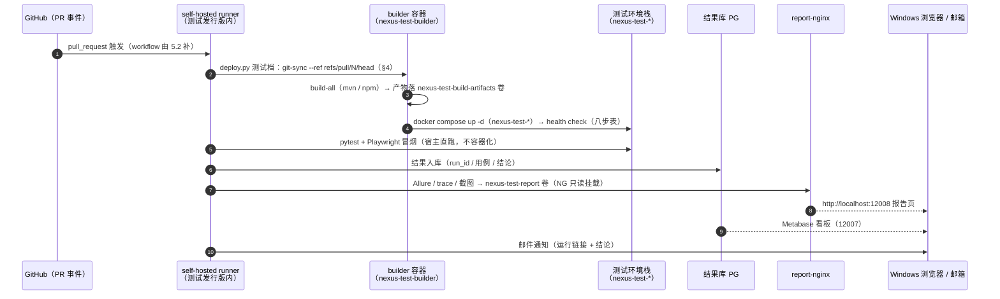
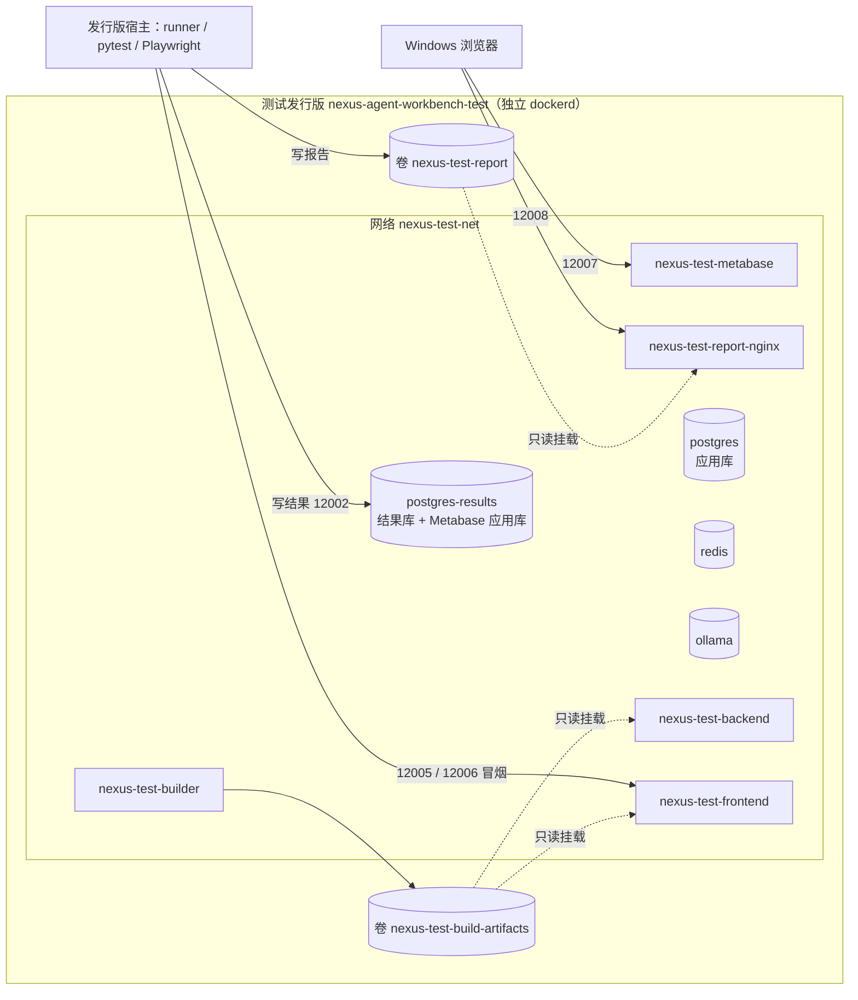

# 05 自动化测试 — task.6 设计文档（阶段5）

> 任务级别：**L1 阶段级** ｜ 状态：✅ **已确认（2026-10-08，D1/D2/D3 均按推荐）** ｜ 对应任务：`docs/task/task.6+自动化测试.md`
> 本文档覆盖子任务 **5.1 测试环境编排与部署链路复用**；5.2 / 5.3 / 5.4 / 5.5 只留占位（§7）。
> ✅ **§5 两处事项已拍板（2026-10-08）：E1 = (b)、E2 = (a)**；**本设计已确认，可进入编码**（L1 流程 Step 3）。
> 🏷️ 环境术语：`nexus-agent-workbench` = **开发环境**（dev）；`nexus-agent-workbench-test` = **测试环境**（test，**不挂 /mnt/c**）。
> **测试发行版内是独立 dockerd**（2026-10-08 实测：`dockerd` 进程在发行版内、`docker ps -a` 为空）——开发环境走 Docker Desktop，两者互不可见。
> **既成决策（不得改写）**：测试环境**完全独立**、不访问开发环境任何服务；**自带 Ollama**（M4-①）；**两个 PG 容器**（被测应用库 / 结果库，Metabase 应用库跟结果库实例，M4-②）；**不依赖云端模型**（M4-③，workflow 不需要 DeepSeek secret）。
> 引用：`docs/design/00-环境与部署.md` §2（拓扑与卷约定）；`docs/design/01-多租户与认证.md` §2（builder 链路）；`qa/README.md`；`CLAUDE.md`；[`deploy.py`](../../scripts/py/deploy.py) + `.claude/skills/deploy/SKILL.md`（部署真源）。

---

## 1. 阶段总览

PR 打开/更新 → GitHub Actions 的 **self-hosted runner**（跑在测试发行版 `nexus-agent-workbench-test` 内）拉起 →
**拉 PR 代码**（builder 容器内 git，按 PR ref）→ **builder 打包** → `docker compose up` 测试环境（`nexus-test-*`）→
**health check**（复用 `deploy.py` 八步，**非交互档**）→ **pytest + Playwright 冒烟**（在发行版**宿主**上直跑，**不容器化**）→
结果写 **Postgres 结果库** + Allure / trace / 截图落**命名卷** → **Nginx 暴露报告** → **邮件通知**。

---

## 2. 测试环境拓扑

### 2.1 服务清单

> **服务名保持与开发环境一致**（`postgres` / `redis` / `ollama` / `builder` / `nexus-backend` / `nexus-frontend`），
> 带 `nexus-test-` 前缀的是**容器名 / 卷名 / 网络名 / 项目名**（跨环境可见的标识），理由见 §3.1。
> 镜像 tag 一律 `nexus-test-*:dev`（与开发环境的 `nexus-*:dev` 区分；独立引擎下本不会撞，但名字要能一眼分清）。

| 服务名 | 镜像（均带加速前缀） | 容器名 | 宿主端口 | 命名卷 | 健康检查 | 依赖顺序 |
|---|---|---|---|---|---|---|
| postgres | `docker.m.daocloud.io/pgvector/pgvector:pg16` | nexus-test-postgres | 12001:5432 | nexus-test-pg-data | `pg_isready -U nexus -d nexus` | — |
| postgres-results | 同上（复用同一镜像，结果库不用向量扩展，多占 ~600MB 可忽略） | nexus-test-postgres-results | 12002:5432 | nexus-test-pg-results-data | `pg_isready` | — |
| redis | `docker.m.daocloud.io/library/redis:7-alpine` | nexus-test-redis | 12003:6379 | nexus-test-redis-data | `redis-cli ping` | — |
| ollama | `docker.m.daocloud.io/ollama/ollama:0.33.2` | nexus-test-ollama | 12004:11434 | nexus-test-ollama-models | `ollama list` | — |
| ollama-init | 复用 ollama 镜像（一次性） | nexus-test-ollama-init | 无 | 无（写进 ollama 卷） | 无（`restart: "no"`） | after ollama healthy |
| builder | `nexus-test-builder:dev`（`build: ./builder`，profiles: ["build"]） | nexus-test-builder | 无 | builder-src / builder-m2 / builder-npm / build-artifacts | 无（手工启停） | —（刻意不 depends_on postgres，同 dev） |
| nexus-backend | `nexus-test-backend:dev` | nexus-test-backend | 12005:8089 | build-artifacts(ro) | `wget -qO- localhost:8089/actuator/health` | after postgres + redis healthy |
| nexus-frontend | `nexus-test-frontend:dev` | nexus-test-frontend | 12006:80 | build-artifacts(ro) | `wget -qO- 127.0.0.1`（⚠️ **必须 127.0.0.1**，`localhost` 会解析到 ::1 而 nginx 只听 IPv4 —— 已知假故障） | after nexus-backend healthy |
| metabase | `docker.m.daocloud.io/metabase/metabase:<tag>`（⚠️ **非官方命名空间，前缀后不加 `/library/`**；tag 待实测选定，见 §6-2） | nexus-test-metabase | 12007:3000 | 无（应用库 = 结果库 PG 实例） | ⚠️ 待实测（镜像内有无 curl/wget 未验；探 `/api/health`） | after postgres-results healthy |
| report-nginx | `docker.m.daocloud.io/library/nginx:1.27-alpine` | nexus-test-report-nginx | 12008:80 | nexus-test-report(ro) | `wget -qO- 127.0.0.1` | — |

- 前端 nginx 站点配置沿用 `docker-compose/frontend/nginx.conf`（`proxy_pass http://nexus-backend:8089` 按**服务名**写，服务名不变即可零改动复用）。
- 测试档**不挂** `.env.local`（M4-③：不依赖云端模型）；`.env.test` 不放任何敏感值（随仓库提交，与 `.env` 同性质）。
- 结果库实例上要预建**两个 database**（结果库 + Metabase 应用库 `metabase_app`）——实现方式（init 脚本 or M6 手工建库）由 5.5 / M6 落，此处只记约束。

### 2.2 网络与命名卷

| 类型 | 名称（`name:` 显式固定，避免随项目名/目录漂移） | 挂给谁 | 用途 |
|---|---|---|---|
| 网络 | nexus-test-net（bridge） | 全部服务 | 容器间服务名互访 |
| 卷 | nexus-test-pg-data | postgres | 被测应用库数据 |
| 卷 | nexus-test-pg-results-data | postgres-results | 结果库 + Metabase 应用库 |
| 卷 | nexus-test-redis-data | redis | 会话/租户缓存 |
| 卷 | nexus-test-ollama-models | ollama / ollama-init | 模型（≈6GB，只下一次） |
| 卷 | nexus-test-builder-src | builder | 容器内 git 工作区 |
| 卷 | nexus-test-builder-m2 | builder | Maven 本地仓库缓存 |
| 卷 | nexus-test-builder-npm | builder | npm 缓存 |
| 卷 | nexus-test-build-artifacts | builder(写) / backend,frontend(ro) | 产物共享目录（app.jar + dist） |
| 卷 | nexus-test-report | 测试框架(写) / report-nginx(ro) | Allure HTML + trace + 截图（布局由 5.5 定） |

### 2.3 与开发环境的对照

| 维度 | 开发环境（dev） | 测试环境（test） | 关系 |
|---|---|---|---|
| 引擎 | Docker Desktop（WSL 集成） | 测试发行版内**独立 dockerd** | 结构性隔离（`docker ps -a` 互不可见） |
| 发行版 | `nexus-agent-workbench` | `nexus-agent-workbench-test`（**不挂 /mnt/c**） | 新增 |
| 项目名 | `name: nexus` | `name: nexus-test` | 新增 |
| 网络 | nexus-net | nexus-test-net | 新增 |
| 容器名 | nexus-*（5 常驻 + init + builder） | nexus-test-*（同构） | 新增 |
| 宿主端口 | 5432 / 6379 / 11434 / 8089 / 8088 | 12001~12008（§2.4） | 已核实无交集 |
| Dockerfile | `docker-compose/{backend,frontend,builder}/` | **同一批**（相对路径零改动复用，见 §3.3） | **复用** |
| builder 入口脚本 | `git-sync` / `build-*` / `db-patch-migrate` | 同一批（`git-sync` 需加 ref 参数，§4.1-⑦） | 复用 + 扩展 |
| 补丁目录 | `/db-patch`（宿主） | 同目录（随 PR 代码进 builder 工作区） | **复用** |
| 部署脚本 | `scripts/py/deploy.py`（八步） | 同一脚本 + 测试档（§4） | 复用 + 扩展 |
| 结果库 / 统计 | 无 | postgres-results + 结果表/视图（5.5）+ Metabase | 新增 |
| 报告 | 无 | nexus-test-report 卷 + report-nginx | 新增 |
| 模型 | qwen2.5:7b + bge-m3（卷内常驻） | 同两款，**重下 ≈6GB** | 重拉 |

### 2.4 端口分配（两种口径，**给推荐**）

**口径 A —— 草稿第 4 条字面：所有容器端口都发布，且落 12000~13000。**
即 §2.1 表里的 12001~12008 全部作为 `ports:` 发布。

**口径 B —— 推荐：只发布"跨出 docker 边界"所必需的端口；其余不写 `ports:`。**

| 端口 | 服务 | 谁会用 | 口径 B 是否发布 |
|---|---|---|---|
| 12002 | postgres-results | 发行版宿主上的 pytest 写结果 | ✅ |
| 12005 | nexus-backend | 宿主的冒烟（`deploy.py` 直连判据） | ✅ |
| 12006 | nexus-frontend | 宿主的 Playwright / 人工看页面 | ✅ |
| 12007 | metabase | **Windows 浏览器**（M6 / M7） | ✅ |
| 12008 | report-nginx | **Windows 浏览器**（M7 看 Allure） | ✅ |
| 12001 | postgres | 只被容器内消费者（builder / backend）使用 | ❌ 不发布 |
| 12003 | redis | 同上 | ❌ 不发布 |
| 12004 | ollama | 同上 | ❌ 不发布 |

- **推荐 B 的理由**：① 未发布的端口**结构性不可能**与宿主任何服务冲突（比"落 12xxx 段"更强的保证）；② 少 3 个宿主监听面；③ 人工排查不必走端口 —— `docker compose exec` 进容器即可（psql / redis-cli / `ollama list` 都有）。
- **B 与草稿字面的差异要说清**：草稿写"所有容器端口都放到 12000~13000"，B 把它读作"**凡是发布的端口**都必须落在该段内"；若要求逐字合规，直接用 A（端口表就是 §2.1 那一段），本设计其余部分不受影响。
- ✅ **口径已定（2026-10-08，用户拍板）：B**。
- ⚠️ 12xxx 段与 Windows 侧既有服务是否冲突**未实测**（§6-1）；WSL2 会把发行版监听的端口自动转发到 Windows `localhost`（⚠️ 订正：dev 的 8088/8089 是 **Docker Desktop** 转发的，不能作为本条佐证 —— 见 §6-9），所以"发布"的判据是**发行版侧监听**。

### 2.5 资源约束（与开发环境同机共存）

- **7B CPU 推理需 5GB+ 内存**（`check-env.sh` 检查点 7 的既有阈值）；测试环境**自带第二套 Ollama**（M4-①）⇒ 两套模型服务可能同时驻留。
- M1 交接物预期"`wsl --shutdown` 会连带停掉开发环境"（该验证本身标注为"缓做"）⇒ 两发行版**很可能共享同一个 WSL2 虚拟机资源池**，`.wslconfig` 的内存/CPU 上限是**全局**的（属用户侧手工项）。⚠️ 未实测（§6-6）。
- 注意事项：CI 触发时避免开发环境同时跑重量操作；RAG / 对话类用例在 CPU 推理下慢（单条超时阈值由 5.4 定，别照抄）。
- 磁盘：**948G 可用**（M1 实测）；第二套镜像（ollama 8.45GB + pgvector 621MB + redis 58MB + Metabase）+ 模型 ≈6GB ≈ **+15GB** ⇒ 无风险。

---

## 3. 资产复用边界

### 3.1 复用清单

| 资产 | 位置 | 测试环境怎么用 | 改动 |
|---|---|---|---|
| backend 运行镜像（Dockerfile + entrypoint.sh） | `docker-compose/backend/` | `context: ./backend`（相对 compose 文件目录，§3.3） | **无** |
| frontend 运行镜像（Dockerfile + nginx.conf） | `docker-compose/frontend/` | 同上；nginx.conf 的反代按**服务名** `nexus-backend:8089` 写，服务名不变即零改动 | **无** |
| builder 镜像（Dockerfile + settings.xml + 5 个入口脚本） | `docker-compose/builder/` | 同上；产物仍落 build-artifacts 卷、前后端只读消费 | `git-sync` 加 `--ref`（§4.1-⑦） |
| db-patch 补丁目录 | `db-patch/` | 随 **PR 代码**进 builder 工作区（容器内 clone），迁移照跑 | **无** |
| 部署八步 | `scripts/py/deploy.py`（+ SKILL.md） | 同一脚本 + 测试档参数 | §4 |
| 夹具 / 冒烟用例 | `qa/` | 5.4 / 5.5 落（`qa/e2e/` 已有 `.gitkeep`） | — |
| `scripts/sh/*`（up.sh / check-env / check-health / probe.sh） | `scripts/sh/` | **不复用、不动** —— 见下方 ⚠️ | 不动 |

- ⚠️ **不要在测试发行版里跑 `scripts/sh/*`**：它们把 `docker-compose/docker-compose.yml`、`.env`、`nexus-*` 容器名**写死**为开发口径（`probe.sh` 第 56~58 行），在测试引擎上只会得到一片"找不到容器"的假故障。探针库是否参数化，本阶段**不动**（避免把 5.1 扩成三套脚本的改造）。
- 镜像 tag / 容器名带 `nexus-test-` 前缀；**服务名保持与开发一致**——这是零改动复用 nginx.conf、后端 `POSTGRES_HOST: postgres`、builder `NEXUS_PG_HOST: postgres` 的前提（它们全按服务名写）。

### 3.2 测试 compose 的形态：独立文件（推荐） vs override 叠加

| 形态 | 说明 | 取舍 |
|---|---|---|
| **独立文件**（推荐） | 另写一份完整的 `docker-compose.test.yml`（服务名同 dev；容器名/卷名/网络名/项目名带 `nexus-test-`） | ① "测试环境完全独立"表达为**结构**而非一堆覆盖；② 无合并语义的坑；代价：约 300 行重复 ⇒ 评审时逐行核对两文件 diff，**差异只允许出现在白名单内**（命名 / 端口 / 结果库 / Metabase / 报告 Nginx / 不发布端口 / 不挂 `.env.local`） |
| override 叠加（`-f 开发.yml -f test.yml`） | 少重复 | override **无法删服务**；`name:` / `container_name` / `ports` 的合并（追加 vs 替换）语义琐碎且**本项目未实测** ⇒ 容易"看着覆盖了、其实没生效" |

### 3.3 build 相对路径的既有实测口径（2026-09-11 实测，compose v5.1.4）

- `build.context` 相对 **compose 文件所在目录**；`build.dockerfile` 相对**已解析的 context**（`<context>/<dockerfile>`）。
- `docker compose config` **不解析** `dockerfile`、不做路径存在性检查 ⇒ 静态预检要用
  `docker compose -f <测试 compose> build --print` + 逐路径 `test -e`。
- 现状写法 `context: ./backend` + `dockerfile: Dockerfile` → `docker-compose/backend/Dockerfile`（存在）。
  ⇒ **测试 compose 只要落在 `docker-compose/` 目录里，这三段 build 照抄即成立**（E2 候选 (a) 的零改动论据）；落在别处就要写 `../../docker-compose/backend` 之类，易错。

---

## 4. `deploy.py` 复用方案（本设计的重头）

> 执行位置：CI 里 runner 就在测试发行版内，**直接** `python3 <checkout>/scripts/py/deploy.py <测试档参数>`
> —— 不经 `wsl -d` 层，也不涉及 `MSYS_NO_PATHCONV`（那是 Windows 侧调用才有的坑）。
> 脚本本身从 runner 的 checkout（= PR head）取，`_find_repo_root` 的标记在 checkout 根同样成立（§4.1-①）。

### 4.1 九个参数化点（逐条：现状 → 改法 → 影响面）

**① 仓库根定位**
- 现状：`_find_repo_root` 按标记上溯（标记 = 存在 `docker-compose/docker-compose.yml`），已不写死层级 ✅
- 改法：**不改**。前提：测试 compose 落 `docker-compose/`（E2-(a)）；CI 从 runner checkout 跑脚本，标记同款成立。
- 影响面：无。若 E2 选 (b)/(c)，标记要加一条候选。

**② compose 目录与文件名**
- 现状：`COMPOSE_FILE` 写死 `docker-compose/docker-compose.yml`；`compose()` 不带 `-f`，靠 `cwd=COMPOSE_DIR` 的默认发现。
- 改法：把 `-f <file>` 与 `--env-file <env>` 收进一个**档位常量**（profile），由 `compose()` 原子地加在子命令前；**两档都显式给**（对称、无隐式发现）。⚠️ 防呆三条：ⓐ 两个路径只能由同一个档位常量提供，**不开放单独覆盖的 CLI 开关**；ⓑ 启动时读被选中 compose 文件的 top-level `name:`，与档位期望（`nexus` / `nexus-test`）不符即 die；ⓒ `compose config` 抽查宿主端口落档位段（测试档 12000~13000）。
- 影响面：⚠️ **订正（2026-10-08 主会话复核）**：原写「`compose()` 一处改动全脚本生效」**不完整** —— `COMPOSE_FILE` / `ENV_FILE` / `COMPOSE_DIR` 还有 **4 处直接读者**，不走 `compose()`，必须一并随档位常量切换：
  - ⓐ `deploy.py:240` `COMPOSE_FILE.exists()`（step 1 前置）——不切会**检查错文件**（开发文件存在即通过，静默）；
  - ⓑ `deploy.py:403` `COMPOSE_FILE.read_text()`（step 3.2 模型清单的真源）——不切会拿**开发** compose 的 `ollama-init` 清单给测试环境对账（今天两份内容恰好相同 ⇒ **静默不报**，与"镜像静默过期"同类）；
  - ⓒ `deploy.py:289` / `:594` `read_env(ENV_FILE)`——已由 ③ 覆盖（同一路径同时喂脚本与 compose）；
  - ⓓ `deploy.py:143` `cwd=COMPOSE_DIR`（compose() 工作目录）——建议随档位；`deploy.py:327` 读的 `frontend/nginx.conf` 是**共用资产**（§3.1 无改动），保持指向 `docker-compose/` 即可。
  - ⇒ 实施判据：`grep -n 'COMPOSE_FILE\|ENV_FILE\|COMPOSE_DIR' scripts/py/deploy.py` 逐个确认「直接读者：改走档位常量 / 或写明为何不切」。
  - dev 档行为不变（同一文件、显式与隐式等价）。
  ⚠️ 最凶的漏法：**只给 `--env-file` 不给 `-f`** ⇒ 拿测试 env 去插值**开发** compose，静默把开发文件按测试端口/项目起起来 —— 防呆 ⓑ 专门拦它。

**③ env 文件**
- 现状：`ENV_FILE = docker-compose/.env`；deploy.py 自己 `read_env` + compose 自动发现**恰好同一个文件**（未显式绑定）。
- 改法：`--env-file` 参数；同一路径**同时**喂 ⓐ deploy.py 的 `read_env` ⓑ compose 命令；测试档**跳过** `.env.local` 缺失的 WARN（M4-③ 不需要 DeepSeek）。
- 影响面：dev 不变；测试档 env 与 compose 必须成对（见 ② 防呆）。

**④ compose 项目名**
- 现状：开发文件内 `name: nexus`；脚本不显式 `-p`。
- 改法：测试文件内 `name: nexus-test`（**唯一真源写文件里**，命令行不重复 `-p`）；脚本只在防呆断言里读它。
- 影响面：`compose ps` 的名字解析走 `--format json`，不依赖名字过滤 ⇒ 无需其它改动。

**⑤ 期望健康的容器名清单**
- 现状：`EXPECTED_HEALTHY` 写死 5 个 `nexus-*`。
- 改法：随档位给。测试档 = `nexus-test-postgres / -redis / -ollama / -backend / -frontend` **+ `nexus-test-postgres-results`**（结果写入的前置，纳入阻断判定）；`nexus-test-metabase` 与 `nexus-test-report-nginx` 列**非阻断**检查（报告链路归 5.5，起得慢不该让部署红）。
- 影响面：step7 只依赖清单本身，改动局部。

**⑥ 烘进镜像的文件清单**
- 现状：`BAKED_FILES` 用**仓库根相对路径**、服务名为键；状态存 `.tmp/deploy-state.json`。
- 改法：文件清单不变（Dockerfile 复用），但三处要动：ⓐ **状态文件按档位分开**（`.tmp/deploy-state.test.json`）——否则两档互相污染基线，"该 rebuild 没 rebuild / 不该 rebuild 瞎 rebuild"都会出现；ⓑ **测试档把 `builder` 纳入 rebuild 判定**（开发档刻意不含它，由 up.sh 第 2 步管；CI 里没人管 ⇒ 改了 `git-sync` 会静默用旧镜像——正是本项目反复踩的"镜像静默过期"类）；ⓒ 文档措辞订正：task.6 写"相对 **compose 目录**的路径"，实际是**相对仓库根**（`REPO / f`）——以现状为准（见 §9 不一致处）。
- 影响面：dev 状态文件不受影响（新档新文件）。

**⑦ 拉什么 ref（最关键的一处）**
- 现状：`git-sync` 只认 `NEXUS_REPO_BRANCH`（容器 env，**创建时注入**）；`deploy.py` 调 `builder("git-sync")` 无参；**没有 ref/SHA 入参 ⇒ CI 拉 PR 代码这条路目前走不通**。
- 改法：`git-sync` 加**可选参数** `--ref <refspec>`：省略 ⇒ 现状（`origin/$NEXUS_REPO_BRANCH`）；给定 ⇒ `git fetch --prune origin <refspec>` + `git checkout --force --detach FETCH_HEAD`（+ 既有 `clean -fd` 保留）。`deploy.py` 加 `--ref`，透传给 `compose exec -T builder git-sync --ref <refspec>`。
  - **为什么不改容器 env**：`NEXUS_REPO_*` 只在**容器创建时**注入（改 `.env` 必须重建 builder 容器 —— 既有实测教训）；CI 每次跑都重建容器 ⇒ 成本与失败面都变大。参数化到 **exec 层**，一次跑一条命令。
  - **ref 选型**：`refs/pull/<N>/head`（GitHub 的 PR 隐藏 ref，**必然可取**）vs `refs/pull/<N>/merge`（GitHub 预合并结果，**冲突时不生成**）—— 本文档**推荐 head + 记录 SHA**；最终语义与 5.2 的触发策略对齐（本文档不拍）。裸 SHA（`git fetch origin <sha>`）受服务端开关影响，⚠️ 未实测（§6-8）。
  - 配套：`--expect-sha <PR head SHA>` 两个一起用才闭环（断言"真拉到的就是 PR 的 head"；`--expect-sha` 已存在）。
- 影响面：① `git-sync` 烘在 builder 镜像里 ⇒ 改动要**重建 builder 镜像**（开发侧 `docker compose build builder`；测试侧见 ⑥-ⓑ）；② step3.1「分支真源链」检查在 REF 非空时语义变化（实际拉的是 REF）⇒ CI 档改为 INFO（真源就是 `--ref`）；③ 测试库会被应用到 **PR 的 db-patch** —— 期望行为（测试库可重建），但要写进文档免得误判。
- 验证动作（未实测）：`git ls-remote <repo> 'refs/pull/*/head'`（任一能出网的环境）。

**⑧ 冒烟里的登录账号**
- 现状：step8 写死 `admin` / `admin123`。
- 改法：`--login-user` / `--login-password`（默认值不变）；CI 显式传或从 env 文件取。
- 影响面：默认零变化；意义是"测试库被清 / 口令变更时不改代码"。

**⑨ 测试环境可能不成立的判据（降级为 WARN 的路径）**
- 现状：ⓐ nginx `client_max_body_size`（宿主缺 → FAIL / 容器内查不到 → WARN）；ⓑ 向量维度（DB 取不到 → WARN / 两侧不一致 → FAIL）；ⓒ 模型清单（ollama 未响应 → WARN / 缺模型 → FAIL）。
- 改法：引入**判据档**：`strict`（dev 默认，维持现状）/ `test`（**前置物不存在 ⇒ WARN**；**存在但不一致 ⇒ 仍 FAIL**）。测试档典型场景：库还没迁移（`t_kb_chunk` 不存在）、前端容器未起。
- 影响面：语义不漂移 —— 降级的只是"环境不具备"，不放过"不一致"。

### 4.2 「CI 里没有'人'」的处置：非交互档

- 现状：脚本**本就零提问**（`stdin=DEVNULL`、`exec -T`、无 input）；"失败即停等人"是 **SKILL.md 的流程约定**，不是代码行为。CI 缺的不是"取消提示"，是 ⓐ 失败即非 0 退出（**现状已满足**：`main()` 返回 `1 if R.failed`）ⓑ **机器可读摘要**（人不在，邮件正文 / Actions 摘要要读它）。
- 改法：加 `--ci` 档（或 `--summary-json <path>`）：每步 `(step, status, summary)` + 拉到的 SHA + 结论落一份 JSON；颜色可选关（`--no-color`）。
- 影响面：dev 路径零变化；⚠️ **选定后要同步进 `.claude/skills/deploy/SKILL.md`**（它是流程真源 —— 现在写的是"一次跑完、零提示、失败即停等人"，要补一句 CI 档口径）。
- 附注：CI **首跑缓存全冷**（镜像要拉、builder-m2 / npm 缓存空、模型 ≈6GB 重下）⇒ **耗时远超 1 分钟目标，属预期**；上界待 M7 实测。

---

## 5. 待确认事项（**列选项 + 推荐，本文档不代拍**）

### 5.1 复用实现形态（= task.6 待确认 #2）

| 选项 | 说明 | 代价 |
|---|---|---|
| (a) 给 `deploy.py` 加参数 | 单文件、单入口 | 改动面直接压在**已实跑验证过**的部署链路上（首跑曾崩 3 次）；每加一个参数都要重验 dev 路径 |
| **(b) 抽可参数化核心 + 薄包装**（task.6 推荐；本文档同推荐） | 现有入口（SKILL.md 的调用命令）**零改动**，CI 走新入口；八步判据**只写一份** | 两层入口 ⇒ 要立防漂移硬规则：**包装层只组装参数、不得含任何判据**；需要一次"抽核心"的改动（用"dev 部署跑一次仍全绿"回归） |
| (c) 另写 CI 专用脚本 | 不动现有链路 | ❌ 不推荐：八步判据两份，必然漂移（本项目"判据只写一份"的教训 —— `probe.sh` 共享探针库、up.sh/check-env/check-health 三脚本不各写一份；另见 `deploy.py` 头条"凡断言必须实测"） |

- **推荐 (b)**：与 task.6 的倾向一致；理由是"(a) 的收益（少一层）小于它在已验证链路上引入的风险"，而 (c) 直接违反判据单一真源。
- ✅ **已拍板（2026-10-08，用户）：(b)**。

### 5.2 测试 compose 与 env 文件的落位（**与 task.6 待确认 #1 联动**）

| 选项 | 说明 | 代价 / 论据 |
|---|---|---|
| **(a) `docker-compose/docker-compose.test.yml` + `.env.test`**（本文档推荐） | 与"**夹具**禁止进 `docker-compose/`"**不冲突**：禁令的对象是**夹具**（会被注入被测环境的探针/种子，`qa/README.md` 的定义），测试 compose 是**编排**、**不被任何生产链路消费**（静态核实：up.sh / 镜像构建 / db-patch 迁移都只读 `docker-compose.yml` 与各自 Dockerfile；`docker-compose.test.yml` 不在 compose 的默认发现名（`compose.yaml` / `compose.yml` / `docker-compose.yaml` / `docker-compose.yml`）里）。且 `build.context` 相对 compose 文件目录 ⇒ 三份 Dockerfile 复用**零改动**（§3.3） | docker-compose/ 目录住两套编排 ⇒ 需要命名纪律 + §4.1-② 的防呆断言。 ⚠️ 若把禁令理解为"docker-compose/ 只准住开发编排"，则 (a) 不合 —— 请拍板时明确；本文档按"禁令对象是夹具"读 |
| (b) 归 `qa/` | 与"测试资产归 qa/"的直觉一致 | Dockerfile 相对路径复用变形（要 `../../docker-compose/backend` 绕行或复制 Dockerfile ⇒ 直接违背"复用"）；`qa/` 的定位是"夹具与用例辅助（不属于生产链路）"，而编排是 **CI 链路的一环**，塞进去会把定位搅浑 |
| (c) 新顶层目录（如 `test/compose/`） | 与待确认 #1 的目录之争联动 | 新增顶层目录约定（要改 `CLAUDE.md` 目录表）+ 相对路径同样要绕行 |

- ⚠️ **联动关系**：task.6 把 compose 落位挂在「待确认 #1（E2E 落 `qa/e2e/` 还是新建一级 `test/`）」上——那是**间接**联动（#1 的字面内容是 E2E 脚本目录）。两处应**一并拍板**，否则会出现"E2E 在 `qa/e2e/`、compose 却在 `test/`"这类第三种分裂。本文档**按 (a) 先写**（更忠实于现有宪法与 `qa/README.md`）。
- ✅ **已拍板（2026-10-08，用户）：(a)**；连带「待确认 #1」一并取 (a) —— E2E 脚本落 `qa/e2e/`，草稿的「一级 `test/` 目录」正式关闭。

---

## 6. 风险与「⚠️ 需实测确认」

> **未实测不得写成既成事实。** 下表"现状"栏全部只是推断 / 静态核实。

| # | 待确认项 | 现状（推断 / 静态核实） | 验证动作（可执行） |
|---|---|---|---|
| 1 | Windows 侧 12000~13000 段是否被占用 | 与本项目 dev 端口无交集已静态核实；**Windows 其他软件未实测** | 口径 B 只需逐个查 5 个：`Get-NetTCPConnection -LocalPort 12002`（同 12005 / 12006 / 12007 / 12008） |
| 2 | Metabase 镜像可拉取性与资源占用 | 未实测；**非官方命名空间**（前缀不带 `/library/`，写法与官方镜像不同）；tag 未定 | `docker pull docker.m.daocloud.io/metabase/metabase:<tag>`；起容器看 `docker stats --no-stream` |
| 3 | 报告卷"一个写、一个读"的权限 | 未实测（写方 = 宿主 runner 用户，读方 = nginx 的 uid 101 ⇒ **403 风险**） | 5.5 交付后 `docker run --rm -v nexus-test-report:/a alpine ls -lR /a` 看属主 + Windows 浏览器实开报告页 |
| 4 | 非交互档的实际行为（退出码 / 摘要 / 超时） | 未实测 | 在测试环境先制造一次**受控失败**（如 `--expect-sha` 传错前缀）看非 0 退出与 JSON 摘要，再跑正确的 |
| 5 | 测试发行版内**容器级**出网（github / 镜像源 / Maven / npm / ollama registry） | dev 环境容器能出网的证据来自 **Docker Desktop 的解析器**；测试发行版是**独立 dockerd**，其容器出网**未实测** | 栈起来后 `docker compose … exec -T builder getent hosts github.com` + `git ls-remote`；`ollama pull` 一次；builder 镜像首次构建（apt / nodesource） |
| 6 | 两发行版的内存/CPU 是否共享同一 WSL2 资源池 | M1 交接物预期 `wsl --shutdown` 会连带停掉开发环境（该验证本身"缓做"）⇒ 推断共享；**未实测** | 两环境同时起时各跑 `free -h` 与 `docker stats --no-stream` 对照 |
| 7 | `-f` + `--env-file` 组合语义（compose v5.6.0） | 静态推断：`-f` 使项目目录 = compose 文件目录、`--env-file` 决定插值来源；**未实测** | `docker compose -f docker-compose/docker-compose.test.yml --env-file docker-compose/.env.test config` 看端口与 `name:`；再确认同目录裸 `docker compose config` 仍解析**开发**文件 |
| 8 | `refs/pull/<N>/head` 可拉取性 | GitHub 的 PR ref 长期可匿名取；**本机未实测** | `git ls-remote <repo> 'refs/pull/*/head'` |
| 9 | 测试发行版**发布端口在 Windows 侧的可达性** | 推断：WSL2 `localhostForwarding` 默认开、独立 dockerd 的发布端口监听 `0.0.0.0` ⇒ 应可达；⚠️ **未实测**（dev 的 8088/8089 是 **Docker Desktop** 转发的，**不能**作为本条佐证） | 5.1 首次拉起后，Windows 侧 `curl -s -o /dev/null -w '%{http_code}' http://localhost:12006/` 期望 200 |

- 旁注：M1 交接物有一条"**待做**"—— runner 服务需重启以带上 `docker` 组（否则 CI 会 `permission denied ... docker.sock`）。属 M 侧收尾，不是本设计项，但 **M7 前必须闭环**。

---

## 7. 占位（由其它子任务补）

- **7.1 CI 触发与通知链路**（`.github/workflows/e2e-smoke.yml`、标签、邮件落位）—— 由 **5.2** 补。
- **7.2 前端定位契约**（`data-tid` 收窄、落层写法）—— 由 **5.3** 补。
- **7.3 冒烟框架与用例**（pytest + Playwright、`.venv`、超时阈值、TC-05）—— 由 **5.4** 补。
- **7.4 报告与结果可视化链路**（Allure/trace/截图 → 卷 → Nginx；结果表/视图 → Metabase）—— 由 **5.5** 补。

---

## 8. 静态验收判据（5.1 对应，来自 task.6）

- `docker compose -f <测试 compose> config --quiet` 通过；所有 `image:` / `FROM` 带 `docker.m.daocloud.io` 前缀（官方镜像含 `/library/`；**Metabase 非官方命名空间，前缀后不加 `/library/`**）。
- 新增端口全部落 12000~13000（口径 B 下为已发布的 5 个）。
- 与开发环境**四件套不重名**逐项核对：项目名（`nexus` → `nexus-test`）、网络（`nexus-net` → `nexus-test-net`）、命名卷（`pg-data` 等 → `nexus-test-*`）、容器名（`nexus-*` → `nexus-test-*`）。
- ⚠️ 运行期判据（一条命令拉起后 `/api/health` 200 且 `data.checks` 三项 UP）与"12xxx 段不撞 Windows 既有服务"**待实测**——验证动作见 §6-1 与 task.6 5.1 验收标准。

---

## 9. 与 task.6 的出入（发现即报，不自行挑一条照做）

1. **路径基准措辞**：task.6 5.1 ⑥ 写"烘进镜像的文件清单（**相对 compose 目录**的路径）"；`deploy.py` 实现是**相对仓库根**（`REPO / f`）。以**现状实现为准**（§4.1-⑥ⓒ）。
2. **compose 落位的挂靠**：task.6 5.1 写"compose（落位待定，见待确认事项第 1 条）"，而第 1 条的字面内容是 **E2E 目录之争**（`test/` vs `qa/e2e/`），二者只是间接联动 —— 本文档在 §5.2 把它明确化并给出候选。
3. **口径取舍留痕**：草稿第 4 条"所有容器端口都放到 12000~13000"与"未发布端口可以不存在"是两种读法 —— 本文档 §2.4 两种都写出并给推荐，未代拍。

---

> **本设计已确认（2026-10-08，D1/D2/D3 均按推荐）—— 可进入编码**（L1 流程 Step 3）。

