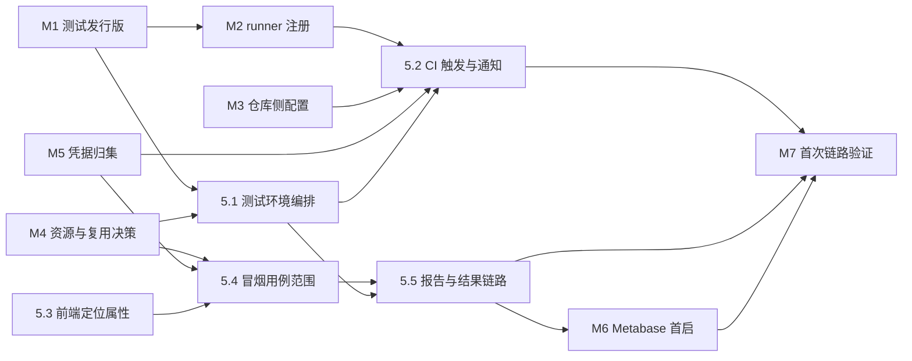

# task.6 自动化测试（E2E 冒烟）（阶段5）

> 任务级别：L1 阶段级（跨模块、影响架构） ｜ 状态：🚧 进行中（M1~M5 ✅；**5.1~5.4 ✅ 全部交付**；5.5 待开工；首跑 + M5.5 + M6 / M7 待做）
> ⚠️ **前置闸门（已推进）**：M1~M4 已完成（2026-10-08）—— **5.1 / 5.3 / 5.4 已解锁**；
> 5.2 仍压在 M2/M3 的交接物（标签字符串、secret 键名）与 M5 上，5.5 压在 5.1 / 5.4 上。
> 设计文档：`docs/design/05-自动化测试.md` ｜ 测试案例：`docs/test-cases/TC-05.md`
> 草稿来源：[`docs/drafts/自动化测试.md`](../drafts/自动化测试.md)（17 条，**存档区原文不动**）
>
> ⚠️ **编号为推定项，待用户拍板**：既有 `task.1`~`task.5` 对应阶段0~4（阶段4 未开工），故本阶段推定为
> **「第五阶段」→ `task.6` → 测试案例 `TC-05`**（stage 4 的 `TC-04` 按编号约定仍归它）。
> 若用户改为其他编号，只需改本文件与 `docs/核心任务.md` 的两处链接，草稿不受影响。
>
> 🏷️ **环境术语（2026-10-08 用户澄清，全文已按此订正）**：`nexus-agent-workbench` = **开发环境**（dev）；
> `nexus-agent-workbench-test` = **测试环境**（test）；将来可能的 `nexus-agent-workbench-prod` = **生产环境**（prod）。
> ⚠️ 一处**不**随订正改：`CLAUDE.md` 里的「**生产链路**」是对 `scripts/` 的定义（会被 up.sh / 镜像构建 / db-patch 迁移消费），
> 与「生产环境」不是一回事，本文档沿用原措辞。

## 任务目标

PR 触发的一条龙自动化冒烟：**拉 PR 代码 → 打包 → 部署到独立测试环境 → health check → Playwright E2E 冒烟 → 报告可查、结果入库、邮件通知**。

## 执行要求

本任务为 L1 阶段级任务：先产出设计文档（`docs/design/05-自动化测试.md`）并经确认后再编码；
完成后更新 `docs/核心任务.md` 进度标记并生成 `TC-05`。

本阶段的额外要求（与前五个阶段不同，逐条都是硬要求）：

1. **手工任务先行、且与 AI 任务分开勾选**：M1~M7 由用户本人完成，AI 任务不得代劳、也不得"假设它已经好了"往下写代码。
   每完成一项 M，把「交接物」回传，AI 才能把压在它后面的子任务标成可开工。
2. **矛盾必须指出、不得自行挑一条照做**（`CLAUDE.md` 明文）：本文件已在「待确认事项」列出核实过的矛盾与选项，
   **不替用户拍板**；能按更忠实的一条先做就做，同时注明选择。
3. **凡未经实测的运行期事实，一律标注「⚠️ 需实测确认」并配一条可执行的验证动作**，不得写成既成事实
   （沿用 `docs/task/task.1+环境准备.md` 0.3 的判据纪律）。
4. **测试资产归属**：E2E 与夹具落 `qa/`（`qa/e2e/` 已有 `.gitkeep` 占位）；**禁止**往 `scripts/`、`db-patch/`、
   `docker-compose/` 里塞测试夹具（见 `qa/README.md` 与 `.claude/agents/qa-engineer/CLAUDE.md` 的《Test Harmlessness》）。
5. **本阶段只做冒烟**：用例**少而精**（一人工程，执行成本全在用户身上）—— 建议集合见 5.4，别贪大。
6. **镜像加速**：新增的 Dockerfile `FROM` / compose `image:` 一律走 `docker.m.daocloud.io` 前缀
   （官方镜像加 `/library/`）；**禁止**改 `/etc/docker/daemon.json`。
7. **部署链路倾向"扩展而非另起炉灶"**：真源是 `.claude/skills/deploy/SKILL.md` + `scripts/py/deploy.py`；
   复用结论与代价见 5.1 与「待确认事项」第 2 条。

---

## 🔧 需要用户本人手工完成的任务（M1~M7）

> **为什么单独成节**：草稿 1/2/3/6/10/15/17 里的这几件事，AI 做不了 —— 要么是**浏览器/GitHub 平台操作**，
> 要么涉及**凭据**，要么是**资源与账号决策**。把它们与 AI 任务分开勾选，才能看清"到底卡在谁身上"。
> 每项固定五段：为什么必须手工 / 前置条件 / 逐步操作 / 交接物 / 完成判据。

### M1 建测试用 WSL 发行版 `nexus-agent-workbench-test`（不挂本地盘）

- **为什么必须手工**：创建发行版、在其内安装 docker、关闭 `/mnt/c` 自动挂载，全是**宿主环境变更**；
  且 `CLAUDE.md` 与各 agent charter 明文规定「发行版由用户按项目指定，**禁止自行探测**」。
- **前置条件**：Windows 11 + WSL2 可用；现有发行版 `nexus-agent-workbench` 的 sudo 可用（作为参照）；
  磁盘余量 —— 参照 `wsl.abc.md` §3.3/§3.4 的实测体积：ollama 镜像 **8.45GB**、pgvector **621MB**、
  redis-alpine **57.8MB**，再加模型（`qwen2.5:7b` 4.68GB + `bge-m3`，**bge-m3 体积未实测**）与第二套 builder 层。
  → **开工前先 `df -h /` 看余量**，数字填进 M4 的决策表。
- **逐步操作**：
  1. 建发行版并**固定命名为 `nexus-agent-workbench-test`**（建法自选；名字必须与本文档、`wsl.abc.md` 的后续记录一致）。
  2. 在该发行版内装 **独立 docker engine + compose 插件**，并**关掉 Docker Desktop 对该发行版的 WSL 集成**
     （Docker Desktop → Settings → Resources → WSL Integration；不关则发行版里的 `docker` CLI 仍指向 Desktop，两个入口打架）。
     ⚠️ 2026-10-08 实测教训：集成未关时 `docker info` 的 Name = `docker-desktop`、`docker ps -a` 能看到开发环境的 `nexus-*` 与其它项目 —— 那等于没换引擎。
  3. **关掉自动挂载**：`/etc/wsl.conf` 写 `[automount]` + `enabled = false`，然后 Windows 侧 `wsl --shutdown` 使配置生效
     —— 这条是草稿 1「不挂载本地硬盘」的落地判据。
  4. 确认 docker 可用：`wsl -d nexus-agent-workbench-test -- bash -c "docker version && docker compose version"`。
  5. ⚠️ 顺手确认镜像加速**不依赖 daemon.json**（本项目规则）：在该发行版内跑
     `docker pull docker.m.daocloud.io/library/hello-world`，看是否秒级完成。
- **交接物（已回填，2026-10-08 实测）**：
  - 发行版名 `nexus-agent-workbench-test` ✅（用户确认）；
  - **独立引擎** ✅：`dockerd` 进程在发行版内（PID 309）、context 仅 `default`、`docker ps -a` 为空（看不到 `nexus-*` 与其它项目）—— ⚠️ 判据用「发行版内有 dockerd」与「容器列表为空」，**不要只看 `docker info` 的 Name**（那是主机名，两发行版可能同名）；
  - `/mnt` 无 `c` ✅（M1 完成判据，用户已断言）；
  - 磁盘：`/` 与 `/var/lib/docker` 同一文件系统，**可用 948G** ✅；
  - 用户 `caotan` 在 `docker` 组 ✅、免 sudo 可用 ✅；`docker.service` **enabled + active** ✅（重启可自恢复）；
  - 插件：Compose v5.6.0 / buildx v0.38.0 ✅；镜像加速实测通过（`docker.m.daocloud.io/library/hello-world` 秒级拉通）✅；
  - ✅ **runner 服务已重启（2026-10-09 08:07，用户操作）**：`actions.runner.KeanuCao-nexus-agent-workbench.nexus-tester.service` = loaded active running；**runner 进程 Groups 含 docker GID 1003**（`/proc/831/status` 实证）⇒「旧组 ⇒ CI 里 permission denied」的风险已闭环；
  - ⚠️ **缓做**：`wsl --shutdown` 后重进的自动恢复验证（会连带停掉开发环境，择机再做）。
- **完成判据**：Windows 侧 `wsl -d nexus-agent-workbench-test -- bash -c "docker version"` 打印出版本号，
  且 `ls /mnt` 看不到 `c`。

### M2 注册 GitHub Actions self-hosted runner（标签 / 可见性 / 能拉码）

- **为什么必须手工**：注册 token 只在 GitHub 页面一次性可见；runner 进程的注册与常驻是平台侧操作 + 长期运行决策。
- **前置条件**：M1 完成；仓库 Actions 权限已开（M3）；runner 需要能访问 github.com。
- **逐步操作**：
  1. GitHub → 仓库 `Settings → Actions → Runners → New self-hosted runner`，**照着页面给出的那段命令原样执行**
     （页面会带上下载地址与注册 token；**不要照抄本文档的命令拼装**，它是会变的）。
  2. 注册时给 runner 打标签（建议 `nexus-test`）：`runs-on` 要用到，**标签字符串以 M2 交接物为准**。
  3. 装成常驻服务（前台 `./run.sh` 只适合验证一次，长期跑要装服务）。
  4. 把该用户加入 `docker` 组（否则跑不了本项目所有容器操作）—— ⚠️ 这等价于给 root 权限，
     公开仓库上必须配合 M3-③ 的限制。
  5. 验证能拉码：在该发行版内 `git ls-remote https://github.com/<owner>/<repo>.git HEAD` 返回 SHA。
- **交接物**：runner 名称 ｜ **标签集合的精确字符串**（workflow 的 `runs-on` 逐字对齐）｜ 可见性（仓库级/组织级）｜
  `git ls-remote` 是否成功 ｜ 是否装了常驻服务。
- **完成判据**：GitHub 页面 `Settings → Actions → Runners` 里该 runner 显示 **Online/Idle**。

### M3 GitHub 仓库侧配置（Actions 权限 / secrets / 谁能触发）

- **为什么必须手工**：仓库 Settings 是平台侧操作；secret 的值不能经 AI（部署脚本也明文「不打印密钥」）。
- **前置条件**：M2 的 runner 已注册。
- **逐步操作**（逐条做完，把结论填进交接物）：
  1. `Settings → Actions → General`：确认 Actions 允许运行、Workflow permissions 选哪档。
  2. **确认仓库可见性**（public / private）—— 现有 `.env` 的 `NEXUS_REPO_URL` 走**匿名 HTTPS**，
     链路能跑通意味着仓库**当前可匿名读**（⚠️ 需你确认这一推断）；若改私有，builder 的 `git pull` 就需要凭据，
     属 M5 的范围。
  3. ★ **限制谁能触发 self-hosted runner**：公开仓库 + self-hosted runner = **任何人开 PR 就能在你的机器上执行代码**。
     处置选项（见「待确认事项」第 5 条，需你拍板）：设仓库为私有 / 只允许同仓分支触发 /
     开启「外部贡献者需批准」。
  4. **决定密钥的存放位置**：GitHub Repository secrets **或** 测试发行版内的本地 env 文件（不进仓库）。
     两者只能选一种作为真源，**不要两处都放**（会重演 `.env.local` 双行同名覆盖那次事故）。
  5. 若选 GitHub secrets：把**键名清单**（不含值）记进交接物 —— workflow 里要按名引用。
- **交接物**：仓库可见性 ｜ Actions 权限档位 ｜ 已配置的 **secret 键名清单（只报名字，不报值）** ｜
  触发策略（是否限制外部 PR）｜ secrets 与本地 env 文件**哪个是真源**。
- **完成判据**：`Settings → Actions → Runners` 能看到 runner；做一次最小 workflow 触发（或等 M7 时一并验证），
  该运行出现在仓库 Actions 列表里。

### M4 测试环境资源与复用决策（第二套 Ollama/模型是否重下；与开发环境的关系）

- **为什么必须手工**：磁盘/内存是物理资源、时间成本是你的；而"要不要复用开发环境"直接影响
  `qa-engineer` charter 的《Test Harmlessness》红线（**测试不得碰业务状态**）—— 没有 AI 能替你拍这个板。
- **前置条件**：M1 的磁盘数字；草稿 10 与《Test Harmlessness》都摆在桌上。
- **逐步操作**：对着下表逐行给结论（AI 会把结论记录进设计文档，不放行任何与之矛盾的实现）。

| # | 决策点 | 选项 | 代价 / 依据 |
|---|---|---|---|
| ① | 测试环境要不要**第二套 Ollama + 重下模型** | (a) 要（会话/知识库冒烟可真跑）<br>(b) 不要（冒烟只覆盖登录/页面/导航） | (a) 8.45GB 镜像 + 约 5GB 模型 + 每次推理吃 CPU；<br>(b) 省磁盘省时间，但对话/知识库两条链路的冒烟就落不了地 |
| ② | 测试环境与结果库**是否共用一个 PG 容器**（不同 database） | (a) 共用<br>(b) 两个 PG 容器 | (a) 省一个容器；需明确"结果库"与"被测应用库"的库名<br>(b) 隔离更干净，多一个容器与一份数据卷 |
| ③ | 冒烟是否**允许依赖云端模型**（DeepSeek） | (a) 允许<br>(b) 不允许（只用本地 Ollama） | (a) 依赖密钥；且 **fork PR 拿不到 secret**（见「待确认事项」第 5 条）；<br>(b) 少一个不确定源，推荐 |
| ④ | 测试环境与开发环境**是否共用同一个 docker daemon** | 由 M1 的实测结论决定 | 共用 ⇒ 容器名/网络名/卷名/项目名**全同**，必然互相顶掉（见下方"冲突面"）；独立 ⇒ 端口段不重叠即可 |
| ⑤ | 是否允许测试环境**访问开发环境的服务**（草稿 10 的兜底） | (a) 允许<br>(b) 不允许 | (a) **与《Test Harmlessness》直接冲突** —— 部署与测试会写开发环境的容器、业务库与 Redis；<br>(b) 推荐 |

**✅ 结论（2026-10-08 用户拍板：测试环境完全独立 —— 自备全套服务，不碰开发环境）**

| # | 结论 | 落地含义 |
|---|---|---|
| ① | **要** —— 测试环境自带 Ollama + 模型 | ④ 改独立引擎后账要重算：镜像**需重拉**（ollama ≈8.45GB + pgvector ≈621MB + redis ≈58MB，走加速 ≈5 分钟）、模型 ≈6GB 重下（≈4 分钟）；原「从开发卷拷模型省下载」**跨引擎不可行**，取消。磁盘实测 **948G 可用** ⇒ 前提满足 |
| ② | **两个 PG 容器**（被测应用库一个、结果库一个） | 测试环境起 2 个 PG；Metabase 应用库的落位在设计文档定（默认跟结果库那个实例） |
| ③ | **不允许依赖云端**（DeepSeek） | 冒烟只用本地 Ollama；workflow 不需要 DeepSeek secret |
| ④ | **独立引擎 —— 已实测（2026-10-08）**：用户关闭 Docker Desktop 对该发行版的 WSL 集成，并在发行版内装了独立 docker engine。判据：**`dockerd` 进程在发行版内**（PID 309，决定性判据）、context 仅 `default`（无 `desktop-linux`）、**`docker ps -a` 为空**（看不到 `nexus-*` 与其它项目）⇒ **结构性隔离成立** | 命名（`nexus-test-*`）与端口（12000~13000）约定不变，但撞车已成**结构性不可能**。开发环境未改动（仍走 Docker Desktop）；**CI 不再依赖 Docker Desktop 常开**（早先那条约束随本次变更解除） |
| ⑤ | **不允许** —— 不访问开发环境的任何服务 | 草稿 10 的「整套复用开发环境」**就此废弃**；「需实测确认」#4（跨发行版互通）随之**注销** |

- ✅ **M4 完成（2026-10-08）**：①~⑤ 全部落定；④ 经**两次**实测（先共用 Desktop → 改独立引擎）；磁盘 **948G 可用**。
- 📌 **④ 的两次实测留痕**：早先 = Docker Desktop 单引擎共用（`nexus-*` 与 bazi 等可见 ⇒ 命名/端口升为硬约束）；随后用户拍板改独立引擎（结构性隔离 + 解除 CI 对 Docker Desktop 的依赖）。
- **交接物**：①~⑤ 的结论（已录）＋ ④ 的实测事实（**已二次回填**）＋ 磁盘 **948G**（已回填）＋ 跨发行版访问（**⑤ 定为不允许 ⇒ 注销**）。
- **完成判据**：AI 拿着这张填好的表，能不加猜测地写 5.1 的服务清单与 5.4 的用例范围。

### M5 凭据归集（DeepSeek / SMTP / git）

- **为什么必须手工**：凭据不能过 AI（`deploy.py` 已写死"不打印密钥"、`.env.local` 只报存在/缺失）。
- **前置条件**：M3-④ 已定"secret 放哪"。
- **逐步操作**：
  1. **SMTP 发信凭据**（草稿 17 需要）：host / port / 用户名 / **授权码或应用专用密码** / 收件人地址 / 是否 TLS。
  2. **DeepSeek key**：仅当 M4-③ 选了"允许依赖云端模型"才需要；否则跳过（推荐跳过）。
  3. **git 拉码凭据**：仅当仓库转私有（M3-②）才需要 —— 届时 builder 容器的匿名 `git pull` 会失败。
  4. 按 M3-④ 的决定，把值放进**唯一真源**那处（本地 env 文件或 GitHub secret）。
- **交接物**：**每个键的键名 + 存放位置 + 用途**（不报值）｜ 发件人/收件人 ｜ 端口与加密方式 ｜
  "值在哪个文件的哪个键"这句话能指着说清。
- **完成判据**：AI 只要键名就能把 workflow / 邮件步骤写出来；跑起来时值能从真源取到（M7 一并验证）。

### M5.5 准备 runner 侧运行环境（持久 venv + Chromium，一次性）

- **为什么必须手工**：`playwright install --with-deps` 需要 **root/sudo**（装系统库），而 CI 非交互（输不了密码）；
  要么人工装一次，要么给 runner 配免密 sudo（等于再让一份代码拥有 root，不做）。⇒ 这是**隐性人工前置**：
  不写清"谁装、判据是什么"，CI 会在第一次 PR 上以"步骤 2 红"现形。
- **前置条件**：M1（发行版）✅；发行版内 `python3` 可用；PyPI 与 Playwright CDN 可达（⚠️ 需实测）；sudo 可用。
- **逐步操作**（在测试发行版内、任意一份 checkout 里跑；与设计 §7.1.8-② 的命令一字对齐）：

  ```bash
  python3 -m venv "$HOME/nexus-e2e-venv"
  "$HOME/nexus-e2e-venv/bin/pip" install -r <checkout>/qa/e2e/requirements.txt
  "$HOME/nexus-e2e-venv/bin/python" -m playwright install --with-deps chromium   # 要 sudo 装系统库
  sha256sum <checkout>/qa/e2e/requirements.txt | cut -d' ' -f1 > "$HOME/nexus-e2e-venv/.requirements.sha256"
  ```

  ⚠️ **指纹行最后写**，且用**与 CI 同一份内容**的 `requirements.txt`（checkout 先 pull 到最新）——
  指纹不一致时 workflow 会红，那正是"有人改了依赖、venv 该重装"的正确信号。
- **交接物（已回填，2026-10-10）**：venv = `$HOME/nexus-e2e-venv` ｜ Python **3.12.3**（发行版自带；
  与 Windows 面的 3.14.4 不是一回事，**CI 用的是这个**）｜ playwright **1.63.0** / chromium **153.0.8010.12**
  ｜ 指纹已写入且与克隆一致（`c38594a6…` ⇒ CI 步骤 2 会过；PyPI / Playwright CDN 可达性亦被安装本身证明）
  ｜ sudo：本次为交互输入（**CI 不需要** —— workflow 只校验、不安装）。
- **完成判据**（不依赖 CI，发行版内直接验）：workflow 步骤 2 的等价三条全过 ——
  ① `test -x "$HOME/nexus-e2e-venv/bin/python"`；② 指纹与 `qa/e2e/requirements.txt` 一致；
  ③ `"$HOME/nexus-e2e-venv/bin/python" -c "from playwright.sync_api import sync_playwright; p=sync_playwright().start(); b=p.chromium.launch(); print('chromium OK:', b.version); b.close(); p.stop()"` 打印版本号。

### M6 Metabase 首启管理台配置（建管理员 / 连库 / 看板）

- **为什么必须手工**：浏览器操作 + 管理员账号口令，且"要看什么统计"是你的判断（草稿 15）。
- **前置条件**：5.5 已交付（Metabase 容器起得来、结果表与 SQL 视图已应用）；
  端口落 12000~13000；容器连库走 compose 网络内的服务名 + 容器内端口（**不是宿主端口**）。
- **逐步操作**：
  1. Windows 浏览器打开 `http://localhost:<Metabase 端口>`（端口由 5.5 交付时给出）。
  2. 创建管理员账号（口令不进任何文档）。
  3. `Add database` 连**测试环境的 PG**（host 用服务名，port 用容器内端口，db 用结果库名）。
  4. 选要展示的视图（建议先只做 1~2 个：最近 N 次运行的通过率、失败用例 TopN），**别一开始就铺大**。
  5. 记下看板 URL，作为 M7 的验证入口之一。
- **交接物**：Metabase 端口 ｜ 已连的库名 ｜ 看板名与 URL ｜ 管理员账号（**口令不入文档**）。
- **完成判据**：浏览器里打开看板能看到至少一个视图的查询结果（例：最近 10 次运行的通过率）。

### M7 首次链路验证（开 PR → 看 Actions → 收邮件 → 看报告）

- **为什么必须手工**：`push` 与 PR 合并是项目的既有纪律（由你手工做）；邮件收件与浏览器看报告也在你侧。
- **前置条件**：AI 子任务 5.1~5.5 已交付；M1~M6 完成。
- **逐步操作**：
  1. 从特性分支开一个**测试 PR**（内容随意，改一行文档即可）。
  2. 打开仓库 `Actions` 页面，看这次运行逐步跑过（重点看"部署"步骤是否给出 PASS/FAIL 表）。
  3. 到收件箱确认收到通知邮件。
  4. Windows 浏览器打开报告页（Allure）与 Metabase 看板。
  5. 验证完把 PR 关掉或合入（**由你决定**）。
- **交接物**：Actions 运行 URL ｜ 邮件到达情况（到/未到 + 时间）｜ 报告页 URL 能否打开 ｜
  若失败：**原始输出**（不要只给结论，`deploy.py` 的纪律是"失败即停、人工定方案"）。
- **完成判据**：Actions 页面出现该 PR 的运行记录，且邮件到达、报告页可打开。
  ⚠️ **"用例失败"与"链路没跑通"要分清**：只要运行记录存在、输出可读，M7 就算完成；用例红是 5.4 的返工，不是 M7 的失败。

### M 任务 ↔ AI 子任务的阻塞关系



- **不被任何 M 阻塞的只有 5.3**（前端加定位属性）—— 它是本阶段唯一可以在 M1 之前就开工的活。
- 5.4 的**框架骨架**可先写，但**能不能真跑**取决于 M1/M4。
- **M5.5**（runner 环境准备，2026-10-10 新增）—— 5.2 工作流步骤 2 与冒烟实跑的前置，已并入首跑清单。

---

## 子任务拆解

### 5.1 测试环境编排与部署链路复用

- **输入**：草稿 4/5/6/10/14；`docker-compose/docker-compose.yml` 与 `docker-compose/.env`（端口与凭据真源）；
  `scripts/py/deploy.py`；`docs/design/00-环境与部署.md` §2（拓扑与卷的既有约定）；M1 / M4 的交接物。
- **输出**：
  - 测试环境 compose（**落位已定**：`docker-compose/docker-compose.test.yml` + `.env.test` —— 2026-10-08 拍板，见设计文档 §5.2）+ 与之配套的 env 文件（端口段 12000~13000，
    项目名/卷名/网络名/容器名前缀与开发环境**不重名**）；
  - deploy 复用方案：**倾向扩展 `scripts/py/deploy.py`**（参数化点见下），把"怎么跑一次部署"收敛在同一个真源；
  - 设计文档 `docs/design/05-自动化测试.md` 的「测试环境拓扑」小节。
- **依赖**：M1、M4（可与 5.3 并行）
- **验收标准**：
  - 静态：`docker compose -f <测试 compose> config --quiet` 通过；所有 `image:` / `FROM` 带 `docker.m.daocloud.io` 前缀
    （官方镜像含 `/library/`）；**新增端口全部落在 12000~13000**。
  - 静态：两套环境的宿主端口**无交集** —— 现有端口为 `5432 / 6379 / 11434 / 8089 / 8088`（已核实，均不在 12000~13000 段内）。
  - 静态：与开发环境不重名的四件套逐项核对 —— 项目名（开发环境 `name: nexus`）、网络（`nexus-net`）、命名卷
    （`pg-data` / `redis-data` / `ollama-models` / `builder-src` / `builder-m2` / `builder-npm` / `build-artifacts`）、
    容器名（`nexus-*`）。**判据**：两套同时起着时 `docker ps -a --format '{{.Names}}'` 无重名冲突（⚠️ 2026-10-08 订正：M4-④ 已实测**独立引擎**，撞车结构性不可能 —— 命名仍照 `nexus-test-*` 办，理由是「一眼能分清」而非防撞）。
  - ⚠️ **需实测确认**：测试环境一条命令拉起 PG / Redis / 后端 / 前端后，`curl` 测试端口拿到的 `/api/health` 为 200
    且 `data.checks` 三项 UP（验证动作：`curl -s http://127.0.0.1:<测试后端端口>/api/health`）。
  - ⚠️ **需实测确认**：12000~13000 段与 Windows 侧既有服务不冲突（验证动作：Windows 侧
    `Get-NetTCPConnection -LocalPort <端口>`，逐个新端口查）。
  - **deploy 复用必须交代清楚的参数化点**（评审时逐条对照）：① 仓库根定位（`deploy.py` 已按标记上溯，✅ 不写死层级）；
    ② compose 目录与文件名（现写死 `docker-compose/docker-compose.yml`）；③ env 文件；④ compose 项目名；
    ⑤ 期望健康的容器名清单（现写死 `nexus-*` 五个）；⑥ 烘进镜像的文件清单（**相对仓库根**的路径 —— 2026-10-08 经实现核对订正，此前写作「相对 compose 目录」）；
    ⑦ **拉什么 ref**（CI 要拉 PR 的 head，现有 `git-sync` 只认分支名 —— 这是最关键的一处）；
    ⑧ 冒烟里的登录账号（现写死 `admin/admin123`）；⑨ 测试环境可能不成立的判据（向量维度查 `t_kb_chunk`、
    nginx `client_max_body_size`）要有降级为 WARN 的路径。
- **推荐执行角色**：`devops-engineer`

### 5.2 CI 触发与通知链路

- **输入**：草稿 2/3/17；M2 的**标签精确字符串**、M3 的触发策略与 secret 键名、M5 的邮件键名；5.1 的部署方案。
- **输出**：`.github/workflows/e2e-smoke.yml`（PR 触发 → `runs-on: [self-hosted, <M2 标签>]` → 部署测试环境 →
  跑 5.4 的冒烟 → 收尾通知）；邮件发送步骤（落位见「待确认事项」第 6 条）。
- **依赖**：M2、M3、M5、5.1
- **验收标准**：
  - `runs-on` 的标签与 M2 交接物**逐字一致**（差一个字符就是"永远排队"）。
  - 触发条件明确：`pull_request` 指向 main（是否加 `workflow_dispatch` 手跑入口由设计定）；**必须写明 PR 的来源限制**
    （同仓分支 / fork，见 M3-③）。
  - 失败即红：步骤不吞退出码（禁止 `|| true` 掩盖部署失败）；邮件与报告步骤**在失败路径上也要执行**
    （`if: always()` 一类）。
  - 不出现明文凭据：密钥一律走 secret / env 引用；日志不打值。
  - ⚠️ **需实测确认**：runner 内可达 github.com 与 Actions 依赖（验证动作：M2 的 `git ls-remote` + 首次运行）；
    **建议零 marketplace action、纯 shell 步骤** —— 少一个外部依赖，也顺带绕开"action 版本与网络"两个变量。
  - ⚠️ **需实测确认**：workflow 文件新增在 PR 里能否被该 PR 自身触发（平台行为，以 M7 的运行记录为准；
    若不成立，先把 workflow 合入 main 再复验）。
  - ⚠️ **风险要写进设计文档**：`deploy.py` 的既有纪律是「一次跑完、零提示、**失败即停等人**」，
    而 **CI 里没有"人"**。处置选项：脚本加一个"非交互模式"（不提示、失败即非 0 退出 + 机器可读摘要），
    或 CI 里只包装调用并接受"红即人工看"。**选定后要同步进 `.claude/skills/deploy/SKILL.md`**（它是流程真源）。
- **推荐执行角色**：`devops-engineer`

### 5.3 前端定位契约（`data-tid` 收窄改造）

- **输入**：草稿 12；**冒烟实际会用到的元素清单**（见下表 —— 这是"收窄"的依据，不写"可能的地方"）。
- **输出**：仅在下表列出的元素上加定位属性（属性名见「待确认事项」第 3 条，暂按 `data-tid` 写）；
  定位约定表（含"每种组件定位属性落在哪一层 DOM"）落 `docs/design/05-自动化测试.md` 或 `qa/e2e/README.md`（择一，别两处维护）。
- **依赖**：无（**本阶段唯一不被 M 任务阻塞的活**）

| 冒烟要用的元素 | 文件 | 建议定位值 |
|---|---|---|
| 用户名输入 / 密码输入 / 登录按钮 / 页面内错误提示 | `frontend/src/views/LoginView.vue` | `login-username` / `login-password` / `login-submit` / `login-error` |
| 导航项（对话 / 知识库 / 退出登录） | `frontend/src/components/AppNav.vue` | `nav-chat` / `nav-knowledge` / `nav-logout` |
| 模型选择 / 输入框 / 发送 / 停止生成 | `frontend/src/views/ChatView.vue` | `chat-model` / `chat-input` / `chat-send` / `chat-stop` |
| 上传控件 / 提问输入 / 提问按钮 / 答案块 | `frontend/src/views/KnowledgeView.vue` | `kb-upload` / `kb-question` / `kb-ask` / `kb-answer` |
| 控制台标题（登录后落点判据） | `frontend/src/views/DashboardView.vue` | `dashboard-title` |

- **验收标准**：
  - 属性值在仓库内可 `grep` 出**唯一**清单，且每个值在 DOM 里唯一（**不得两处同名**）。
  - 不改行为、不改样式、不动业务逻辑；`npm run type-check` 零错误（**不打包** —— `frontend-engineer` 的红线）。
  - ⚠️ **需实测确认（本子任务的头号待确认项）**：Element Plus 组件上的透传属性**落在哪一层 DOM** ——
    `el-input` 的根是包裹 `div.el-input`、内层才是原生 `<input>`；`el-select` 根是 `div`（**不是**原生 `<select>`）；
    `el-upload` 根是 `div`（真正的文件框是内层 `input[type=file]`，通常还是隐藏的）。
    **验证动作**：加完属性后在浏览器 DevTools 执行 `document.querySelector('[data-tid=login-password]').outerHTML`
    （或 `...?.tagName`），按实际落层写死定位写法（如 `[data-tid=login-password] input`）。
  - ⚠️ **需实测确认**：草稿 13「优先用 Role」在这几处**不全成立** —— `<input type="password">` 在可访问性树里
    一般**没有 textbox 角色**，密码框用 Role 定位大概率取不到。
    **验证动作**：在 Playwright 里对密码框试 `get_by_role("textbox")` 与 `[data-tid=...] input` 两种写法，取能过的那个。
    建议固化成口径：**按钮/链接/标题类能用 Role 就用 Role；表单控件（input / select / upload）一律走定位属性**。
- **推荐执行角色**：`frontend-engineer`

### 5.4 pytest + Playwright 冒烟框架与用例

- **输入**：草稿 7/8/9/11/13/16；5.3 的定位约定；M4 的模型/云端决策；既有冒烟链路的出处（TC-01 登录、TC-02 2.4-*、TC-03 3.5-1）。
- **输出**：
  - `qa/e2e/`：pytest 工程（`conftest.py`、用例文件、`requirements.txt`、`README.md`）；
  - `.venv` 创建与依赖安装说明（**Python 3.14.4**，草稿 9）；
  - trace / 截图 / Allure 原始结果的**产物路径约定**（交给 5.5 挂卷）；
  - `docs/test-cases/TC-05.md`（按 `docs/test-cases/` 既有格式：步骤栏可无损复现 + 「实测」栏留空）。
- **依赖**：5.3、M4、M5（仅当 M4-③ 允许依赖云端模型）
- **验收标准**：
  - **冒烟集合少而精**（建议 5 条，见下），每条都能指回既有的 TC 用例或验收标准；**不做全量 E2E**。
  - 每条用例失败必留 **trace + 截图**（成功是否留由设计定）；产物落点与 5.5 的卷路径一致。
  - 单条用例超时可配（RAG 那条最慢，⚠️ **需实测确认**耗时上界后再定阈值，别照抄别的项目的数字）。
  - 至少 1 条负路径（登录失败），且判据是**页面内可见文案**而非只在日志里。
  - 断言不依赖被测系统之外的外部网络（不调云端、不装 marketplace 依赖）。
  - **无害性**：用例不得清除/重建被测环境的业务数据；需要造数据的走 `qa/fixtures/` + 一次性作用域
    （沿用 `qa/README.md` 的三条铁律）。
  - ⚠️ **需实测确认**：Python 3.14.4 下 `playwright` / `pytest-playwright` / `allure-pytest` 能否装上
    （验证动作：`python3 -m venv .venv && .venv/bin/pip install -r qa/e2e/requirements.txt`，看是否有轮子缺失）。
  - ⚠️ **需实测确认**：Playwright 的浏览器与**系统依赖**（headless 也需要系统库）在该发行版内是否齐备
    （验证动作：`python -m playwright install --with-deps chromium` 或按草稿用 chrome channel，取能过的那条）。
  - 建议冒烟集合（**待设计文档定稿；这是"收窄"的起点，不是既成事实**）：

    | # | 用例 | 定位需求 | 出处 |
    |---|---|---|---|
    | S1 | 登录成功 → 落到控制台 | `login-*` + `dashboard-title` | TC-01 登录链路 |
    | S2 | 登录失败 → 页面内错误提示（负路径） | `login-*` + `login-error` | TC-01 失败口径 |
    | S3 | 未登录直达 `/chat` → 被送回 `/login` | 无新元素 | TC-02 `2.4-7` / `2.4-8` |
    | S4 | 对话页发一句 → 出现回答 | `chat-*` | TC-02 `2.4-1` |
    | S5 | 知识库上传夹具 → 提问 → 出现答案与引用 | `kb-*` | TC-03 `3.5-1`（最慢，视 M4 决策可裁剪） |
- **推荐执行角色**：`qa-engineer`

### 5.5 报告与结果可视化链路（Allure + trace + 截图 → 卷 → Nginx；结果 → Postgres → Metabase）

- **输入**：草稿 5/6/11/13/14/15；5.4 的产物路径约定；测试环境的 PG 与 compose（5.1）。
- **输出**：
  - **报告链路**：Allure HTML + Playwright trace + 截图落**命名卷**；Nginx 容器只读挂该卷并暴露一个
    **12000~13000 段内**的宿主端口，Windows 浏览器可直接打开；
  - **结果链路**：测试结果表 DDL + 统计 SQL 视图（**落位见「待确认事项」第 4 条**）+ 写入方（测试框架侧收尾步骤）；
  - **Metabase**：容器定义（读结果库）+ 首启配置指引（交 M6 人工）。
- **依赖**：5.1、5.4
- **验收标准**：
  - 卷内容可列：`docker run --rm -v <报告卷>:/a alpine ls -lR /a` 能看到 `index.html`、`trace.zip`、`*.png`
    （⚠️ **需实测确认**：卷内文件属主与 Nginx 读权限 —— 一个写一个读，uid 不一致会 403）。
  - Windows 浏览器打开 `http://localhost:<报告端口>` 能看到本次 Allure 报告首页，并能点进失败用例的 trace/截图。
  - `SELECT count(*) FROM <结果表> WHERE run_id = '<本次>'` 与该次运行的用例数一致；
    统计视图能 `SELECT` 出「最近 N 次运行的通过率」。
  - ⚠️ **需实测确认**：Allure 报告生成是否需要 **JVM**（Allure CLI 传统上是 Java 程序；`allure-pytest` 只写原始
    JSON，**不生成 HTML**）。验证动作：在测试发行版内跑一次 `allure --version`；不通再取
    (a) 发行版内装 JRE、(b) 借 builder 镜像里的 JDK 17（`docker-compose/builder/Dockerfile` 已含）、
    (c) 换纯 JS 的生成器 —— **三选一留待设计文档定，不在这里拍**。
  - ⚠️ **需实测确认**：Metabase 镜像能否经 `docker.m.daocloud.io` 前缀拉取（它**不是**官方命名空间，不加 `/library/`）；
    以及它的内存占用是否与第二套 Ollama 抢资源。验证动作：拉取 + 起容器 + 看 `docker stats`。
  - ⚠️ **需实测确认**：结果表所在库与 Metabase 自己的应用库是否共用同一个 PG 实例（M4-② 的结论落地后复验）。
- **推荐执行角色**：`devops-engineer`（报告卷 / Nginx / Metabase 容器）＋ `backend-engineer`（结果表 DDL 与统计视图的 SQL 补丁）

## 🚩 阶段交付物

- 测试环境 compose 编排 + 与开发环境不重名的项目/卷/网络/容器命名（端口全部 12000~13000）
- `.github/workflows/e2e-smoke.yml`（PR → self-hosted runner → 部署 → 冒烟 → 通知）
- `qa/e2e/` pytest + Playwright 冒烟工程与 `docs/test-cases/TC-05.md`
- 前端定位属性（收窄到 5.3 表格里的元素）+ 定位约定表
- 报告链路：Allure 报告 + Playwright trace + 截图 → 命名卷 → Nginx 暴露
- 结果链路：结果表 + SQL 视图 + Metabase 看板
- 邮件通知（SMTP）
- 设计文档 `docs/design/05-自动化测试.md`

## ✅ 阶段验收标准

1. **手工侧**：M1~M7 全绿（逐项判据见各 M 任务）。
2. **触发侧**：在 PR 上触发一次，仓库 Actions 页面出现该次运行记录；
   **部署步骤打印出一张 PASS/FAIL 表**（沿用 `deploy.py` 的输出形态）。
3. **测试侧**：冒烟集合跑完并给出结论；失败时能拿到 trace 与截图定位。
4. **报告侧**：Windows 浏览器可直接打开本次 Allure 报告首页（端口在 12000~13000 段内）。
5. **结果侧**：结果表能查到本次运行的用例数与结论；Metabase 看板能看到通过率一类的统计。
6. **通知侧**：收件箱收到一封带运行链接与结论的邮件。
7. ★ **无害性（Test Harmlessness 口径）**：跑完之后**开发环境零变化**。
   可执行判据：跑前跑后各取一次 —— ① `docker compose -f docker-compose/docker-compose.yml ps` 的容器状态清单；
   ② 开发库的 `SELECT count(*) FROM t_db_patch`；③ `git status --porcelain`。三次取值必须一致。

## ⚠️ 待确认事项（**未拍板，此处不代定**）

> 每条的格式：**原始出处 / 冲突点 / 选项 + 推荐**。执行时按更忠实的一条先做，同时把矛盾上报（`CLAUDE.md` 明文）。

| # | 事项 | 原始出处 | 冲突点 | 选项 —— **未拍板** |
|---|------|---------|--------|-------------------|
| 1 | **E2E 目录落哪** | 草稿 7：「目录应该在第一级建一个 test 目录，……应该有一个 ui 或者 e2e 目录用来保存测试脚本」<br>`CLAUDE.md` 目录约定：「E2E 待解禁后落 `/qa/e2e`，不放在本目录、也不与组件单测混放」<br>`qa/README.md` 目录表：`e2e/` 行的状态是"待 `docs/design/01-多租户与认证.md` §D8 解禁后再落"；`qa/e2e/.gitkeep` 已存在 | 草稿要新建**一级 `test/`**；宪法与 `qa/README.md` 把 E2E 指到 **`qa/e2e/`**（且 `qa/` 的定义是"不属于生产链路"的测试资产） | (a) **落 `qa/e2e/`（推荐）**：与宪法、`qa/README.md` 现有约定一致，零新增顶层目录、零新增目录约定；`qa/e2e/.gitkeep` 就是在等它<br>(b) 新建一级 `test/`：忠实草稿，但要同时改 `CLAUDE.md` 目录结构、`qa/README.md`，并把已有 `qa/e2e/` 占位删掉 —— 三处文档与一次迁移<br>⚠️ **本文件按 (a) 写**（更忠实于宪法），草稿的"第一级 test 目录"作为待拍板项保留 |
| 2 | **`deploy.py` 复用方式** | 草稿 10：「如果 [`deploy.py`](../../scripts/py/deploy.py) 可以复用就好了」「测试环境也在 `nexus-agent-workbench-test` 里面搭一套吧，不知道会不会和 `nexus-agent-workbench` 里面的冲突，如果冲突，就复用 `nexus-agent-workbench` 里面的测试环境」 | 部署真源是 `scripts/py/deploy.py`（八步、零提示、失败即停等人）；但它的 compose 目录/文件名、容器名清单、登录账号、烘镜像文件清单都是**写死开发环境**的，且 CI 里"等人"这个前提不存在 | **结论：复用，且是"扩展"不是"另起炉灶"**（详见 5.1 的九个参数化点）。实现形态二选一：<br>(a) 给 `deploy.py` 加参数（`--compose-file` / `--project-name` / `--ref` / `--ci`…）—— 单一真源，但改动面压在现有部署链路上；<br>(b) **抽可参数化核心 + 加一个薄包装**（推荐）：现有调用路径零改动、风险最小，代价是两层入口；<br>(c) 另写 CI 专用脚本 —— **不推荐**：八步判据会有两份，必然漂移（本项目已出过"判据只写一份"的教训） |
| 3 | **定位属性名：`tid` 还是 `data-tid`** | 草稿 12 的示例写 `tid="password"`；同条又要求"pytest 脚本优先使用 Role 结合 tid 定位" | 草稿用 `tid`；但 `tid` 不是标准自定义属性前缀，且**未来可能撞上某个组件的同名 prop**（届时静默变成 prop、DOM 上什么都没有）| (a) **`data-tid`（推荐）**：HTML 规范内建的自定义数据属性，不会被任何组件当 prop 吃掉，`[data-tid=x]` 选择器稳定；代价是与草稿字面不一致（需在文档里记一句）<br>(b) 保留 `tid`：忠实草稿；代价是需自己保证不撞 prop，且语义上"这是个自定义属性"对外不自明<br>⚠️ **选定后只能在** 5.3 的约定表 + `TC-05` **各写一处**，禁止两种混用。✅ **已拍板（2026-10-09，用户）：(a) `data-tid`** |
| 4 | ~~**结果表与 SQL 视图的落位**~~ **✅ 已拍板（2026-10-10，用户）：(b)** —— 落测试环境自己的初始化目录（`docker-compose/postgres-results-init/`；即当前实现）；⚠️ 实测澄清：(a) 的 `db-patch` 链打的是**应用库**，走 (a) 会建错库。以下为当时的选项记录： | 草稿 5：「它应该有一个 postgrep 容器，用来保存测试结果作为查询使用」；草稿 15（Metabase 看统计）；`qa/README.md`：「`fixtures/sql/` 放种子/清理/取指纹的 SQL 片段，**不放表结构变更**（那些走 `db-patch`）」 | 结果表是**表结构**：放 `qa/fixtures/sql/` 违反 `qa/README.md`；放正式 `db-patch/` 则会被**开发库**一并建出来（测试基础设施表进开发库；将来有了生产库，同一条迁移链也会把它带过去）| (a) 走正式 `db-patch/`：单真源、复用现成迁移链路；代价是开发库多一张测试表（将来生产库同样会有）<br>(b) 归**测试环境自己的初始化目录**（落位随「待确认 1」的目录决定）：开发库保持干净；代价是多一条独立迁移路径，要自己保证幂等<br>(c) 由 Metabase/初始化脚本建：**不推荐**（schema 变更散在工具里）<br>⚠️ 本文件按"(b) 的落位待定、实现细节交设计文档"写 |
| 5 | **PR 触发策略与 self-hosted runner 的安全面** | 草稿 2/3（runner 注册 + 能在 GitHub 看到）；草稿 17（PR 触发全链路）| **公开仓库 + self-hosted runner = 任何人开 PR 即可在你的机器上执行代码**；且 **fork PR 拿不到 repository secrets**（草稿 17 的邮件、云端 key 都会受影响）| (a) 仓库转私有（最干净，但要处理 builder 的拉码凭据 → M5-③）<br>(b) 保持公开 + 只允许**同仓分支**的 PR 触发（在 workflow 里判 `github.event.pull_request.head.repo.full_name == github.repository`）<br>(c) 保持公开 + 开启「外部贡献者需批准」<br>(d) 允许 fork PR：等于开放代码执行（**不推荐**）<br>⚠️ 无论哪条，**冒烟集合建议不依赖云端模型**（M4-③ 选 (b)），这样"fork 无 secret"不成为用例失败的原因 |
| 6 | ~~**邮件通知的落位**~~ **✅ 已拍板（2026-10-10，用户）：(b)** —— 落 `scripts/py/notify-mail.py`（`scripts/` 已重新定位为「devops 三环境工具箱」⇒ 原"口径扩展"代价消失；收益 = **可单独重放**）。以下为当时的选项记录： | 草稿 17：「最后邮件通知一下吧」 | 项目没有现成的通知脚本；`scripts/` 的定位是"生产链路（被 up.sh / 镜像构建 / db-patch 迁移消费）"，邮件步骤三者都不消费 | (a) 直接内联在 workflow 的 shell 步骤里（**推荐**，若 ≤ 20 行且只依赖 Python 标准库 `smtplib`）<br>(b) 落 `scripts/py/notify-mail.py`（与 `deploy.py` 同一个家；代价是要接受"`scripts/` 也会装 CI 用的脚本"这一口径扩展）<br>(c) 用 marketplace 的邮件 action（不推荐：多一个外部依赖，与"零 marketplace action"的建议相悖） |

## ✅ 已拍板（2026-10-08，用户：三处均按推荐）

| # | 事项 | 决议 | 出处 |
|---|---|---|---|
| 待确认 #1 | E2E 脚本目录落位 | **(a) 落 `qa/e2e/`**（草稿的「一级 `test/` 目录」关闭） | 与 D2 一并拍板 |
| 待确认 #2 | `deploy.py` 复用形态 | **(b) 抽可参数化核心 + 薄包装**（硬规则：包装层只组装参数、不含判据） | 设计文档 §5.1 |
| D2 | 测试 compose / env 落位 | **(a) `docker-compose/docker-compose.test.yml` + `.env.test`**（build.context 相对 compose 目录 ⇒ 三份 Dockerfile 零改动复用） | 设计文档 §5.2 |
| D3 | 端口口径 | **B：只发布跨出 docker 边界必需的 5 个**（12002 / 12005 / 12006 / 12007 / 12008） | 设计文档 §2.4 |
| 待确认 #3 | 定位属性名 | **(a) `data-tid`**（禁止与 `tid` 混用；约定表与 TC-05 各写一处） | 设计文档 §7.2 |
| 待确认 #4 | 结果表 / 视图落位 | **(b) 测试环境自己的初始化目录**（实测：`db-patch` 链打的是应用库 ⇒ (a) 会建错库） | 设计文档 §7.4.8 |

> 其余待确认（#4 结果表落位 / #5 PR 触发策略 / #6 邮件落位）**不阻塞 5.1**，分属 5.5 / 5.2。

**⚠️ 待修缺口（2026-10-09，5.4 静态核实 + 主会话复核）**：测试档的 `nexus.ai.rag.answer-model-type` 未配置
（`application.yml:226` 默认 `DEEPSEEK`）⇒ `/api/kb/ask` 必回 503 / `code=20100`，**S5 拿不到答案**。
键名全集核对：`.env.local` 只有两键（`DEEPSEEK_API_KEY` / `NEXUS_AI_RAG_ANSWER_MODEL_TYPE`），
后者是**唯一**缺口（前者按 M4-③ 本就不需要）。
修法两处：`.env.test` 加 `NEXUS_AI_RAG_ANSWER_MODEL_TYPE=OLLAMA` **且** 测试 compose 的 backend `environment` 透传同名变量；
修完 S5 的 20100 分支应从 SKIP 改回 **FAIL**（已派 devops，2026-10-09）。

## ⚠️ 需实测确认（高风险项清单，逐条配验证动作）

> **未实测不得写成既成事实**。以下每条的"现状"栏都只是**推断或静态核实**，不是实测结论。

| # | 待确认项 | 现状（推断 / 静态核实） | 验证动作（可执行） |
|---|---------|----------------------|------------------|
| 1 | Python 3.14.4 下 `playwright` / `pytest-playwright` / `allure-pytest` 的可用性 | 草稿 9 说本机是 3.14.4 + `.venv`；三个包在该版本下是否有轮子**未知** | `python3 -V`；`python3 -m venv .venv && .venv/bin/pip install -r qa/e2e/requirements.txt`，看是否有 build 失败/降级 |
| 2 | Playwright 浏览器与系统依赖在该发行版内是否齐备 | 未实测 | `.venv/bin/python -m playwright install --with-deps chromium`（或 chrome channel），看是否有缺库报错 |
| 3 | Allure HTML 是否需要 JVM；Nginx 如何暴露 | Allure CLI 传统上是 Java 程序（`allure-pytest` 只写原始 JSON，**不出 HTML**）—— 属已知知识但**本项目未实测** | 测试发行版内 `allure --version`；不通则试 builder 镜像内的 JDK 17（镜像已有） |
| 4 | ~~两个 WSL 发行版之间能否互通~~ **已注销（2026-10-08）**：④ 实测为共用 Docker Desktop 单引擎，「跨发行版」提法本身已不成立；⑤ 定为不允许访问开发环境 | 未实测；且 M4-⑤ 的推荐是"不需要"（Test Harmlessness） | 在测试发行版内 `curl -s --max-time 5 http://<Windows 主机 IP>:8088/api/health`；无论通不通，都要在 M4 里给出"是否允许"的结论 |
| 5 | Element Plus 上定位属性的落层 | `el-input` 根是 `div.el-input`（内层才是原生 `input`）、`el-select` 根不是原生 `select`、`el-upload` 的真实文件框在内层且通常隐藏 —— 均**未在本项目实测** | 加属性后 DevTools 里 `document.querySelector('[data-tid=login-password]').outerHTML`，按实际落层定定位写法 |
| 6 | `<input type="password">` 能否用 Role 定位 | 推断：密码框在可访问性树里通常**没有** textbox 角色 ⇒ 草稿 13「优先 Role」在这条上大概率不成立 | Playwright 里对密码框同时试 `get_by_role("textbox")` 与 `[data-tid=...] input`，记录哪个能过 |
| 7 | 12000~13000 段是否与 Windows 侧既有服务冲突 | 与**本项目**现有端口（5432/6379/11434/8089/8088）无交集 —— 已静态核实；Windows 侧其他软件占用**未实测** | Windows 侧逐个 `Get-NetTCPConnection -LocalPort <端口>` |
| 8 | ~~测试环境与开发环境的冲突面~~ **已实测（2026-10-08）：独立引擎，结构性隔离成立** —— 详见 M4-④ | 若**共用同一个 docker daemon**：项目名（`nexus`）、容器名（`nexus-*`）、网络（`nexus-net`）、命名卷（`pg-data` 等）**全部同名 ⇒ 必然互相顶掉**；若各自独立 daemon：端口段不重叠即可共存 | M1 交接物里的 `docker version` Server 段 + 在该发行版内 `docker ps -a` 看是否能看到开发环境的容器 —— **看得到就是共用的** |
| 9 | GitHub 平台与 runner 的网络可达性 | builder 容器内 `git-sync` 能拉到代码 ⇒ github.com 的 **git 通道**可用；但**测试发行版内**、以及 Actions 的 HTTPS/CDN 通道**未实测**；`docs.docker.com` / `github.com` 曾整段时间不可达（见 devops charter 铁律 2） | 测试发行版内 `git ls-remote <仓库URL> HEAD`；如需 marketplace action，再验 `curl -I https://github.com` |
| 10 | Metabase 镜像可拉取性与资源占用 | 未实测；且它**不属于官方命名空间**（前缀写法与 `/library/` 规则不同） | `docker pull docker.m.daocloud.io/metabase/metabase:<tag>`；起容器看 `docker stats` |
| 11 | SMTP 出网 | 未实测（端口 465/587 是否被网络放行未知） | 用 M5 给的凭据手工发一封测试邮件（由用户执行） |
| 12 | 报告卷里"一个容器写、另一个容器读"的权限 | 未实测（uid 不一致会 403） | 5.5 交付后按验收标准里的 `ls -lR` 命令列出属主，再用浏览器实开一次报告页 |
| 13 | `deploy.py` 拉到 **PR head** 的能力 | 静态核实：`git-sync` 只认分支（`NEXUS_REPO_BRANCH`），**没有 ref/SHA 参数** ⇒ CI 拉 PR 代码这条路**目前走不通** | 在测试环境实测一次；不可行则按 5.1 第 ⑦ 点加参数 |

## 完成状态

**用户手工任务（M）**

- [x] M1 建测试用 WSL 发行版 `nexus-agent-workbench-test`（不挂本地盘）—— ✅ 判据与交接物已回填（独立引擎实测）
- [x] M2 注册 GitHub Actions self-hosted runner —— ✅ **交接物已回传（2026-10-09，含事后补加标签）**：名称 `nexus-tester`；标签 = **`self-hosted` / `Linux` / `X64` / `nexus-test`**（`nexus-test` 为用户事后补加）；状态 **Idle**（在线待命）；仓库级；常驻服务已实证（systemd active）⇒ **5.2 的 `runs-on` 定稿 = `[self-hosted, nexus-test]`**（自定义标签精确定位，避免将来多 runner 时误派）
- [x] M3 GitHub 仓库侧配置 —— 用户确认完成；**交接物（2026-10-09 部分回传）**：
  ① **触发策略 = 公开仓库 + 「外部贡献者需批准」**（设计选项 (c)）；5.2 的 workflow **建议再加同仓守卫**（`head.repo.full_name == github.repository`，双保险）；
  ② **Actions 权限 = 仅 KeanuCao 名下 action** ⇒ 5.2 必须**零 `uses:`、纯 shell**（checkout 也用 `git fetch`）；
  ③ **Workflow permissions = 只读**（够用：流程只读仓库，邮件走 SMTP 不需 token）；
  ④ **密钥真源 = GitHub Repository secrets**（2026-10-09 拍板；理由：日志自动打码 + 值不落发行版磁盘）；**6 个键已建**：`SMTP_HOST` / `SMTP_PORT` / `SMTP_USER` / `SMTP_PASS` / `MAIL_FROM` / `MAIL_TO`（值由用户填，AI 不看）
- [x] M4 测试环境资源与复用决策（含"是否复用开发环境"的拍板）
- [x] M5 凭据归集 —— ✅ **闭环（2026-10-09）**：**SMTP** 6 键已入 GitHub secrets（真源唯一，见 M3-④）；**DeepSeek key 不需要**（M4-③ 不依赖云端）；**git 拉码凭据不需要**（公开仓库、匿名 clone）
- [x] M5.5 准备 runner 侧运行环境（持久 venv + Chromium）—— ✅ **完成（2026-10-10，用户执行；主会话只读复核）**：判据三条全过（venv 可执行 / 指纹与克隆一致 / `chromium OK: 153.0.8010.12`）
- [ ] M6 Metabase 首启管理台配置（建管理员 / 连库 / 看板）
- [ ] M7 首次链路验证（开 PR → 看 Actions → 收邮件 → 看报告）

**AI 子任务**

- [x] 5.1 测试环境编排与部署链路复用 —— ✅ 交付（PR #18 已合并）；**dev 回归 27s 全绿**；**首跑 ✅（2026-10-10：192s 全 PASS + 冒烟 5/5）**
- [ ] 5.2 CI 触发与通知链路 —— 压在 M2 / M3 / M5 / 5.1 之后
- [x] 5.3 前端定位契约（`data-tid` 收窄改造）—— ✅ 交付（2026-10-09）：16 值 / 5 文件 + 设计文档 §7.2（唯一真源）；静态判据全过（值唯一、无混用、type-check 0）；**浏览器实测 5 条归 5.4 / M7**
- [x] 5.4 pytest + Playwright 冒烟框架与用例 —— ✅ 交付（2026-10-09）：`qa/e2e/` 工程 + S1~S5 + `TC-05.md`；`--collect-only` 5 条收齐（主会话独立复跑）；✅ **已验证（2026-10-10 首跑 5/5 通过，19.4s，run_id `20261010T023815Z`）**
- [ ] 5.5 报告与结果可视化链路 —— 压在 5.1 / 5.4 之后，验收含 M6

> 📌 **解锁状态（2026-10-10）**：**5.1~5.4 ✅ 全部交付**（5.1 含 dev 回归、5.2 含 (b) 重构与 CI 档、5.3 已部署、5.4 框架已复核）；**只剩 5.5**（报告链路，待首跑验过 5.1 / 5.4 后开工）。
> ✅ **测试环境首跑完成（2026-10-10 10:35，192s 全 PASS + 冒烟 5/5 · 19.4s）** —— 5.1 的运行期验收成立、5.4 已验证；3 条 WARN 均为冷启动形态（已逐条核实：模型那条是时序假警报——ollama-init 日志两条都是"已存在，跳过"）。
> ⏳ **待做**：**5.5 报告链路** / M6（Metabase 首启）/ M7（开 PR 走 CI 全链路）。
